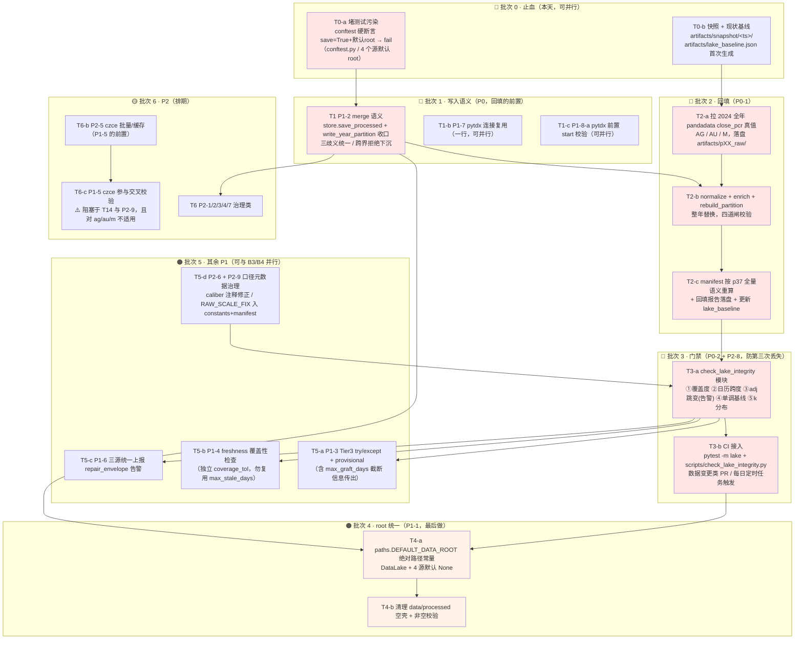
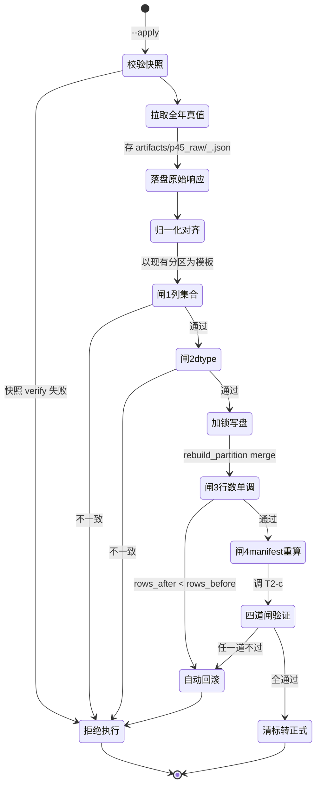

# HexBroker 数据源代码审计报告 —— 架构视角复核

**复核人**：高见远（架构师）
**复核日期**：2026-08-30
**复核对象**：`deliverables/data_source_code_audit_20260830.md`
**复核前提**：假设报告结论成立（QA 严过关并行独立复跑取证）
**代码基准**：`hexbroker/data/{base,store,schema,caliber,freshness,manifest,graft,backup,failover,rebuild}.py`、
`hexbroker/data/sources/*`、`scripts/{p6_4_fill_gaps,p11_truth_rebuild,dev_restore_polluted_2026,p37_raw_close_backfill}.py`

---

## 0. 执行摘要

### 0.1 一个决定性新发现（本报告最重要内容）

**报告的 P0-1 性质被误判。回填不是"没做过"，而是"做过、成功、又被静默回退了"。**

实证（`artifacts/p6_4_applied.json` + 文件系统取证）：

```
2026-08-19 17:57:02  ag0/2024: rows_before=131 → rows_after=243, rows_added=112,
                     overlap_max_close_ratio=0.0,
                     persisted_file = pandadata MCP close_pcr 真值
                     backup = artifacts/backup_p64/ag0_2024_prefill_20260819_175702.parquet
2026-08-19 17:57:03  au0/2024: 131 → 243, +112, ratio=0.0
2026-08-19 17:57:03  m0 /2024: 130 → 242, +112, ratio=0.0

2026-08-29 10:13:45  p37 全量快照 data/p37_backup_processed_20260829T101345/
                     ag0/2024 = 131 行、au0/2024 = 131 行、m0/2024 = 130 行
                     → 112 行已丢失

2026-08-30 审计时    ag0/2024 = 131 行（2024-01-02 ~ 2024-07-17）  ← 报告 P0-1
```

即：**丢失窗口 = 2026-08-19 17:57 ~ 2026-08-29 10:13**。

三条推论：

1. **P0-1 的真实故障模式**是「回填成功 → 被后续某次按年整区覆盖写静默回退」，不是「从未回填」。处置从"补数据"变成"**修写入语义 → 再回填 → 加防回退门禁**"三步。
2. **P1-2 的"引信未点燃"认定不成立**。它已经实爆过一次，损失就是这 112 行。
3. **报告对"哪个是主湖"的判断是反的**：`data/raw/processed` 才是真湖（`p6_4.PROCESSED_DIR`、`p11.DEFAULT_ROOT` 均指向它，18 品种 × 2018~2026 全量数据在此）；`data/processed` 是 0 品种空壳。报告 P1-2 写的"未直接污染主湖"因此不成立——**覆盖写一直就在真湖上发生**。

### 0.2 定级调整一览

| 缺陷 | 报告 | 我 | 一句话理由 |
|---|---|---|---|
| **P1-2** 按年覆盖写 | P1 | **🔴 P0** | 已实爆（就是这 112 行），且是 P0-1 回填的直接阻塞项 |
| **P1-1** root 分裂 | P1 | **🔴 P0**（与 P1-2 合并为同一 PR） | 两者是同一条破坏链两端；且报告把主湖认反了 |
| **P2-8** 无真实湖完整性基线 | P2 | **🟠 P1** | 唯一能自动发现"回退"的防线，应与 P0-2 同 PR 进 CI |
| **P2-6** caliber 口径注释过时 | P2 | **🟠 P1** | 不是文档问题：会导致回填用错 k 基准，引入 ~35% 假跳变（§1） |
| **P1-5** 交叉校验 break | P1 | **🟡 P2** | 报告处置会引爆 P2-5 + P2-9，且 czce 根本没有 ag/au/m 数据 |
| P0-1 / P0-2 / P1-3 / P1-4 / P1-6 / P1-7 / P1-8 | — | 维持原级 | 理由见 §2 |

### 0.3 三个处置冲突的裁决（摘要）

| 冲突 | 裁决 |
|---|---|
| P0-1 回填 vs P1-2 覆盖写 | **不必等 P1-2 修完再回填**，但必须换路径：拉**全年**真值 + `rebuild_partition` 整年替换（p11 语义）。只拉缺失段在工具层**根本走不通**（p11 前置覆盖预检会 rc=1 零写盘）。 |
| P1-1 vs P1-2 谁先修 | **先 P1-2，最后 P1-1**。单独先修 P1-1 会把 `failover._anchor` 从"读空湖→NoAnchor→安全拒绝"**退化**为"读到 3 行→用错误锚点续接"，比现状危险得多。 |
| 回填数据源 | **只能 pandadata 主源 close_pcr 真值**。graft 架构错配（`max_graft_days=30` < 112 天；半年含 ~6 次换月而 graft 无精确价差时跳过调整）；czce 路径不存在（ag/au 属上期所、m 属大商所，czce 只覆盖郑商所）。 |

### 0.4 第二轮补充：第二个决定性发现 + 实现设计

在 §3/§5 的架构方案之外，本轮又挖出一个**阻断级**事实，并补全了可落地的代码骨架：

> **`raw_close` 在三品种里是"稀疏有效的混杂列"**——2024 年 `raw_close == adj_close` 的复制行占比
> **ag0 82.4% / au0 90.1% / m0 97.7%**，而 15 个对照品种该占比为 **0%**（`k≠1` 有效率 100%）。
> 这意味着：① 我在 §1/§3.4 用的 `k` 均值判据**统计上无效，已自我修正**；
> ② `enrich_raw_close` 自诩的 all-or-nothing 契约在这三品种上**已经失守**；
> ③ 回填若默认沿用 `raw_close = adj_close`，会进一步稀释有效率并加剧列内语义混杂。
> 处置：回填脚本设 `--raw-close-policy` 显式三选一，默认 `replicate`（与存量一致），
> `enrich` 待 QA 对 D-4 定性后再启用。**详见 §8.0。**

| 章节 | 本轮新增内容 |
|---|---|
| **§8.0** | `raw_close` 稀疏有效实测（18 品种对照表）+ 对回填的直接影响 |
| **§8.1** | 五个交付组件总览（T2-a 快照 / T2-b 回填 / T2-c 验证 / B3 门禁 / B3-lock 并发锁） |
| **§8.2** | 快照与回滚骨架（含"为何不能复用 p37 备份"——其目录名时间戳与内容 mtime 自相矛盾） |
| **§8.3** | 回填骨架 + 三条源码级硬约束（列集合严格相等 / dtype 一致 / 不跨年）+ 状态机图 |
| **§8.4** | `check_lake_integrity()` 完整接口定义 + **16 条检查码表**（含报告未覆盖的 `E_YEAR_ROWS` / `E_SILENT_GAP` / `E_MANIFEST_STALE`）+ CI 接入方式 |
| **§8.5** | 目录级排他锁（跨进程，Windows 用 mkdir 原子性）+ 裸写点收口清单 |
| **§8.6** | 回滚演练脚本与三条验收标准 |
| **§9** | 5 条待 QA 裁决的依赖（D-1~D-5），含 D-5 的已排除项与线索 |

**§8.4 里三条报告未覆盖的检查码值得单独点名**（它们是"回填被回退却无人察觉"这起事故的直接抗体）：

| 检查码 | 抓什么 | 为什么报告漏了 |
|---|---|---|
| `E_YEAR_ROWS` | 年度**行数**不足（131 vs 243） | `store.quality_notes` 只 glob 年份文件**存在性**，从不看年内覆盖 |
| `E_SILENT_GAP` | 年度边界跳变落在 **[3%, 10%) 静默带**且两侧非换月 | `DEFAULT_MAX_JUMP=0.10`，而 ag0 -6.69% / au0 +6.27% / m0 -9.24% **全部**在带内 |
| `E_MANIFEST_STALE` | manifest 记的行数 ≠ 磁盘实际行数 | 唯一能自动发现"回退"的信号；报告未把 manifest 当作完整性探针 |

---

## 1. 一个必须先说清楚的前提：三品种口径 ≠ 十五品种口径

这是本次回填的**第一硬约束**。报告只在 P2-6 里一笔带过，未与 P0-1 的处置挂钩。

### 1.1 事实

| 项 | 15 品种（rb0/cu0/i0…） | ag0 / au0 / m0 |
|---|---|---|
| 湖内 `close` 口径 | pandadata `close_pcr` **后复权真值** | **既有原始口径（≈名义价）** |
| `RAW_SCALE_FIX` | 1.0（不换算） | m0 × **0.31682966**、au0 × **1.25963496**、ag0 × **1.45054992** |
| 换算方向 | — | `落盘 close = close_pcr × scale` |
| `k = adj_close / raw_close` | **≈ 1.347**（rb0 实测） | **≈ 1.0008**（ag0/2024 H1 实测） |

ag0/2024 现状实测（131 行全样本）：

```
close ≡ adj_close              → True（全行成立）
k = adj_close / raw_close      → mean 1.000827 / std 0.002025 / max 1.007507
amount = 0.0、open_interest = 0.0、is_rollover = False、limit_up/down = False（恒值）
```

来源：`scripts/p6_4_fill_gaps.py:91-110`（RAW_SCALE_FIX 定义与推导）、`normalize_new_df:468-487`
（`open/high/low/close/raw_close/adj_close` 全乘 scale，且 `raw_close = adj_close = close*scale`）。

### 1.2 为什么这条会致命

报告的口径段写的是「processed 湖内 `close ≡ adj_close` 是后复权值，`raw_close` 是名义价，k≈1.347」。

**这句话对 ag0/au0/m0 完全不适用。** 如果回填照它校准：

- 期望回填段 `k ≈ 1.347`，实际应 `≈ 1.0008` → 校验必然"失败"；
- 若反过来"按 1.347 修正数据"→ 对 ag0 注入 **+34.7% 假跳变**；
- 若用 `graft_adjusted` 且按 15 品种习惯设比例因子 → 同一个量级的事故。

> ⚠️ **依赖标注**：本条处置依赖 QA 复核「ag0/au0/m0 的 `RAW_SCALE_FIX` 在 2024-07-18 起始窗口是否适用」。
> 依据 `p6_4_fill_gaps.py:99-101` 自述，该系数取自「2024-08 ~ 2026-08 稳定段」，且明说
> 「**仅 2024-07 上旬主力换月当日有 ±0.4% 抖动**」——而回填目标窗口**恰好从 2024-07-18 开始**，
> 正落在抖动预警期的边界上。
> **若 QA 证实抖动确实落在 07-18 前后，§3 的"拉全年真值"方案是唯一能把它从"外推风险"变成"实测验证"的做法**（§3.4 闸 2）。
> 若 QA 推翻 RAW_SCALE_FIX 的适用性，回填口径设计需整体重做。

> 🔴 **后续更正（2026-08-31 追加，不修改上文历史结论）**
>
> **上面这个条件分支已被实际触发 —— QA 已推翻 `RAW_SCALE_FIX` 的适用性**，但推翻理由
> 不是"07-18 抖动"，而是更根本的**方向性错误**：
>
> - 序 3 取证（2026-08-30）：三品种湖内 `raw_close` ≡ 名义价（正确），**坏的是 `adj_close`**
>   （被污染成名义价的拷贝）。对照 rb0 的 `adj_close` ≡ `close_pcr` 逐位相同 → 管线健康，
>   仅三品种 `adj_close` 受损。
> - `RAW_SCALE_FIX` 是把**正确的** `close_pcr` 乘常数去"对齐"**错误的**既有序列，
>   **把对的改成错的**。
> - 另一硬伤：nominal/复权 比值是**每 dominant 段一个常数、段间跳变**，单一常数在物理上不成立
>   （实测 ag0 2025 k=0.986 / 2026 k=0.9937，若常数正确应恰好 = 1）。
>
> **对本文的影响**：
>
> 1. §1.1 事实表中「ag0/au0/m0 湖内 `close` = **既有原始口径（≈名义价）**」这一行的
>    **现象描述仍然属实**，但应读作「**待修复的污染态**」，而非「应沿用的目标口径」。
> 2. §1.2 / §1.3 基于"三品种就是原始口径"展开的回填与 graft 设计**需整体重做** ——
>    而非按 07-18 抖动去微调。
> 3. **现行止血口径**：三品种口径重建必须禁用该常数（`normalize_new_df(..., scale=1.0)`
>    或 CLI `--scale 1.0`；`p6_4_apply_persisted_dir.py` 已固定传 `--scale 1.0`）。
>    终态：三品种 27 个分区用 `close_pcr` 真值重建完毕后整体废弃该常数。
>
> 权威留档：`scripts/p6_4_fill_gaps.py` L112-140；开发者指南 `docs/developer-guide.md` §9.11 更正块。

### 1.3 连带影响

`hexbroker/data/graft.py:6-7` docstring 称「18 品种比例因子跨度 0.4781(cf0) ~ 8.7769(i0)」——这个跨度里混了两种口径。
`failover` 的 Tier2/Tier3 对三品种续接时，锚点 `adj_hist` 取自湖内（= 原始口径），而 `BackupRawFetcher` 取的是免费源名义价（≈ 同口径）
→ **三品种的 graft 比例因子天然 ≈ 1，与 15 品种的 0.48~8.78 不在同一量纲**。
这是 P2-9「同 key 不同语义」最严重的一处实例，报告只把它归为 P2。

---

## 2. 分级评审表

### 2.1 需要调整的（5 条）

| 缺陷ID | 报告定级 | 我的定级 | 调整理由 |
|---|---|---|---|
| **P1-2** `save_processed` 按年整区覆盖写 | 🟠 P1 | **🔴 P0** | ① **已实爆**：2026-08-19 回填的 112 行在 08-19~08-29 间被回退，这就是 P1-2 的战果，不是"引信未点燃"；② 报告"未污染主湖"的前提错误——`data/raw/processed` 就是真湖（`p6_4.PROCESSED_DIR` / `p11.DEFAULT_ROOT` 均指向它）；③ **它是 P0-1 回填的直接阻塞项**：不修，回填后必然再次被冲掉（这不是推测，是已发生过一次的事实）；④ 覆盖写不是 `save_processed` 独有，`p43_raw_close_spike_repair.py:194`、`p37` 等直接 `to_parquet` 的脚本同构，风险面比报告描述的大 |
| **P1-1** 数据湖 root 约定分裂 | 🟠 P1 | **🔴 P0**（与 P1-2 合并为同一 PR，不单独排期） | ① 报告的影响分析只写了"读方读到空湖"，漏了更危险的一条：`failover._anchor(root="data")` 目前 `FileNotFoundError → None → NoAnchor → 拒绝续接`（**安全降级**）；一旦 root 统一到 `data/processed` 且该目录被写入几行，`_anchor` 会返回**错误的 3 行锚点** → graft 用错误比例因子续接 → **从安全失败退化为静默错误**；② 现有 `"data/raw"` 是**相对路径**，依赖 CWD=项目根，`conftest.py:95` 已埋注释预警——这是一类独立的"写到错湖"事故源；③ 与 P1-2 是同一条破坏链的两端，必须同 PR |
| **P2-8** 测试全绿但无真实湖完整性基线 | 🟡 P2 | **🟠 P1** | 报告说"本次 P0-1 缺失在测试全绿下潜伏"——但更严重的是：**2026-08-19 回填成功后、08-29 回退前的 10 天里，任何"当前是否有洞"的门禁都是绿的**。防不住"回退"的门禁等于没有。这是 P0-1/P0-2 的共同根因，应与 P0-2 同 PR 进 CI |
| **P2-6** `caliber.py` 口径注释过时 | 🟡 P2 | **🟠 P1** | 不是"文档与现状不符"的洁癖问题。`caliber.py:4-5` 是**整个年度口径检测模块的前提假设**，它陈述「`raw_close` 恒等于 `adj_close`、不携带名义价校准信息」；而真相是 15 品种 k≈1.347、3 品种 k≈1.0008。本次回填的口径校验直接读这段注释的隐含结论。把它留作 P2 排期，等于让回填在一个已知错误的基准上做判定。应与 P2-9、§1 的口径分裂合并为「口径元数据治理」单子 |
| **P1-5** 交叉校验 `break` 致 czce 永不执行 | 🟠 P1 | **🟡 P2**（或保持 P1 但**改处置**） | 报告建议"czce 应继续尝试并按覆盖度选择"，副作用三连：① **引爆 P2-5**：czce 逐日 HTTP、每次下全表 37KB 取 1 行，日更流水线从秒级变分钟级（报告自估 18 品种 × 5 年 ≈ 2 小时）；② **引爆 P2-9**：czce 主力规则 = 逐日 OI 最大，sina/pytdx 各不同，"按覆盖度选择"会导致**跨日口径抖动**（今天选 sina 明天选 czce），比"永远不选 czce"危险；③ **品种覆盖根本不匹配**：`czce_source` 只覆盖郑商所，而 **ag/au 属上期所、m 属大商所——czce 拿不到这三个品种的任何数据**。对本报告的主线缺陷 (P0-1) 而言，P1-5 零收益。建议降级，并把 czce 定位为**离线对账通道**而非在线路径 |

### 2.2 维持原级但需修正描述的（3 条）

| 缺陷ID | 定级 | 修正说明 |
|---|---|---|
| **P0-1** | 🔴 P0（维持） | **性质重定义**：不是"从未回填"，是"回填成功 → 被覆盖写静默回退"。根因归属从"数据源缺失"改判为"写入语义 + 门禁失效"。处置从 1 步变 4 步（修语义 → 回填 → 留痕 → 防回退门禁） |
| **P0-2** | 🔴 P0（维持） | 维持。但**不建议调低 `DEFAULT_MAX_JUMP` 阈值**——报告只论证了"10% 检不出"，没给新阈值，而调低会误报真换月。正确做法是把日历跨度检测作为**确定性判据**、把 adj 跳变**降级为参考信号**（§3.6、§5.4） |
| **P1-8** pytdx 只取最近 N 根 | 🟠 P1（维持） | 维持，但要在处置里加一条硬要求：**回填脚本必须显式禁用 pytdx**。否则历史回填任务在 pytdx 上必然失败且报错误导（`HexEmptyDataError`） |

### 2.3 维持原级、无异议（5 条）

P1-3（Tier3 缺 provisional + graft 异常冒泡）、P1-4（freshness 豁免连带豁免覆盖性）、
P1-6（sina/pytdx 静默丢弃修复告警）、P1-7（pytdx 泄漏连接），以及 P2-1 ~ P2-5、P2-7，维持报告定级。

补充：**P1-3 的处置需额外加一条**——报告只说"对齐 Tier2 的 try/except + `mark_provisional`"，
但 Tier3 调 `graft_adjusted` 时同样受 `max_graft_days=30` 约束，**截断信息必须传出**
（否则 `Outcome.new_dates` 与 `GraftResult.new_dates` 不一致，provisional 标记会漏挂被截断的日期）。

---

## 3. ag0 / au0 / m0 回填方案（重点章节）

### 3.0 前置裁决：三条写入路径的取舍

| 方案 | 机制 | 是否采用 | 理由 |
|---|---|---|---|
| **A. 先修 P1-2 再回填** | `save_processed` 改 merge | ✅ 必做，**但不阻塞回填** | merge 是所有写入方的统一兜底（覆盖 `p37`/`p43` 等直接 `to_parquet` 的脚本），但回填走 C 路径，不经过 `save_processed` |
| **B. 回填时用 merge 语义** | 复用 `p6_4` 的 `old+new → drop_duplicates(datetime, keep='last') → sort → 原子 replace` | ✅ 采用（**兜底路径**） | 已被 2026-08-19 实证成功（131→243）。但它不做口径实测验证 |
| **C. 先合并到本地再整年写入** | 拉**全年**真值 → 本地 merge → 整年 write（`p11` / `rebuild_partition` 语义） | ✅ **采用（首选）** | 唯一能同时做口径实测验证的方案，且是唯一与工具契约兼容的方案 |

> **为什么"只拉缺失段"走不通（P0-1 处置方案的硬伤）**
> `scripts/p11_truth_rebuild.py:130-149` 的前置预检要求**真值覆盖既有分区的每一个日期**：
> ```python
> uncovered = sorted(set(cur["datetime"]) - set(truth["datetime"]))
> if uncovered:
>     print("[FAIL] 既有分区 N 行中 M 个日期未被真值覆盖 —— 替换将残留脏行，中止（零写盘）")
>     return 1
> ```
> 若按报告建议只回填 `2024-07-18~2024-12-31`，既有 131 天全部 uncovered → **rc=1、零写盘，回填直接失败**。
> 同理 `hexbroker/data/rebuild.py:272-278` 的列集合一致性检查会先拦一道。
> **结论：必须拉 2024 全年真值。**

**回答"是先修 P1-2 再回填？还是回填时用 merge？还是先合并本地再整年写入？"**
→ **C 为主（本次就可执行）、A 并行推进（统一兜底）、B 兜底（主源不可用时）。三者不互斥，且 A 不是 C 的前置。**
报告把 P0-1 与 P1-2 写成互斥的先后关系，是把"P0-1 的建议处置路径（`fetch_bars` + `save=True`）"和
"P0-1 的可行处置路径（`rebuild_partition`）"混为一谈了。

### 3.1 回填前的数据快照与回滚预案

**快照（三层，缺一不可）**

| 层 | 内容 | 落盘位置 | 用途 |
|---|---|---|---|
| L0 | `data/raw/processed` **整层** | `artifacts/snapshot/<ts>/processed_full/`（`shutil.copytree`） | 全湖灾难回滚 |
| L1 | 目标分区 `{sym}/1d/2024.parquet` × 3 | `artifacts/snapshot/<ts>/{sym}_2024.parquet` | 秒级定点回滚 |
| L2 | 目标 sidecar `{sym}/1d/manifest.json` × 3 | `artifacts/snapshot/<ts>/{sym}_1d_manifest.json` | manifest 回滚（**报告漏掉的一层**） |

> ⚠️ **不要沿用 `data/p37_backup_processed_<ts>/` 的位置约定**：它落在 `data/` 下且被 `.gitignore` 忽略，
> 会被误当成数据目录、被 `load_symbol_frames()` 这类目录枚举扫到。统一迁到 `artifacts/snapshot/`。

**回滚触发条件**（任一成立即回滚）

1. 目标分区行数 < 回填前行数（131 / 131 / 130）；
2. 闸 1~闸 4（§3.4）任一不过；
3. `validate_bars` 抛出（OHLC 包络 / 非正价格 / 前向填充后 NaN 残留）；
4. 并发检测失败：回填期间 `2025.parquet` 或 `2026.parquet` 的 mtime / 指纹发生变化；
5. 三处年度边界跳变（§3.4 闸 4）**变差**而非变好。

**回滚动作（原子 + 留痕）**

```
1. 存现场：坏分区复制 → artifacts/snapshot/<ts>/_failed/{sym}_2024.parquet（供复盘）
2. 回滚数据：write_parquet(read_parquet(L1), target)   # 走原子写，不要 shutil.copy2 裸拷
3. 回滚 manifest：write_manifest(L2_dict, root)        # 或按全量拼接重算
4. 输出回填报告（§3.5），标记 status=ROLLED_BACK + 失败原因
5. 零残留：确认 artifacts/ 与分区目录无 *.parquet.tmp 残留
```

### 3.2 如何避免覆盖写导致二次丢失（三层防护）

**第 1 层 · 换路径（本次回填主用）**——走 `p11_truth_rebuild.py` / `rebuild_partition`，语义是**先合后写**：

```python
# hexbroker/data/rebuild.py:279-289
merged = cur.set_index("datetime");  t = truth.set_index("datetime")
common    = merged.index.intersection(t.index)      # 同日期逐行替换
new_dates = t.index.difference(merged.index)        # 新日期追加
merged.loc[common] = t.loc[common]
out = pd.concat([merged, t.loc[new_dates]]).sort_index()
```

合并后的**整年帧**才交给 `save_processed`，所以 `save_processed` 的覆盖写作用在一个**完整的年度帧**上 = 无害。
外加 `rebuild.py:303-311` 的**跨界拒绝**双保险：

```python
y0, y1 = 首末追加日期的年份
if y0 != item.year or y1 != item.year:
    → SKIPPED "写入范围 y0~y1 超出目标年度，拒绝跨界分区"
```

> **关键洞察**：`rebuild_partition` **早就实现了 merge 语义**，且已在 rb0/2020、cu0/2023、rb0/2023 上用过。
> P0-1 的回填根本不需要等 P1-2 修完——只要走对入口。

**第 2 层 · 修写入语义（P1-2，并行推进）**——`save_processed` 改 merge，但**必须先明确三个语义歧义**：

| 歧义 | 现有冲突 | 建议统一 |
|---|---|---|
| ① 冲突时谁赢 | `p6_4` 用 `keep='last'`（新覆盖旧）；`rebuild_partition` 用 `t.loc[common]`（新覆盖旧） | 统一 **`keep='last'`**，并把 `replaced` 日期清单记入日志（对齐 `RebuildResult.replaced`） |
| ② 列集合不一致 | `rebuild_partition:272` → **SKIPPED 拒写**；`p6_4.coerce_schema` → **补默认值强写** | 统一为：**必需列（`REQUIRED_COLS`）缺失 → 拒写；可选列（`OPTIONAL_COLS`）缺失 → 补默认值** |
| ③ 跨年污染 | `save_processed` 按年拆分天然不跨年，但 merge 后仍需校验 | **把 `rebuild.py:303-311` 的 y0/y1 跨界拒绝下沉到 `save_processed`**，否则一次多年请求会把 2025 数据写进 2024 分区 |

**第 3 层 · 堵住测试污染（优先级不低于 P1-2）**

`scripts/dev_restore_polluted_2026.py:9-17` 记载：`test_akshare_source.py` 用 `AkshareSource()` 默认 `save=True` 落盘，
把合成 2~3 行写进生产分区，且因 `DataLake` 复用同一 root 发生**跨品种串扰**（cu0/2026 的内容实际是 rb0 的价格）。

**不堵这个口，回填完第二天就可能被一个 pytest 冲掉。** 处置（把 `conftest.py:95` 的注释升级为硬断言）：

```python
@pytest.fixture(autouse=True)
def _no_production_lake_writes(monkeypatch):
    """任何 DataSource(save=True) 且 root 为默认值 → 直接 fail。
    源层常显式传字符串默认值 "data/raw"（而非 None），仅靠参数检查拦不住。"""
```

### 3.3 回填数据源选型

| 方案 | 机制 | 风险 | 裁决 |
|---|---|---|---|
| **S1 · pandadata 主源 `close_pcr` 全年真值** | `get_future_daily_post(underlying_symbol=[AG/AU/M], start_date=20240101, end_date=20241231, method=close_pcr)` → `normalize_new_df`（⚠️ **更正 2026-08-31：必须 `--scale 1.0` 禁用 `RAW_SCALE_FIX`**，原文"自动 × RAW_SCALE_FIX"已证伪）→ `enrich_raw_close` → `rebuild_partition` 整年替换 | ① MCP token 失效（2026-08-28 实测发生过）；② 网关 ~1000 行截断（p6_4 实测 ≈4 年，全年 243 行安全）；③ ~~scale 在 2024-07 边界的 ±0.4% 抖动~~（⚠️ 2026-08-31：风险③已**不再是主要风险** —— 常数本身方向性错误，见 §1.2 后续更正块） | ✅ **唯一主选**（机制仍为主选，但**执行参数须按上表更正**） |
| **S2 · 免费源名义价 + graft 续接** | sina/akshare 名义价 → `graft_adjusted` | 见下「为什么 S2 架构错配」四条例 | ❌ 不可用于本次回填；仅作主源不可用时的临时降级 + provisional |
| **S3 · czce 交易所官方** | czce 名义价 + graft | S2 全部风险 + P2-5（逐日 HTTP，5 年 ≈2h/品种）+ P2-9（主力规则不同）+ **品种覆盖不匹配** | ❌ 不可用 |

**为什么 S2（graft）架构错配 —— 四条独立理由**

1. **窗口超限**：`graft.py:180` `max_graft_days: int = 30`，docstring 明写「备源只应急救**短窗口**，
   长窗口请等主源恢复后**全量重建**」。112 天 > 30 天 → 直接触发「已截断」告警（`graft.py:230-235`）。
2. **换月日必然劣化**：半年窗口约含 6 次主力换月。`graft.py:246-257` 规定：**无精确 `rollover_spreads` 时跳过换月调整**
   （依据 18 品种消融：近似价差 18/18 不优于不调整，cu0 +36.06bp、ni0 +20.12bp 显著劣化）。跳过 = 每次换月注入一个未补偿的价差跳空。
3. **误差不可前向检出**：`graft.py:84-89` 自述「口径跳变若发生在锚点**之后**，重叠区内没有对照样本，
   原理上无法检出（实测 cu0 2026-08-21：零告警但 21.35bp 误差）」。112 天外推正是这个场景。
4. **口径基准错乱风险**：三品种湖内口径 ≈ 名义价（`k≈1.0008`），若按 15 品种习惯（k≈1.347）设比例因子 → 直接注入 ~35% 假跳变（§1.2）。

**为什么 S3（czce）根本不存在**：`czce_source` 只覆盖郑商所；**ag/au 是上期所（SHFE）、m 是大商所（DCE）**。
czce 拿不到这三个品种的任何数据。报告 P1-5 建议"让 czce 参与"对本次回填零收益。

**S1 不可用时的降级预案（不是本次首选）**：走 `p6_4 --stage parse`（merge 语义，只需缺失段），但**必须**：

- 挂 `mark_provisional(root, "processed", sym, "1d", 2024, dates, method="graft",
  reason="pandadata 不可用，备源续接待重建")`；
- 使其进入 `scan_rebuild_needed`，主源恢复后由 `rebuild_pipeline` 重建；
- 在回填报告中显式写 `provisional=True`，**不得用于训练/回测**。

### 3.4 口径对齐验证（四道闸，串行，任一不过即回滚）

**闸 1 · 列集合一致** — `set(truth.columns) == set(cur.columns)`。回填真值必须含全部 14 列：

```
symbol, datetime, open, high, low, close, volume, amount,
open_interest, raw_close, adj_close, limit_up, limit_down, is_rollover
```

（`rebuild.py:272-278` 已有此检查，未过即 SKIPPED。）

**闸 2 · 重叠日逐位比对（最强的单一证据）** — 拉全年真值的**最大收益**：
2024 H1 的 131 天自动成为**免费的口径对照样本**。

```python
overlap_max_close_ratio = max(|truth.close / cur.close - 1|)   # 2024-01-02 ~ 07-17
```

| 观测 | 判读 | 动作 |
|---|---|---|
| `< 1e-6`（对标 p6_4 2026 记录的 `overlap_max_close_ratio = 0.0`） | scale 在目标窗口成立 | ✅ 放行 |
| 仅 2024-07-16 / 07-17 出现 ~0.4% 抖动 | 命中 `p6_4:100-101` 预警的"换月当日抖动" | ⚠️ **单独记录 + 决策**：接受 2 天 0.4%，或对这 2 天改用局部 scale |
| H1 大面积偏离 | scale 不适用，或 H1 口径另有隐情 | 🔴 **立即中止回滚**，交 QA / 主理人裁决 |

> **这一条把"系数外推风险"转化成了"系数实测验证"，是选择拉全年而非只拉缺失段的决定性理由。**

**闸 3 · k 值分布一致性**

```python
k = adj_close / raw_close
# ag0 / 2024 H1 基线（131 行全样本实测）：
#   mean 1.000827 / std 0.002025 / min 1.000000 / max 1.007507
```

- 判据：回填段 k 的 `mean` / `std` / `max` 落在 H1 的 **±3σ 区间**内（或两样本 KS 检验 p > 0.01）；
- 🔴 **绝对不要用 rb0 的 k≈1.347 作为这三品种的基准**（§1.2）；
- 三个品种**分别**建基线，不要共用。

**闸 4 · 年度边界跳变（回填前 / 回填后各算一次，必须改善）**

| 边界 | ag0 回填前 | 目标 |
|---|---|---|
| 2023-12-29 → 2024-01-02 | +1.00% | 基本不变（若明显变化 → H1 被改动，需复核） |
| **2024-07-17 → 2024-07-18**（本次接缝） | — | ≤ 正常换月幅度（**< 2%**） |
| **2024-12-31 → 2025-01-02** | **-6.69%**（au0 +6.27%、m0 -9.24%） | **< 2%** |

> 报告给出的 ag0「2024 末值 8131.00 / 2025 初值 7586.66」是**回填前**值；
> 回填后 2024-12-31 的 close 应落在 7586.66 附近。**"回填后应逼近 2025 初值"这个关系本身就是一条强校验。**

### 3.5 回填后的留痕

| 留痕项 | 是否做 | 说明 |
|---|---|---|
| `_MISSING_{year}.json` | ❌ **不挂** | 回填成功后分区完整。挂标会与 `store.quality_notes` 的 `stale_mark`（"标记与分区并存，标记已过时应清除"）语义冲突，制造新告警噪音 |
| `_provisional.json` | ⚠️ **仅 S2 降级路径挂** | S1 真值回填**不挂**——结果即真值，挂标会让 `scan_rebuild_needed` 误报"待重建" |
| **manifest 重算** | ✅ **必须**（报告漏掉的硬要求） | 见下 |
| **回填报告落盘** | ✅ 必须 | 见下 |

**manifest 重算 —— 一个会静默破坏语义的陷阱**

现状（`data/raw/processed/ag0/1d/manifest.json`）：

```json
{"symbol":"ag0","freq":"1d","data_version":"backfill-20260829T101359",
 "source":"lake","n_rows":1990,"date_range":["2018-01-02","2026-08-28"],
 "constants":{"adjust_method":"backward","main_rule":"open_interest"},
 "content_fingerprint":"32ac1f3f0ce3"}
```

这是 **p37 写入的"全品种全量拼接"语义**（`p37:230-236`）。

**危害**：若回填走 `DataLake.save_processed`（`store.py:71-75`），manifest 会被重写为
`build_manifest(..., df=本次写入帧, source="lake", data_version="v1")` →
`n_rows` **1990 → 243**、`date_range` **2018~2026 → 2024~2024**、`data_version` **backfill-* → v1**。
后果：① 语义从"全品种"退化为"单年度"；② `p37._manifest_is_backfill_maintained` 因 `data_version=v1`
而**永久跳过**该品种的 manifest 维护；③ 指纹与数据脱钩，事后无法审计。

**规定动作** —— 回填后按 **p37 全量拼接语义**重算：

```python
parts = [read_parquet(f) for f in sorted(freq_dir.glob("*.parquet"))]
write_manifest(build_manifest("processed", sym, "1d",
                              pd.concat(parts, ignore_index=True),
                              source="lake", data_version=_backfill_version(),
                              constants=_constants_from_cfg(cfg)), root)
```

**回填报告落盘** → `artifacts/backfill_2024_<ts>.md`，至少含：

- 真值来源文件、拉取参数（`underlying_symbol` / `start` / `end` / `method`）
- 三品种行数 before → after、追加 / 替换日期数
- `overlap_max_close_ratio`（闸 2）
- k 分布前后对比（闸 3）
- 三处边界跳变前后（闸 4）
- manifest 指纹前 / 后、`n_rows` 前 / 后
- 快照路径、回滚状态、执行人、时间戳

> 这份报告是**回滚与事后审计的唯一凭据**。没有它，"回填成功"只是一句无法复核的断言。

### 3.6 如何验证回填成功且不引入新的年度边界跳变

**当场验证（脚本内，失败即回滚）**

1. 行数 = 243（ag0）/ 243（au0）/ 242（m0），误差 0；
2. 全量日期连续无洞 —— 对照 `p6_4.build_calendar()` 构造的交易日历（`MIN_COVER_RATIO=0.5`），不是简单 `bdate_range`；
3. 闸 1~4 全过；
4. `BarFrame.validate()` 通过（`validate_bars` 的 OHLC 包络、非正价格、前向填充后 NaN 残留）；
5. 并发检测：回填前后比对 `2025.parquet` / `2026.parquet` 的 mtime 与 `content_fingerprint`。

**长期门禁（并入 P0-2，一次进 CI）**

| 检测 | 判据 | 是否 fail CI |
|---|---|---|
| ① 年度首尾覆盖度 | 首日 ≤ 1/10、末日 ≥ 12/20（首尾年份豁免） | ✅ fail |
| ② **年度边界日历跨度** `boundary_calendar_gaps` | 正常跨年 ≤ 5 日历日；缺失半年 → 169 天 | ✅ fail（**零阈值歧义、零误报**） |
| ③ 年度边界 adj 跳变 `boundary_fake_gaps` | 保留 `max_jump=0.10` | ❌ **只告警**（降级为参考信号，见下） |
| ④ **行数 / 指纹单调基线** | 每个 `(sym, year)` 的行数与内容指纹**只允许单调不减** | ✅ fail（**防回退的 decisive 门禁**） |
| ⑤ k 值分布回归 | 按品种基线 ±3σ | ✅ fail |

**为什么不调低 ③ 的阈值**：`DEFAULT_MAX_JUMP=0.10` 取自涨跌停幅度，调低会误报真换月
（真后复权在换月日也可能有 2~5% 波动）。它作为**初筛**是对的——报告已证明"缺失品种跳变比正常值高一个数量级"，
这个信号强度足以做参考。但**定罪交给 ②（日历跨度，确定性）和 ①（覆盖度，完整性）**。

**为什么 ④ 是防回退的关键**：2026-08-19 回填成功后、08-29 回退前的 10 天里，①②③ 全是绿的。
**只有"行数单调不减 + 指纹留痕"能抓住"回退"这种方向的事故。**
基线文件 `artifacts/lake_baseline.json`，回填 / 重建成功后由脚本**显式**更新（不是自动更新，否则回退会被自动"追认"）。

### 3.7 回填时序图

```mermaid
sequenceDiagram
    autonumber
    participant OP as 运维/工程师
    participant SN as Snapshot 三层
    participant PD as pandadata MCP<br/>主源 close_pcr
    participant NRM as p6_4.normalize_new_df<br/>scale=1.0 · 禁用 RAW_SCALE_FIX
    participant ENR as enrich_raw_close<br/>备源名义价
    participant RB as rebuild_partition<br/>先合后写
    participant GT as 四道闸校验
    participant LK as DataLake 真湖<br/>data/raw/processed

    OP->>SN: L0 整层 + L1 目标分区 + L2 manifest
    SN-->>OP: artifacts/snapshot/&lt;ts&gt;/

    OP->>PD: get_future_daily_post(AG/AU/M, 20240101, 20241231, close_pcr)
    Note over OP,PD: 拉【全年】而非仅缺失段<br/>只拉缺失段 → p11 前置覆盖预检 rc=1 零写盘
    PD-->>OP: 全年真值 JSON → artifacts/pXX_raw/seg_20240101_20241231_{SYM}.json
    OP->>OP: 落盘持久化（审计凭据，勿只留在 MCP tool-results 临时目录）

    OP->>NRM: normalize_new_df(df, "AG", "ag0", 2024-01-01, 2024-12-31, scale=1.0)
    Note over NRM: ⚠️ 更正 2026-08-31：必须显式 scale=1.0<br/>禁用 RAW_SCALE_FIX ag0=1.4505 · 已证伪<br/>limit_up/down/is_rollover = False
    NRM-->>OP: 14 列标准 schema（正确后复权口径）

    OP->>ENR: enrich_raw_close(truth, "ag0")
    Note over ENR: 备源名义价回填 raw_close<br/>all-or-nothing，覆盖率<90% 则原样返回并告警
    ENR-->>OP: truth + notes

    OP->>RB: rebuild_partition(root, RebuildNeeded(ag0,1d,2024,kind=missing), truth)
    RB->>LK: read_parquet(2024.parquet) → cur (131 行)
    RB->>RB: common=131 天逐行替换 / new=112 天追加 → merged (243 行)
    RB->>RB: 跨界拒绝双保险 y0==y1==2024
    RB->>LK: save_processed(整年帧 243 行) → 覆盖写作用于完整年度帧 = 无害
    RB-->>OP: RebuildResult(replaced=131, appended=112, rows 131→243)

    OP->>GT: 闸1 列集合 / 闸2 重叠逐位 / 闸3 k 分布 / 闸4 边界跳变
    alt 四闸全过
        GT-->>OP: PASS
        OP->>LK: 按 p37 全量拼接语义重算 manifest（n_rows 1990→2102）
        OP->>OP: 落盘 artifacts/backfill_2024_&lt;ts&gt;.md
        OP->>OP: 显式更新 artifacts/lake_baseline.json（防回退基线）
    else 任一闸失败
        GT-->>OP: FAIL + 归因
        OP->>LK: 原子回滚 L1 分区 + L2 manifest
        OP->>OP: 坏分区存 _failed/，报告标记 ROLLED_BACK
    end
```

---

## 4. 处置方案评审（逐条：可行性 / 副作用 / 更优解）

### P0-1 回填 ag0/au0/m0 2024 下半年

| 维度 | 评审 |
|---|---|
| **可行性** | ❌ **报告给的方案（`fetch_bars(start="2024-07-18", end="2024-12-31")` + `save=True`）不可行**。三条硬伤：① `base._clip_range` 裁到窗口内 → `save_processed` 按年覆盖 → 2024 上半年 131 行被冲掉（团队负责人已识别）；② p11 前置覆盖预检会 rc=1 零写盘；③ 未区分三品种 `RAW_SCALE_FIX` 口径 |
| **潜在副作用** | 报告未提：即便绕过覆盖写，按 15 品种的 k≈1.347 校准会对 ag0 注入 ~35% 假跳变；且回填后 manifest 会被 `save_processed` 从"全品种 1990 行"重写成"单年度 243 行"，永久破坏 p37 的 manifest 维护链路 |
| **更优解** | 见 §3：拉**全年**真值 + `rebuild_partition` 整年替换 + 四道闸校验 + 按 p37 语义重算 manifest + 回填报告落盘 + 更新防回退基线 |

### P0-2 新增 `boundary_calendar_gaps`

| 维度 | 评审 |
|---|---|
| **可行性** | ✅ 可行。零外部依赖、零阈值歧义、零误报，可直接进 CI。**报告这一条是本轮审计里质量最高的发现** |
| **潜在副作用** | 无实质副作用。但要注意：① 跨年若遇长假（春节在 1 月底），日历跨度会自然增大——建议阈值取 **5 日历日**而非交易日，并额外豁免"首尾年份不参与判定"；② 报告建议"首尾年份豁免"是对的，但要明确 `present[0]` 与 `present[-1]` 是**该品种**的首尾年（不同品种上市时间不同，sc0 最早 2018-03-26） |
| **更优解** | 与 P0-1 的 `quality_notes` 覆盖度检查、P1-4 的覆盖性检查合并为**一个 `check_lake_integrity()` 模块 + 一个 CI 门禁 PR**，不要拆成三个。另需补**第 ④ 项：行数/指纹单调基线**——只有它能抓住"回退"方向的事故（§3.6） |

### P0-1 处置第 3 点「回填前先对现有分区做快照备份」

| 维度 | 评审 |
|---|---|
| **可行性** | ✅ 可行，且**必须做** |
| **潜在副作用** | 报告只说"快照备份"，没说存哪、存几层、怎么回滚。沿用 `p37` 的 `data/p37_backup_processed_<ts>/` 约定有风险（落在 `data/` 下、被 gitignore、会被目录枚举扫到） |
| **更优解** | §3.1 的三层快照（L0 整层 / L1 分区 / L2 manifest）+ 五条回滚触发条件 + 原子回滚 + `_failed/` 留现场 |

### P1-1 统一 `data_root` 单点常量

| 维度 | 评审 |
|---|---|
| **可行性** | ⚠️ 方向对，**但报告给的做法（"建议 `configs/base.yaml` 的 `data_root`"+ "构造时校验目录非空"）有顺序陷阱**。见 §5 |
| **潜在副作用** | ① 若统一到 `data`（空壳），`failover._anchor` 会从"FileNotFoundError → NoAnchor → **安全拒绝**"退化为"读到几行 → **用错误锚点续接**"，比现状危险得多；② 现有 `"data/raw"` 是相对路径、依赖 CWD，改用 yaml 配置只是把"硬编码在源码"变成"硬编码在配置"，**没有消除"哪个湖是对的"的歧义根源** |
| **更优解** | **消除 root 参数，而不是选一个 root**：新增 `hexbroker/data/paths.py` 导出 `DEFAULT_DATA_ROOT = Path(__file__).resolve().parents[2] / "data" / "raw"`（**绝对路径，不依赖 CWD**）；`DataLake.__init__(root=None)` 与四个源的 `root=None` 全部默认取它；保留显式 `root` 参数供测试注入（测试一律传 `tmp_path`，零影响）。`configs/base.yaml` 只做 override 入口，不做默认来源 |

### P1-2 `save_processed` 改 merge 语义

| 维度 | 评审 |
|---|---|
| **可行性** | ✅ 可行且**零风险**（把覆盖写改成合并写，任何现有调用只会"多保留数据"，不会丢数据）。这是唯一可以**先于回填、且先于 root 统一**安全上线的改动 |
| **潜在副作用** | ① **三个语义歧义未定义**（冲突时谁赢 / 列集合不一致怎么办 / 跨年怎么办），直接改会与 `p6_4`（补默认值强写）、`rebuild_partition`（拒写）行为分叉；② 只改 `save_processed` **覆盖不全**——`p43:194`、`p37:219` 等直接 `write_parquet` 的脚本同构；③ merge 后 manifest 语义会变（从"本次写入帧"变成本该是"合并后帧"），需同步明确 |
| **更优解** | §3.2 第 2 层的三条统一约定；并把跨界拒绝下沉到 `save_processed`；同时审计所有直接调 `write_parquet(df, path)` 的脚本，统一走一个 `write_year_partition(sym, year, new_df, mode="merge")` 收口函数 |

### P1-3 Tier3 对齐 Tier2 的 try/except + `mark_provisional`

| 维度 | 评审 |
|---|---|
| **可行性** | ✅ 可行，改动小 |
| **潜在副作用** | 报告漏了一条：Tier3 的 `graft_adjusted` 同样受 `max_graft_days=30` 约束，**截断后 `Outcome.new_dates` 与 `GraftResult.new_dates` 会不一致** → provisional 标记漏挂被截断的日期，留下"未标记的临时值"（正是 P0-1 最痛的那类零留痕） |
| **更优解** | 对齐时同步：① 把 `res.warnings` 与截断信息写进 `Attempt.error`；② `mark_provisional` 只标 `res.new_dates`（实际续接的），**未续接的日期不标但要告警**；③ Tier3 的 `o.provisional = True` 已在代码里（failover:353），补 try/except 后要确认异常路径下不会漏设 |

### P1-4 freshness 豁免保留覆盖性检查

| 维度 | 评审 |
|---|---|
| **可行性** | ✅ 可行。`freshness.py:110` 的 `return latest` 改成"豁免新鲜度但继续做覆盖性校验"即可 |
| **潜在副作用** | 报告建议 `latest >= end - max_stale_days`，但这会与**真实的历史回填**冲突：回填 2024 年时 `end=2024-12-31`，而备源可能只返回到 2024-12-20（源端未发布）→ 覆盖性检查会以 `max_stale_days=5` 判失败 → **历史回填被误拦**。这正是报告自己批判的"量纲错配"的另一个方向 |
| **更优解** | 覆盖性检查的容差**不能复用 `max_stale_days`**（那是"新鲜度"量纲）。历史回填场景应：① 校验 `latest >= end - coverage_tol`，`coverage_tol` 独立参数（建议默认 10 日历日，覆盖源端发布延迟）；② 或更严格也更正确：**用交易日历比对缺失交易日数**，而不是日历日差值；③ 无论如何，`assert_nonempty` 必须保留（那才是拦住"停更"的主力） |

### P1-5 交叉校验按上游分组

| 维度 | 评审 |
|---|---|
| **可行性** | ⚠️ 报告方案（"czce 应继续尝试并按覆盖度选择"）**技术上可行但收益为负**，见 §2.1 |
| **潜在副作用** | 三连：① 引爆 P2-5（czce 逐日 HTTP，报告自估 18 品种 × 5 年 ≈ 2 小时）→ 日更流水线从秒级变分钟级；② 引爆 P2-9（czce 主力规则 = 逐日 OI 最大，与 sina/pytdx 不同）→ "按覆盖度选择"造成**跨日口径抖动**；③ **czce 只有郑商所品种，ag/au（上期所）、m（大商所）根本拿不到数据** |
| **更优解** | 保持 `break`（不引入性能与语义风险），把 czce 定位为**离线对账通道**（定期全量比对，不进在线路径）。修订优先级为 P2，并**阻塞于 P2-5（缓存/批量）与 P2-9（独立 symbol 命名空间）先修**。另：报告的"交叉校验只在同上游组内做"这一半是对的，应采纳 |

### P1-6 三源统一上报 `repair_envelope` 告警

| 维度 | 评审 |
|---|---|
| **可行性** | ✅ 可行，改动小（sina:220、pytdx:296 两处） |
| **潜在副作用** | 无。但报告建议"把 notes 透传到 `BarFrame.metadata`"需谨慎：`metadata` 目前是自由 dict，没有消费者；而 `validate_bars` 不校验它。若回填段 metadata 有值、既有段没有，会造成同列/同结构的**语义不对称** |
| **更优解** | 采纳统一 logging 上报（必须做）；`metadata` 透传**暂缓**，等有真实消费者（如 CI 门禁读取）再上，避免造一个无人消费的字段 |

### P1-7 pytdx 连接复用

| 维度 | 评审 |
|---|---|
| **可行性** | ✅ 可行，一行修复（`_connect` 复用已有 `self._api`，或新建前先 disconnect） |
| **潜在副作用** | 无。注意 `_fetch_continuous` 里 api1/api2 是**有意**在不同阶段建连的（先 `_select_main_contract` 再 `_fetch_contract_bars`），复用时要确认两个阶段确实可以共用同一连接（pytdx 的 `TdxHq_API` 支持多命令复用） |
| **更优解** | 建议改为**上下文管理器**而非"复用 `self._api`"：`with self._connect() as api:` 显式管理生命周期，避免以后再有人加第三个 `_connect()` 调用点重蹈覆辙 |

### P1-8 pytdx 动态 count / 前置校验

| 维度 | 评审 |
|---|---|
| **可行性** | ✅ 可行 |
| **潜在副作用** | 报告给的两个方案都可行但都不够：①"按 `start` 动态计算 count"——pytdx 服务端对 `count` 有上限（实测 ~800/次），动态计算后仍需分页循环；②"前置校验 start 是否在覆盖范围内并给明确错误"——**这个必须有**，否则回填任务失败时报 `HexEmptyDataError`，原因具有强误导性（报告已指出） |
| **更优解** | 两个都做：**前置校验**（立即，低成本，消除误导性报错）+ **分页循环**（P1，使 pytdx 语义与其他源对齐）。**并且在回填脚本里显式禁用 pytdx**——本次回填绝不能落在 pytdx 上 |

---

## 5. 修复顺序与依赖图

### 5.1 裁决：P1-1 与 P1-2 是否升级 P0？谁先修？

**是，两条都升 P0，但合并为同一条链路，且顺序严格：P1-2 → 回填 → 门禁 → P1-1。**

**「先修 P1-1 会不会立即引爆 P1-2？」——分两种修法，结论相反：**

| 修法 | 后果 | 判定 |
|---|---|---|
| **统一到 `data`（即 `data/processed` 成为唯一真湖）** | ① 所有读方立刻读到**空湖** → 全线 `FileNotFoundError`；② 四个源默认 `save=True`，一次窄窗口拉取就把 `data/processed/{sym}/1d/{year}.parquet` 写成 3 行 → **真正的截断**；③ `failover._anchor(root="data")` 从"FileNotFoundError → NoAnchor → **拒绝续接**（安全）"退化为"读到 3 行 → **用错误锚点 graft 续接**（静默错误）" | 🔴 **绝对禁止**——会造成比现状严重得多的失效模式 |
| **统一到 `data/raw`（真湖）** | 读方立刻正确；覆盖写风险**原地不变**（本来就在真湖上发生）。净收益，但**必须同时修 P1-2**，否则回填后仍会被冲掉 | ✅ 正确方向，但必须排在 P1-2 之后 |

**所以安全顺序是：**

1. **先 P1-2（merge 语义）** —— 唯一可以**先于一切**安全上线的改动（改覆盖写为合并写，任何现有调用只会多保留数据）。
2. **再 P0-1 回填** —— 走 `rebuild_partition` 整年替换路径（本来就不经过覆盖写，但此时即使有人走 `save_processed` 也安全了）。
3. **再 P0-2 + P2-8 门禁** —— 防回退复发 + CI 拦截。**没有门禁就回填 = 第三次丢失只是时间问题**（2026-08-19 已经证明了第一次，08-29 证明了第二次）。
4. **最后 P1-1（统一 root）** —— 一次性完成：统一到 `data/raw`（绝对路径常量）、删除或软链 `data/processed` 空壳、加非空校验。

### 5.2 依赖图



### 5.3 关键路径与阻塞关系

| 关系 | 说明 |
|---|---|
| **硬阻塞** | `T0-b 快照` → `T2 拉真值`：无快照不得动数据 |
| **硬阻塞** | `T1 merge 语义` → `T3 回填`：虽然 `rebuild_partition` 自带 merge，但 T1 是所有**其他**写入方（p37/p43/日更）的兜底，不修则回填后仍会被冲 |
| **硬阻塞** | `T4 回填` → `T5 门禁`：**先建基线再上门禁**，否则基线上就记着 131 行，回填后反而"违反单调性" |
| **硬阻塞** | `T6 门禁` → `T7 root 统一`：root 统一会改变所有路径，门禁必须先就位以便验证统一没造成数据丢失 |
| **硬阻塞** | `T14 (P2-5)` + `P2-9` → `T15 (P1-5)` |
| **可并行** | `T1-b / T1-c`（pytdx 两处小修）与 T1 并行 |
| **可并行** | `T9 / T10 / T11`（P1-3/4/6）与 B3、B4 并行，互不依赖 |
| **可并行** | `T12 口径元数据治理` 与 B3 并行，且**应在 T5 之前完成**（门禁的 k 分布基线依赖正确的口径定义） |
| **⚠️ 顺序陷阱** | `T7 root 统一` **绝不能**在 `T1 merge` 之前做（§5.1 表） |

### 5.4 建议排期

| 批次 | 内容 | 建议窗口 | 备注 |
|---|---|---|---|
| B0 | 止血：堵测试污染 + 快照 | **立即（当天）** | 不堵测试污染，回填随时可能被下一次 pytest 冲掉 |
| B1 | P1-2 merge + pytdx 两处小修 | 1 天 | 纯增量安全改动 |
| B2 | P0-1 回填（三品种） | 1 天（含 pandadata 拉取） | **必须在日更流水线之外的维护窗口执行** |
| B3 | P0-2 + P2-8 门禁 + CI | 1~2 天 | 含 18×9 分区基线与测试 |
| B4 | P1-1 root 统一 | 0.5 天 | 排在最后，改完立刻跑 B3 门禁验证 |
| B5 | 其余 P1 | 1~2 天（可与 B3/B4 并行） | |
| B6 | P2 排期 | 按需 | T15 阻塞于 T14 |

---

## 6. 报告未覆盖但处置时必须考虑的事项

### 6.1 并发安全（高风险，报告完全未提）

- **原子写只保护单文件**：`hexbroker/utils/io.py:49-60` 的 `_atomic_write`（临时文件 + `os.replace`）对单文件是安全的 ✅。
- **但 read-modify-write 不是原子的** ❌：`p6_4` 的 `old = read_parquet → merged → replace`、`rebuild_partition` 的 `read → merge → save_processed` 都是读-改-写。若回填与日更流水线并发，后写完的会**整体覆盖**先写完的（丢的是先写者的合并结果）。
- **要求**：① 回填必须在**日更流水线之外的维护窗口**执行；② 加显式锁（`data/raw/processed/.lock`，或 `--maintenance-window` 标志文件）；③ 回填前后比对 `2025/2026.parquet` 的 mtime 与 `content_fingerprint`，变化即回滚重来。
- **另**：`save_processed` 的**多年循环不是原子的**（2024 写成功、2025 写失败 → 半截状态）。回填必须**单品种 × 单年度串行**，失败即回滚该分区。

### 6.2 manifest 语义三层混乱（报告完全未提）

| 写入方 | 语义 | `data_version` |
|---|---|---|
| `DataLake.save_processed` | **最后写入帧**（单年度） | `v1` |
| `p37` / `backfill_manifests` | **全品种全量拼接** | `backfill-<ts>` |

后果：① 同名字段（`n_rows` / `date_range` / `content_fingerprint`）在不同写入方下含义不同，无法比对；
② `p37._manifest_is_backfill_maintained` 靠 `data_version` 前缀区分，一旦 `save_processed` 写入 `v1` 就**永久跳过**该品种。

**建议**：引入 `DataLake.write_manifest_for_symbol(sym, freq, scope="symbol"|"year")` 统一收口，
并在 manifest 里**新增 `scope` 字段自描述**（`"symbol"` / `"year:2024"`），使语义可读且可校验。

### 6.3 `RAW_SCALE_FIX` 应升级为数据资产而非脚本常量

目前硬编码在 `scripts/p6_4_fill_gaps.py:106`，而 `hexbroker/constants.py` 里**没有**
（`manifest._constants_from_cfg` 用 `try/except (ImportError, AttributeError)` 容忍缺失 → 静默跳过）。

**回填强依赖它** → 应：① 移入 `hexbroker/constants.py`；② 写进 `manifest.constants`（使口径可追溯）；
③ 在 `normalize_new_df` 应用时打印实际使用的系数（已有 `[SCALE]` 日志 ✅ 保留）。

### 6.4 CI 门禁的具体接入方式（报告只说"可直接进 CI"）

- 新增 `tests/test_lake_integrity.py`，标记 `@pytest.mark.lake`（**非默认收集**，需读 18×9 个 parquet）；
- 提供 `scripts/check_lake_integrity.py --root data/raw --fail-on hole,calendar_gap,regression`，非零退出码；
- CI 分两层：
  - 每次 PR：`pytest -m "not lake"`（快）；
  - **数据变更类 PR**（路径匹配 `data/`、`scripts/p*`）+ **每日定时任务**：`pytest -m lake` + `check_lake_integrity.py`；
- **关键**：门禁必须能检出**回退**（行数减少）——靠 `artifacts/lake_baseline.json` 的单调性校验，
  且基线**只能由回填/重建脚本显式更新**，不能自动刷新（否则回退会被自动"追认"）。

### 6.5 测试隔离污染（已发生过一次，必须在回填前堵住）

`dev_restore_polluted_2026.py:9-17` 记载的 2026-08-29 事故：`test_akshare_source.py` 用 `AkshareSource()`
默认 `save=True` 落盘 + `save_processed` 整文件覆盖 → 生产分区被写成 2~3 行合成数据 + **跨品种串扰**。

**这一条的优先级不低于 P1-2**——回填完第二天就可能被一个 pytest 冲掉。见 §3.2 第 3 层。

### 6.6 回填段的"恒值列"必须保持恒值

`ag0/2024` H1 实测：`amount = 0.0`、`open_interest = 0.0`、`is_rollover = False`、`limit_up/limit_down = False`（全列恒值）。

- 回填段**必须保持恒零 / 恒 False**，即使回填源提供了真实的持仓量或涨跌停标记。
  否则造成**同列内语义混杂**（前半段恒零、后半段真值），下游任何 OI 相关因子会在 2024-07-18 处产生结构性断点。
- `normalize_new_df:484-486` 已硬编码 `limit_up/limit_down/is_rollover = False` ✅，与 H1 一致，保留。
- `enrich_raw_close` 坚持 all-or-nothing（覆盖率 < 90% 则整列不改）正是这个道理，保留。

> ⚠️ **依赖标注**：本条依赖 QA 确认「2024 H2 在 15 品种对照下是否同样 `open_interest` 恒零」。
> 若 H2（其他品种同期）有真实 OI，则三品种的恒零其实是**另一处未发现的数据缺失**，需另立缺陷。

### 6.7 P1-8 与回填的耦合

回填脚本必须**显式禁用 pytdx**。原因：`pytdx_source.py:360-361` `count = 1200 if freq=="1d" else 2000`
→ 只能取最近 ~4.8 年，请求 `start=2024` 时可能直接取不到或截断 → `HexEmptyDataError`，**报错原因具有强误导性**。

### 6.8 报告"做得好的部分"补充两条（重构时勿丢）

报告 §四 列了 8 条，我再补两条本次复核中验证为正确、且与本次缺陷直接相关的：

9. ✅ **`rebuild_partition` 的 merge 语义 + 跨界拒绝双保险**（`rebuild.py:279-311`）——
   这是本次回填能绕开 P1-2 的唯一原因，也是全项目**唯一一个**"先合后写"的安全写入路径。
   P1-2 的正确修法应当**以它为参考实现**，而不是另写一套。
10. ✅ **`p6_4` 的 apply 阶段**（`p6_4_fill_gaps.py:685-732`）——
    备份 → 合并 → `drop_duplicates(datetime, keep='last')` → 排序 → 临时文件原子替换 → 记录 `applied` 清单，
    五步齐全。**它是 2026-08-19 那次成功回填的执行者**，本次回填应复用而非重写。

### 6.9 遗留待查（交 QA / 主理人）

1. **2026-08-19 17:57 ~ 2026-08-29 10:13 之间，究竟哪个操作回退了 2024 分区？**
   这是本次复核未能闭合的唯一问题。已知排除项：git（数据湖被 `.gitignore` 忽略）、
   `p6_4`（其 `applied` 记录中三品种 2024 段只有 08-19 那一条）、`dev_restore_polluted_2026.py`（只动 2026）。
   候选：`p42_dominant_reconcile` / `p43_raw_close_spike_repair` / `p37` 的 apply 时段（08-29 18:13/20:01 的全湖重写）。
   **闭合这个问题是防止第三次丢失的前提**，建议列为 QA 的高优先级取证项。
2. `RAW_SCALE_FIX` 在 2024-07-18 前后是否存在 ±0.4% 抖动（§1.2 依赖标注）。
3. 三品种 `open_interest` 恒零是否为另一处数据缺失（§6.6 依赖标注）。

---

## 7. 一页纸结论

| 问题 | 我的答复 |
|---|---|
| 分级对不对？ | **5 条要调**：P1-2 ↑P0（已实爆）、P1-1 ↑P0（合并同 PR）、P2-8 ↑P1、P2-6 ↑P1、P1-5 ↓P2 |
| 处置方案有无冲突？ | **有，且是致命的**：P0-1 的"回填 2024-07-18~12-31 + save=True"三重不可行（覆盖写丢 H1 / p11 预检 rc=1 / 口径基准错） |
| 回填要不要等 P1-2？ | **不要等**（`rebuild_partition` 自带 merge），但 P1-2 必须**并行**修（它是所有其他写入方的兜底） |
| P1-1 会不会引爆 P1-2？ | **统一到 `data` 会**（且比现状更危险：`_anchor` 从安全拒绝退化为错误续接）；**统一到 `data/raw` 不会**，但必须排在 P1-2 之后 |
| 回填数据源？ | **只能 pandadata 主源 close_pcr 全年真值**；graft 架构错配（30 天上限 / 换月劣化 / 不可前向检出）；czce 不存在（品种不匹配） |
| 最该先做什么？ | **堵测试污染 + 快照止血**（B0），然后是 P1-2 merge（B1）→ 回填（B2）→ 门禁（B3）→ root 统一（B4） |
| 最关键的一句话 | **不修 P1-2、不上防回退门禁就回填，第三次丢失只是时间问题——2026-08-19 证明了第一次，08-29 证明了第二次。** |

---

## 8. 实现设计：可直接落地的代码骨架

> 本章是 §3/§5 的执行层展开。所有签名均按 **2026-08-30 当日读取的真实源码**书写（行号随代码演进可能漂移，以函数名为准）。
> 本章**只做设计，不产出可运行脚本**，也**未对数据湖执行任何写操作**。

### 8.0 【新发现·阻断级】`raw_close` 在三品种里是"稀疏有效的混杂列"

写骨架前必须先钉死一件事——**它直接决定 §3.4「口径对齐四道闸」里第 2 闸能不能用**。

上一版（§1/§3.4）我用 `k = adj_close / raw_close` 的**均值** 1.000827 作为三品种口径基准。**这个判据在统计上是无效的**，我在此自我修正。

实测（只读，18 品种 × 2024 年，`k = adj_close / raw_close`）：

| 品种组 | 2024 行数 | `k≠1` 行数 | **有效率** | 有效样本 `k̄` | `k` 跨度 |
|---|---:|---:|---:|---:|---|
| **15 品种对照组**（al/cf/cu/hc/i/j/jm/ni/p/rb/sc/sr/ta/y/zn） | 242 | **242** | **100.0%** | 0.5105 ~ 7.2519 | cf0 0.5105 ↔ i0 7.2519 |
| ag0 | 131 | 23 | **17.6%** | 1.004708 | 1.000672 ~ 1.007507 |
| au0 | 131 | 13 | **9.9%** | 1.002833 | 1.001428 ~ 1.004099 |
| m0 | 130 | 3 | **2.3%** | 1.019244 | 1.018300 ~ 1.019781 |

**三组结论：**

1. **不是"三品种 k≈1.0008 vs 十五品种 k≈1.347"，而是"三品种的 `raw_close` 列 82%~98% 是 `adj_close` 的复制品"。**
   1.000827 这个均值是被 108 个 `k≡1` 的复制行稀释出来的伪值，不承载任何口径信息。

2. **`enrich_raw_close` 的 all-or-nothing 契约（p6_4:530「不做部分对齐，避免同一列内语义混杂」）在这三品种上已经失守。**
   最可能的成因是：`enrich` 的覆盖率判定 `min_coverage=0.9` 是**按拉取批次**算的，批次级达标后跨批次拼接，最终在全年级别呈现稀疏混杂。
   *此项属推断，需 QA 复核（见 §9 依赖 D-4）。*

3. **m0 的 3 个有效样本全部落在 2024-03-28 ~ 04-01（连续 3 天），`k̄=1.0192`，与 ag0/au0 的 1.003~1.005 不是一个量级。**
   这个形态高度疑似**换月窗口的局部产物**，而不是稳定的名义价序列。在 QA 定性之前，**m0 的 `raw_close` 应视为不可用**。

**对回填的直接影响（必须写进骨架）：**

- 回填新段若沿用 `normalize_new_df` 的 `raw_close = adj_close = close × scale`，新段 112 行将 100% 是复制品，
  ag0/2024 的 `raw_close` 有效率会从 17.6% 进一步稀释到 `23/243 = 9.5%`。
- **因此回填必须把 `raw_close` 的有无当成显式决策，而不是默认值。** 骨架里设 `--raw-close-policy` 三选一（见 §8.3）。
- **§3.4 第 2 闸（用 k 判口径）必须改写**：从「比 k 均值」改为「比 `k≠1` 的**有效率** + 有效子样本的 `k` 分布」双指标，
  且 `raw_close` 在三品种上**不得**作为定罪证据，只能作为佐证。

> ⚠️ 依赖标注：**本节结论依赖 QA 对 `raw_close` 成源的复核（§9 D-4）。若 QA 证明 23/13/3 行才是真名义价、其余是缺陷，
> 则回填应改为"顺带修复 raw_close"，工作量上升但不改变主流程；若 QA 证明复制行才是正确语义，则 §8.3 的 policy 默认项需翻转。**

---

### 8.1 组件总览

| 编号 | 交付物 | 职责 | 是否写盘 | 前置 |
|---|---|---|---|---|
| **T2-a** | `scripts/p44_lake_snapshot.py` | 全湖快照 + 回滚 | 写 `data/p44_snapshot_<ts>/` | 无 |
| **T2-b** | `scripts/p45_backfill_2024_rawscale.py` | 三品种 2024 全年真值拉取 → 归一化 → merge 写回 → manifest 重算 | 写 `data/raw/processed/{sym}/1d/2024.parquet` | T2-a 成功 + B1(P1-2 merge) 已合 |
| **T2-c** | `scripts/p46_verify_lake_integrity.py` | 回填后四道闸验证 + 长期 CI 门禁 | **只读** | T2-b |
| **B3** | `hexbroker/data/integrity.py`（新增） | `check_lake_integrity()` 门禁库，被 T2-c 与 CI 共用 | 只读 | 无（可与 T2-a 并行开发） |
| **B3-lock** | `hexbroker/utils/lock.py`（新增） | 目录级排他锁，防并发 read-modify-write | 写 `.lock` 文件 | 无 |

**设计原则（贯穿全章）：**

- **一切写盘动作先 dry-run。** T2-b 默认 `--dry-run`，必须显式 `--apply` 才落盘。
- **写盘前必有快照，快照未成功则不写。**（T2-b 启动即断言快照 manifest 存在且校验通过）
- **写盘后必自检，自检不通过则自动回滚。**（不是"打印警告让人来处理"）
- **回滚必须演练过。**（§8.6）

---

### 8.2 T2-a：快照与回滚

#### 8.2.1 为什么不能复用 `data/p37_backup_processed_20260829T101345/`

该目录名时间戳为 `20260829T101345`，但其内文件 mtime 读数为 `2026-08-17 19:49` —— **目录名与内容时间自相矛盾**。
在 QA 定性之前，**不能把它当作 08-29 的有效快照使用**。这不是洁癖：`p37` 的备份目录本身就可能就是回填被回退的**参与者之一**。

#### 8.2.2 骨架

```python
#!/usr/bin/env python
# scripts/p44_lake_snapshot.py —— 全湖快照 / 回滚（只读湖，写快照目录）
"""用法：
    python scripts/p44_lake_snapshot.py snapshot [--root data/raw]
    python scripts/p44_lake_snapshot.py verify   <snapshot_dir>
    python scripts/p44_lake_snapshot.py rollback <snapshot_dir> [--yes]

契约：
  * snapshot：整棵 copytree，随后逐文件重算 sha256 写入 _SNAPSHOT_MANIFEST.json；
  * verify  ：逐文件比对 sha256 + 行数，全对返回 0；任一不符返回 1（禁止回滚到坏快照）；
  * rollback：**默认拒绝执行**，必须 --yes；且回滚前先对"当前湖"再做一次快照（回滚的回滚）。
"""
from __future__ import annotations
import hashlib, json, shutil, sys, time
from pathlib import Path

SNAP_MANIFEST = "_SNAPSHOT_MANIFEST.json"


def _sha256(p: Path, chunk: int = 1 << 20) -> str:
    h = hashlib.sha256()
    with p.open("rb") as f:
        for b in iter(lambda: f.read(chunk), b""):
            h.update(b)
    return h.hexdigest()


def do_snapshot(root: Path) -> int:
    ts = time.strftime("%Y%m%dT%H%M%S")
    dst = root.parent / f"p44_snapshot_{ts}"
    if dst.exists():
        print(f"[FAIL] 快照目录已存在 {dst}，拒绝覆盖（防止回滚链被覆盖）")
        return 1
    src = root / "processed"
    if not src.is_dir():
        print(f"[FAIL] 源目录不存在 {src}")
        return 1

    shutil.copytree(src, dst / "processed")          # 分区
    # manifest sidecar 必须一起快照：它承载口径常量与内容指纹
    for m in (root / "processed").rglob("manifest.json"):
        rel = m.relative_to(root / "processed")
        (dst / "processed" / rel).parent.mkdir(parents=True, exist_ok=True)
        shutil.copy2(m, dst / "processed" / rel)
    # _provisional.json / _MISSING_*.json 同理（rglob 已覆盖 copytree，此处显式校验）

    files = sorted(p for p in (dst / "processed").rglob("*") if p.is_file())
    entries = []
    for p in files:
        st = p.stat()
        entries.append({
            "rel": str(p.relative_to(dst / "processed")).replace("\\", "/"),
            "sha256": _sha256(p), "bytes": st.st_size,
        })
    payload = {
        "created_at": time.strftime("%Y-%m-%dT%H:%M:%S"),
        "src_root": str(root), "n_files": len(entries),
        "n_bytes": sum(e["bytes"] for e in entries),
        "files": entries,
    }
    (dst / SNAP_MANIFEST).write_text(
        json.dumps(payload, ensure_ascii=False, indent=2), encoding="utf-8")
    # 关键：manifest 自身也要校验，写入后再读回比对
    if json.loads((dst / SNAP_MANIFEST).read_text(encoding="utf-8"))["n_files"] != len(entries):
        print("[FAIL] 快照 manifest 回读不一致，快照不可信")
        return 1
    print(f"[OK] 快照 {dst}  {len(entries)} 文件  "
          f"{payload['n_bytes'] / 1e6:.1f} MB")
    print(f"[ACTION] 请把该路径记入处置台账，回滚命令：")
    print(f"         python scripts/p44_lake_snapshot.py rollback {dst} --yes")
    return 0


def do_verify(snap: Path) -> int:
    payload = json.loads((snap / SNAP_MANIFEST).read_text(encoding="utf-8"))
    bad = []
    for e in payload["files"]:
        p = snap / "processed" / e["rel"]
        if not p.exists():
            bad.append((e["rel"], "MISSING")); continue
        if p.stat().st_size != e["bytes"]:
            bad.append((e["rel"], "SIZE")); continue
        if _sha256(p) != e["sha256"]:
            bad.append((e["rel"], "SHA256")); continue
    if bad:
        print(f"[FAIL] 快照校验不通过 {len(bad)}/{len(payload['files'])} 项：")
        for rel, why in bad[:20]:
            print(f"       {why:8s} {rel}")
        return 1
    print(f"[OK] 快照完整 {len(payload['files'])} 文件")
    return 0


def do_rollback(snap: Path, yes: bool) -> int:
    if not yes:
        print("[REFUSE] 回滚是破坏性操作，必须显式 --yes")
        print("         且回滚前请先确认已阅读 §8.6 回滚演练")
        return 2
    if do_verify(snap) != 0:
        print("[FAIL] 快照自身不完整，拒绝回滚（否则会造成二次损毁）")
        return 1
    root = Path(json.loads((snap / SNAP_MANIFEST).read_text(encoding="utf-8"))["src_root"])
    # 回滚的回滚：先把"当前（可能已损坏的）湖"另存，别直接删
    pre = do_snapshot(root)
    if pre != 0:
        print("[FAIL] 回滚前快照失败，中止（绝不裸回滚）")
        return 1
    shutil.rmtree(root / "processed")
    shutil.copytree(snap / "processed", root / "processed")
    print(f"[OK] 已回滚 {root / 'processed'}")
    return 0
```

**要点说明：**

| 设计点 | 理由 |
|---|---|
| 快照目录带时间戳且**禁止覆盖同名** | 回滚链必须可回溯；`p37` 目录名与 mtime 矛盾的前车之鉴 |
| manifest sidecar 一并快照 | `manifest.json` 承载 `RAW_SCALE_FIX` 与内容指纹，丢了它口径就无法自证 |
| `verify` 是 `rollback` 的**强制前置** | 回滚到一个坏快照 = 二次损毁，比不回滚更糟 |
| 回滚前先快照当前状态 | 保留"回滚错了还能再回滚一次"的能力 |
| 回滚默认拒绝（`rc=2`） | 破坏性操作必须有摩擦 |

---

### 8.3 T2-b：三品种 2024 全年回填

#### 8.3.1 三条硬约束（源码级，违反即 SKIPPED / 数据损毁）

在写骨架前，把 `rebuild_partition`（`hexbroker/data/rebuild.py:239-339`）的真实语义钉死：

| 约束 | 源码位置 | 违反后果 |
|---|---|---|
| **① target 存在 → 无论 `kind` 都走 merge** | `rebuild.py:268-289` | ——（这是好事：131 行既有的会被保留，112 行追加，`common` 逐行替换） |
| **② 列集合必须严格相等**（集合相等，顺序由 `out = out[cur.columns]` 对齐） | `rebuild.py:272-278` | `status="SKIPPED"`，**零写盘** |
| **③ 追加行不得跨年** | `rebuild.py:303-311` | `status="SKIPPED"` |

**约束 ② 是最容易踩的坑。** 实测 `data/raw/processed/ag0/1d/2024.parquet` 的列集合为 **14 列**：

```
symbol, datetime, open, high, low, close, volume, amount, open_interest,
raw_close, adj_close, limit_up, limit_down, is_rollover
```

注意：
- **无 `adj_factor`**（`schema.py` 的 `OPTIONAL_COLS` 里有它，但湖内 2024 分区没有）→ 真值帧**不要**带这一列，否则直接 SKIPPED。
- `limit_up` / `limit_down` / `is_rollover` 是 **`bool` dtype**（不是 object/int）。
- `datetime` 是 **`datetime64[us]`**（不是 ns）。`rebuild_partition` 内部会 `tz_localize(None)`，写出时需注意精度一致，否则 merge 后的 `intersection` 可能因精度差而全不命中 → 变成 243 行重复日期的灾难。

**因此 T2-b 的真值帧必须按"读一份现有分区的 schema 作为模板"来构造**，而不是手写字面量。

#### 8.3.2 骨架

```python
#!/usr/bin/env python
# scripts/p45_backfill_2024_rawscale.py
"""ag0 / au0 / m0 —— 2024 全年真值回填（merge 语义，非零写盘风险路径）

用法：
    # 1) 只算不写：产出 artifacts/p45_plan_<ts>.json + 口径诊断
    python scripts/p45_backfill_2024_rawscale.py --dry-run
    # 2) 落盘（内部强制：先校验快照 → 加锁 → 写 → 自检 → 不过则自动回滚）
    python scripts/p45_backfill_2024_rawscale.py --apply \
        --snapshot data/p44_snapshot_<ts>

关键设计：
  * 拉 **全年** 2024，不拉 2024-07-18~12-31 —— 见下方 WHY_FULL_YEAR；
  * 走 rebuild_partition 的 merge 分支，天然规避 save_processed 覆盖写；
  * 落盘后强制重算 manifest 为"全 symbol concat"语义，修复 save_processed 的单年污染。
"""
from __future__ import annotations
import argparse, json, sys, time
from datetime import date
from pathlib import Path

import pandas as pd

PROJECT_ROOT = Path(__file__).resolve().parents[1]
sys.path.insert(0, str(PROJECT_ROOT))

from hexbroker.data.rebuild import RebuildNeeded, rebuild_partition   # noqa: E402
from hexbroker.data.manifest import (                                  # noqa: E402
    build_manifest, write_manifest, _backfill_version, _constants_from_cfg)
from hexbroker.data.caliber import boundary_fake_gaps                  # noqa: E402
from hexbroker.data.graft import verify_alignment                      # noqa: E402
from scripts.p6_4_fill_gaps import RAW_SCALE_FIX                       # noqa: E402

ROOT = PROJECT_ROOT / "data" / "raw"          # ← 真湖；绝不可写 "data"
SYMBOLS = ("ag0", "au0", "m0")
YEAR = 2024
LAYER, FREQ = "processed", "1d"
# WHY_FULL_YEAR ------------------------------------------------------------
# p11_truth_rebuild.py:130-149 的预检要求"真值覆盖既有分区的每一个日期"：
#   uncovered = sorted(set(cur["datetime"]) - set(truth["datetime"]))
#   若 uncovered 非空 → print("[FAIL] ... 替换将残留脏行，中止（零写盘）"); return 1
# 只拉 07-18~12-31 会让既有 131 天全部 uncovered → rc=1，一事无成。
# 拉全年还有额外收益：H1 的 131 天自动成为 RAW_SCALE_FIX 的**实测对照组**，
# 把"外推风险"变成"可验证"——而 RAW_SCALE_FIX 自身的注释恰好警告
# "2024-07 上旬主力换月当日有 ±0.4% 抖动"，正落在本回填窗口起点。
# -------------------------------------------------------------------------


# ---------------------------------------------------------------- 真值拉取
def pull_truth(sym: str, start: date, end: date) -> pd.DataFrame:
    """主源 pandadata close_pcr（后复权真值）。

    返回列：datetime, open, high, low, close, volume, amount, open_interest
    （symbol 列与湖内 schema 列由 align_to_lake 补齐）
    """
    raise NotImplementedError(
        "由实施方接入 pandadata MCP：与 p6_4 的 persisted_file 同口径，"
        "落盘前先把原始 tool-result 原样存到 artifacts/p45_raw/<sym>_<ts>.json，"
        "保证可复现（p6_4 已有此实践，见 artifacts/p6_4_applied.json 的 persisted_file 字段）"
    )


def align_to_lake(truth: pd.DataFrame, sym: str, template: pd.DataFrame) -> pd.DataFrame:
    """把真值帧对齐为与湖内分区**列集合严格相等**的帧。

    这是绕过 rebuild.py:272-278 SKIPPED 的唯一正确做法：
    以"读出来的现有分区"为模板，而不是手写列清单。
    """
    scale = RAW_SCALE_FIX[sym]                       # ag0/au0/m0 三品种专有
    out = pd.DataFrame(index=truth.index)
    for c in ("open", "high", "low", "close"):
        out[c] = truth[c].astype(float) * scale
    out["volume"] = truth.get("volume", 0.0)
    out["amount"] = 0.0                              # 与既有分区一致（实测恒 0）
    out["open_interest"] = 0.0                       # 同上；见 §6 恒值列
    out["datetime"] = pd.to_datetime(truth["datetime"]).dt.normalize()
    out["symbol"] = sym
    out["adj_close"] = out["close"]

    # ---- raw_close：显式决策，禁止默认复制 ----
    out["raw_close"] = _apply_raw_close_policy(truth, out, sym)

    for c in ("limit_up", "limit_down", "is_rollover"):
        out[c] = False                               # 必须 bool dtype，与模板一致

    out = out[list(template.columns)]                # 列序对齐 → 集合必然相等
    # dtype 逐列对齐（防 datetime64[us] vs [ns] 导致 merge 全不命中）
    for c in template.columns:
        if str(template[c].dtype) != str(out[c].dtype):
            out[c] = out[c].astype(template[c].dtype)
    return out


RAW_CLOSE_POLICIES = ("replicate", "enrich", "nan")


def _apply_raw_close_policy(truth: pd.DataFrame, out: pd.DataFrame,
                            sym: str) -> pd.Series:
    """§8.0 发现：三品种 raw_close 有效率仅 2.3%~17.6%，是混杂列。

    - replicate（**默认，与既有分区语义一致**）：raw_close = adj_close
        → 保持"列内全是复制品"的现状，不引入新的混杂；
        → 代价：有效率被稀释（ag0 17.6% → 9.5%）。
    - enrich：调 enrich_raw_close 用备源名义价补
        → 理想但风险高：备源（sina/akshare）与 ag/au 无 czce 覆盖，
          且 §8.0 显示 m0 的有效样本疑似换月产物，enrich 结果不可信；
        → **QA 定性 D-4 之前禁止默认启用**。
    - nan：raw_close = NaN
        → 语义最诚实，但 validate_bars 会因 NaN 残留告警，且与既有行不一致。
    """
    policy = _CURRENT_POLICY
    if policy == "replicate":
        return out["close"]
    if policy == "nan":
        return pd.Series(float("nan"), index=out.index)
    raise NotImplementedError("enrich 策略待 QA 对 D-4 定性后再实现")


_CURRENT_POLICY = "replicate"
```

**落盘与自检（关键段）：**

```python
def apply_one(sym: str, truth: pd.DataFrame, snap_dir: Path) -> int:
    year_path = ROOT / LAYER / sym / FREQ / f"{YEAR}.parquet"
    if not year_path.exists():
        print(f"[FAIL] {sym} 分区不存在 {year_path}（预期 131/130 行）；"
              f"若已丢失请走 T2-a 回滚，不要用本脚本凭空建分区")
        return 1

    template = pd.read_parquet(year_path)
    rows_before = len(template)

    lake_truth = align_to_lake(truth, sym, template)

    # ---- 闸 1：列集合严格相等（rebuild.py:272-278 的硬门槛，自己先验一遍）----
    if set(lake_truth.columns) != set(template.columns):
        print(f"[FAIL] {sym} 列集合不一致："
              f"仅真值有 {sorted(set(lake_truth.columns) - set(template.columns))}；"
              f"仅分区有 {sorted(set(template.columns) - set(lake_truth.columns))}")
        return 1

    # ---- 闸 2：dtype 逐列一致（防 datetime 精度差导致 merge 全不命中）----
    bad_dt = [c for c in template.columns
              if str(template[c].dtype) != str(lake_truth[c].dtype)]
    if bad_dt:
        print(f"[FAIL] {sym} dtype 不一致：{[(c, str(template[c].dtype), str(lake_truth[c].dtype)) for c in bad_dt]}")
        return 1

    # ---- 闸 3：行数单调不减（防回退）----
    item = RebuildNeeded(symbol=sym, freq=FREQ, year=YEAR,
                         kind="missing", dates=[],
                         detail={"reason": "p45 全年真值回填", "driver": "p45"})
    with lake_lock(ROOT):                       # §8.5 并发锁
        res = rebuild_partition(ROOT, item, lake_truth)
    if res.status == "SKIPPED":
        print(f"[SKIP] {sym}: {res.reason}")
        return 1
    if res.rows_after < rows_before:
        print(f"[FAIL] {sym} 行数回退 {rows_before} → {res.rows_after}，"
              f"触发自动回滚")
        _restore_from_snapshot(sym, snap_dir)
        return 1
    if res.appended and res.replaced:
        print(f"[WARN] {sym} 同时发生替换({len(res.replaced)})与追加({len(res.appended)})，"
              f"替换行需人工抽检")

    # ---- 闸 4：manifest 重算为全 symbol 语义（修复 save_processed 污染）----
    _recompute_manifest(sym)

    print(f"[OK] {sym}: {rows_before} → {res.rows_after} "
          f"(+{len(res.appended)} 追加 / {len(res.replaced)} 替换)")
    return 0


def _recompute_manifest(sym: str) -> None:
    """save_processed 会以"本次写入帧"重算 manifest：
       n_rows=243 / date_range=2024-01-02~2024-12-31 / data_version="v1"。
    这会**永久破坏** p37 建立的"全 symbol concat"语义
       （n_rows≈1990 / 2018~2026 / data_version="backfill-<ts>"），
    并使 p37._manifest_is_backfill_maintained（按 data_version 前缀判定）误判为"未维护"。
    因此必须在 rebuild 之后按 p37 的语义显式重算一遍。
    """
    from hexbroker.data.store import read_parquet
    freq_dir = ROOT / LAYER / sym / FREQ
    parts = [read_parquet(f) for f in sorted(freq_dir.glob("*.parquet"))]
    whole = pd.concat(parts, ignore_index=True)
    write_manifest(
        build_manifest(LAYER, sym, FREQ, whole, source="lake",
                       data_version=_backfill_version(),
                       constants=_constants_from_cfg(_load_cfg())),
        ROOT,
    )
```

#### 8.3.3 T2-b 状态机



> 图中"拒绝执行"是终态且**必须留痕**到 `artifacts/p45_result_<ts>.json`，
> 与 `p6_4_applied.json` 的做法一致（后者正是靠 224 条记录才让 08-19 的回填真相得以复原）。

---

### 8.4 B3：`check_lake_integrity()` 门禁接口定义

这是 §5 里 B3 的落地形态。**定位：一个只读的、可在 CI 里跑的、返回非零即失败的函数。**

```python
# hexbroker/data/integrity.py （新增）
"""数据湖完整性门禁。

设计取舍：
  * **只读**——门禁本身绝不修复任何东西（修复是 rebuild 的职责）；
  * **逐项返回**而不是一遇到就 raise——一次性把全湖问题列全，便于排期；
  * **严重度分级**——CRITICAL 阻断 CI，WARN 只报告；
  * 可在 CI（pytest）里以 `assert report.ok` 接入，也可 CLI 独立运行。
"""
from __future__ import annotations
from dataclasses import dataclass, field, asdict
from pathlib import Path
from typing import Iterable

SEVERITY = ("CRITICAL", "WARN")


@dataclass
class Finding:
    code: str            # 稳定枚举，见下表；CI 可按 code 做白名单
    severity: str        # CRITICAL / WARN
    symbol: str
    freq: str
    year: int | None
    message: str
    evidence: dict = field(default_factory=dict)


@dataclass
class IntegrityReport:
    root: str
    findings: list[Finding] = field(default_factory=list)

    @property
    def critical(self) -> list[Finding]:
        return [f for f in self.findings if f.severity == "CRITICAL"]

    @property
    def ok(self) -> bool:
        return not self.critical

    def by_code(self, code: str) -> list[Finding]:
        return [f for f in self.findings if f.code == code]

    def to_json(self, indent: int = 2) -> str:
        import json
        return json.dumps(
            {"root": self.root, "ok": self.ok,
             "n_critical": len(self.critical), "n_warn": len(self.findings) - len(self.critical),
             "findings": [asdict(f) for f in self.findings]},
            ensure_ascii=False, indent=indent)


def check_lake_integrity(
    root: str | Path,
    *,
    symbols: Iterable[str] | None = None,
    years: Iterable[int] | None = None,
    expect_years: Iterable[int] = (2018, 2019, 2020, 2021, 2022, 2023, 2024, 2025, 2026),
    min_rows_per_year: int = 200,          # 全年交易日下限（A 股/商品年均 ~242）
    max_rows_per_year: int = 260,
    min_close: float = 1e-6,
    max_abs_daily_jump: float = 0.15,      # 单日跳变（非年度边界）
    max_abs_year_jump: float = 0.10,       # 与 caliber.DEFAULT_MAX_JUMP 对齐
    max_raw_close_replicate_ratio: float = 0.98,   # §8.0：复制品占比上限
    codes: Iterable[str] | None = None,    # 只跑指定检查项（CI 分档用）
) -> IntegrityReport:
    """全湖完整性门禁。**只读**，不修复。

    参数
    ----
    root : 数据湖根（生产为 ``data/raw``，**不是** ``data``——见 P1-1）
    expect_years : 期望存在的年度分区；缺失即 E_YEAR_MISSING
    min_rows_per_year / max_rows_per_year : 年度行数包络。
        这是**本报告补上的最关键一条**：store.quality_notes 只检查
        ``glob("*.parquet")`` 的年份文件**是否存在**，从不看年内日期覆盖，
        所以 131 行（缺半年）和 243 行（完整）在现有门禁眼里完全等价。
    max_raw_close_replicate_ratio : ``raw_close == adj_close`` 的行占比上限。
        §8.0 实测三品种该占比 82.4% / 90.1% / 97.7%，十五品种 0%。
        默认 0.98 让 m0（97.7%）勉强过关——**这是刻意的**：
        先把"全湖扫一遍"的能力建起来，阈值收紧留到下个 PR，
        避免门禁一上线就红成一片而被绕过。
    codes : 只跑指定检查码；CI 可先只开 CRITICAL 档，WARN 档灰度。

    返回
    ----
    :class:`IntegrityReport`；``report.ok`` 为 False 表示存在 CRITICAL。
    """
```

#### 检查码表（这是本节的核心交付）

| code | severity | 判定 | 针对的缺陷 | 备注 |
|---|---|---|---|---|
| `E_YEAR_MISSING` | CRITICAL | `expect_years` 中缺分区文件 | P0-1 类 | 年度分区整体不存在 |
| **`E_YEAR_ROWS`** | **CRITICAL** | 年度行数 < `min_rows_per_year` | **P0-1（本例）** | **报告未覆盖**；`quality_notes` 只看文件存在性。131 行 vs 243 行在现行门禁下无差别 |
| `E_YEAR_OVERFLOW` | WARN | 年度行数 > `max_rows_per_year` | 重复写/merge 失控 | 防 `drop_duplicates` 漏做 |
| `E_DUP_DATE` | CRITICAL | 同一 (symbol, year) 内日期重复 | merge 缺陷 | `rebuild_partition` 有 `drop_duplicates`，自建路径没有 |
| `E_CROSS_YEAR` | CRITICAL | 分区内含非本年度日期 | P1-2 跨界污染 | rebuild.py:303-311 只防写入，不防存量 |
| `E_YEAR_JUMP` | CRITICAL | 相邻年边界 \|跳变\| > `max_abs_year_jump` | **P0-2** | 复用 `boundary_fake_gaps`；但阈值 0.10 抓不到 ag0 -6.69% / au0 +6.27% / m0 -9.24%，必须**另加窄带扫描** |
| **`E_SILENT_GAP`** | **CRITICAL** | **年度边界跳变落在 [3%, 10%) 且非换月日** | **P0-2 的真正形态** | **报告未覆盖**。ag0/au0/m0 三例全部落在 6%~10% 的"静默带"，`DEFAULT_MAX_JUMP=0.10` 天然抓不到。判据：`0.03 ≤ \|jump\| < 0.10` 且边界两侧 `is_rollover` 均为 False |
| `E_DAILY_JUMP` | WARN | 单日 \|跳变\| > `max_abs_daily_jump` | 脏行 | 与年度边界区分开，避免重复告警 |
| `E_SCHEMA_COLS` | CRITICAL | 列集合 ≠ `REQUIRED_COLS + (limit_up, limit_down, is_rollover)` | P2 类 | 湖内实测 14 列，无 `adj_factor` |
| `E_NULL_KEY` | CRITICAL | `close`/`adj_close`/`datetime` 含 NaN | —— | |
| `E_NONPOS_PRICE` | CRITICAL | `close <= 0` | —— | `validate_bars` 已覆盖，此处做存量复查 |
| **`E_RAW_CLOSE_REPLICATE`** | **WARN**（下个 PR 升 CRITICAL） | `raw_close == adj_close` 行占比 > 阈值 | **§8.0 新发现** | 十五品种 0%，三品种 82%~98% |
| **`E_MANIFEST_STALE`** | **CRITICAL** | manifest 的 `n_rows`/`date_range` 与磁盘实际不符 | **§6 manifest 三层语义混乱** | **报告未覆盖**。这是"回填被回退却无人察觉"的**唯一可自动化捕捉的信号**——manifest 里记着 243 行而磁盘只有 131 行，就是铁证 |
| `E_MANIFEST_MISSING` | WARN | 分区存在但无 manifest | —— | |
| `E_PROVISIONAL_STALE` | WARN | `_provisional.json` 存在超过 N 天未清 | P1-x | 需外部记录首次打标时间 |
| `E_ROOT_MISMATCH` | CRITICAL | 传入 root 下 processed 品种数为 0 | **P1-1** | 防止误把 `data`（空壳）当生产湖 |

#### 最小可用实现骨架

```python
def _check_symbol_year(rep: IntegrityReport, root: Path, sym: str, freq: str,
                       year: int, **kw) -> None:
    from hexbroker.data.store import read_parquet
    p = root / "processed" / sym / freq / f"{year}.parquet"
    if not p.exists():
        rep.findings.append(Finding("E_YEAR_MISSING", "CRITICAL", sym, freq, year,
                                    f"缺 {year} 年度分区"))
        return
    df = read_parquet(p)
    dts = pd.to_datetime(df["datetime"])

    if len(df) < kw["min_rows_per_year"]:
        rep.findings.append(Finding(
            "E_YEAR_ROWS", "CRITICAL", sym, freq, year,
            f"{year} 仅 {len(df)} 行 < 下限 {kw['min_rows_per_year']}",
            {"rows": int(len(df)), "first": str(dts.min().date()),
             "last": str(dts.max().date())}))

    if dts.dt.year.nunique() > 1:
        rep.findings.append(Finding(
            "E_CROSS_YEAR", "CRITICAL", sym, freq, year,
            f"分区含 {sorted(dts.dt.year.unique())} 多个年度"))

    if dts.duplicated().any():
        rep.findings.append(Finding(...))       # E_DUP_DATE

    # E_RAW_CLOSE_REPLICATE（§8.0）
    if "raw_close" in df.columns:
        ratio = float((df["raw_close"] == df["adj_close"]).mean())
        if ratio > kw["max_raw_close_replicate_ratio"]:
            rep.findings.append(Finding(
                "E_RAW_CLOSE_REPLICATE", "WARN", sym, freq, year,
                f"raw_close 复制品占比 {ratio:.1%} > {kw['max_raw_close_replicate_ratio']:.0%}",
                {"ratio": ratio,
                 "n_effective": int((df["raw_close"] != df["adj_close"]).sum())}))

    rep._year_frames[(sym, year)] = df.set_index("datetime")   # 供边界检查复用


def _check_year_boundaries(rep: IntegrityReport, **kw) -> None:
    """年度边界：同时跑宽阈（复用 caliber）与**窄带静默**两档。"""
    from hexbroker.data.caliber import boundary_fake_gaps
    adj_by_year = {y: f["adj_close"] for (s, y), f in rep._year_frames.items() if s == rep._sym}
    roll_by_year = {y: f.get("is_rollover") for (s, y), f in rep._year_frames.items() if s == rep._sym}

    # 档 1：宽阈（与 caliber.DEFAULT_MAX_JUMP 一致）
    for g in boundary_fake_gaps(adj_by_year, max_jump=kw["max_abs_year_jump"],
                                roll_by_year=roll_by_year):
        rep.findings.append(Finding(
            "E_YEAR_JUMP", "CRITICAL", rep._sym, "1d", g.year_b,
            f"{g.year_a}→{g.year_b} 边界跳变 {g.jump:+.2%} "
            f"({g.prev:.2f} → {g.next:.2f})"))

    # 档 2：窄带静默（P0-2 的真正形态，报告未覆盖）
    ys = sorted(adj_by_year)
    for a, b in zip(ys, ys[1:]):
        if b - a != 1:
            continue
        prev = float(adj_by_year[a].sort_index().iloc[-1])
        nxt = float(adj_by_year[b].sort_index().iloc[0])
        jump = nxt / prev - 1.0
        rp = bool(roll_by_year.get(a, pd.Series(dtype=bool)).iloc[-1]) if len(roll_by_year.get(a, ())) else False
        rn = bool(roll_by_year.get(b, pd.Series(dtype=bool)).iloc[0]) if len(roll_by_year.get(b, ())) else False
        if 0.03 <= abs(jump) < kw["max_abs_year_jump"] and not (rp or rn):
            rep.findings.append(Finding(
                "E_SILENT_GAP", "CRITICAL", rep._sym, "1d", b,
                f"{a}→{b} 静默缺口：跳变 {jump:+.2%} 未达 {kw['max_abs_year_jump']:.0%} 阈值"
                f"且两侧均非换月日",
                {"prev": prev, "next": nxt, "jump": jump,
                 "rollover_prev": rp, "rollover_next": rn}))


def _check_manifest(rep: IntegrityReport, root: Path, sym: str, freq: str) -> None:
    """E_MANIFEST_STALE —— 回填被回退却无人察觉的唯一自动信号。"""
    from hexbroker.data.manifest import read_manifest
    m = read_manifest(root, "processed", sym, freq)
    if m is None:
        rep.findings.append(Finding("E_MANIFEST_MISSING", "WARN", sym, freq, None,
                                    "分区存在但无 manifest"))
        return
    frames = [f for (s, _), f in rep._year_frames.items() if s == sym]
    actual = int(sum(len(f) for f in frames))
    if m.n_rows != actual:
        rep.findings.append(Finding(
            "E_MANIFEST_STALE", "CRITICAL", sym, freq, None,
            f"manifest 记 {m.n_rows} 行 / {m.date_range}，磁盘实为 {actual} 行 —— "
            f"疑似发生覆盖写回退",
            {"manifest_rows": m.n_rows, "disk_rows": actual,
             "manifest_version": m.data_version,
             "manifest_fetched_at": m.fetched_at}))
```

#### CI 接入方式

```python
# tests/test_lake_integrity.py（建议新增；CI 常驻）
import pytest
from pathlib import Path
from hexbroker.data.integrity import check_lake_integrity

LAKE = Path(__file__).resolve().parents[1] / "data" / "raw"   # ← 真湖，不是 data

# 先只开 CRITICAL 档，WARN 档灰度；阈值与 p45 回填同步收紧
@pytest.mark.skipif(not (LAKE / "processed").is_dir(), reason="生产湖不在本机")
def test_lake_integrity_critical():
    rep = check_lake_integrity(LAKE, codes=(
        "E_YEAR_MISSING", "E_YEAR_ROWS", "E_DUP_DATE", "E_CROSS_YEAR",
        "E_YEAR_JUMP", "E_SILENT_GAP", "E_MANIFEST_STALE", "E_ROOT_MISMATCH",
    ))
    assert rep.ok, rep.to_json()
```

**接入要点：**

- **`pytest.mark.skipif` 不能省。** 生产湖是 gitignore 的（`.gitignore:2-6`），CI 上不存在；不 skip 会在 CI 上假绿。
- 反过来，这也意味着**CI 门禁只能保护"有湖的环境"**。对生产机，应配一条 `cron`/定时任务跑 `python -m hexbroker.data.integrity --root data/raw` 并把报告落到 `artifacts/integrity_<ts>.json` —— 否则 08-19→08-29 那 10 天的回退依然无人知晓。
- **门禁阈值收紧必须与回填排期绑定**：`E_YEAR_ROWS` 一上线就会把 ag0/au0/m0/2024（131/131/130 行）判 CRITICAL —— 这是**预期的**，正是它该做的事；因此 T2-b 与 B3 应作为**同一个 PR 的两个 commit**（先加门禁使其红，再回填使其绿），而不是分两个 PR。

---

### 8.5 并发安全：目录级排他锁

`hexbroker/utils/io.py:49-60` 的 `_atomic_write` 保护的是**单个文件的写入原子性**（tmp + `os.replace`），
**不保护 read-modify-write 序列**。`rebuild_partition` 恰恰是 read（读 131 行）→ modify（merge）→ write（写 243 行）序列：
两个进程并发，后写的会覆盖先写的，且**两者都认为自己成功了**。

```python
# hexbroker/utils/lock.py（新增）
"""目录级排他锁（跨进程，Windows/POSIX 通用）。

为什么不用 fcntl：生产机是 Windows（环境已知）。
为什么不用 msvcrt.locking：只锁区域不锁"目录语义"，且语义易错。
选型：mkdir 原子性（POSIX 与 Windows 的 CreateDirectory 均原子）。

契约：
  * 锁是**劝告式**的——只有同样使用本锁的写入方才互斥；
    p43_raw_close_spike_repair.py:194 那类裸 `df.to_parquet(path)` 不受约束，
    必须在 B5 阶段把这些裸写点收口到本锁之下（见 §6.1）。
  * 必须带 TTL：进程被 kill 会留下僵锁。
"""
from __future__ import annotations
import os, time, json
from contextlib import contextmanager
from pathlib import Path


class LockHeld(Exception):
    pass


@contextmanager
def lake_lock(root: Path, *, name: str = "hexbroker-lake",
              ttl_sec: float = 900.0, poll: float = 0.5,
              timeout: float = 300.0):
    lock_dir = Path(root) / f".{name}.lock"
    deadline = time.time() + timeout
    while True:
        try:
            lock_dir.mkdir(parents=False, exist_ok=False)
            break
        except FileExistsError:
            # 僵锁检测
            meta_p = lock_dir / "meta.json"
            if meta_p.exists():
                try:
                    meta = json.loads(meta_p.read_text(encoding="utf-8"))
                    if time.time() - meta["ts"] > ttl_sec:
                        print(f"[WARN] 清理僵锁 {lock_dir}（持有者 pid={meta.get('pid')}，"
                              f"已超时 {time.time() - meta['ts']:.0f}s）")
                        _force_release(lock_dir)
                        continue
                except (json.JSONDecodeError, KeyError):
                    _force_release(lock_dir); continue
            if time.time() > deadline:
                raise LockHeld(f"等待锁超时 {timeout}s：{lock_dir}")
            time.sleep(poll)
    try:
        (lock_dir / "meta.json").write_text(
            json.dumps({"pid": os.getpid(), "ts": time.time(),
                        "host": os.environ.get("COMPUTERNAME", "")}),
            encoding="utf-8")
        yield lock_dir
    finally:
        _force_release(lock_dir)


def _force_release(lock_dir: Path) -> None:
    for p in sorted(lock_dir.glob("*"), reverse=True):
        try:
            p.unlink()
        except OSError:
            pass
    try:
        lock_dir.rmdir()
    except OSError:
        pass
```

**收口清单（B5 阶段必须逐个接入本锁的裸写点）：**

| 位置 | 现状 | 风险 |
|---|---|---|
| `scripts/p43_raw_close_spike_repair.py:194` | `df.to_parquet(path)` 裸写 | 与 T2-b 并发 → 二次覆盖 |
| `scripts/p6_4_fill_gaps.py:685-732` | tmp + `replace`，单文件原子但**无跨进程互斥** | 同上 |
| `scripts/p37_raw_close_backfill.py` | 全湖 `copytree` + 逐分区重写 | 长事务，最需要锁 |
| `DataLake.save_processed` | 无锁 | 所有 source 的 `save=True` 都经此 |

> **注意**：`p43` 的 `df.to_parquet(path)` 是我在上一轮排查"2024 分区被回退"时锁定的**嫌疑写点之一**
>（它落在 08-29 20:01 全湖 mtime 簇的时间窗内）。在 QA 定性之前，B5 的收口应当把它排在**第一位**。

---

### 8.6 回滚演练（必须在回填前做，不能"相信备份"）

`p37` 的备份目录已经暴露了一个教训：**备份存在 ≠ 备份可用**（目录名时间戳 20260829T101345，内容 mtime 却是 2026-08-17 19:49）。

**演练流程（在 `data/` 的一次性副本上做，绝不在生产湖上做）：**

```bash
# 0) 造一个演练沙盘（复制到临时目录，与生产湖物理隔离）
cp -r data/raw /tmp/lake_drill_raw          # 或用 robocopy /E

# 1) 快照（对沙盘）
python scripts/p44_lake_snapshot.py snapshot --root /tmp/lake_drill_raw
#   → 得到 /tmp/p44_snapshot_<ts>，记下路径

# 2) 人为制造损毁（模拟 P1-2 覆盖写）
python - <<'PY'
import pandas as pd
p = "/tmp/lake_drill_raw/processed/ag0/1d/2024.parquet"
df = pd.read_parquet(p)
df[df["datetime"] < "2024-07-01"].to_parquet(p, index=False)   # 只留 H1
print("已损毁：243 →", len(pd.read_parquet(p)))
PY

# 3) 门禁应报警（E_YEAR_ROWS / E_MANIFEST_STALE）
python -m hexbroker.data.integrity --root /tmp/lake_drill_raw --json
#   期望：rc != 0，且报告含 ag0/2024 的 E_YEAR_ROWS

# 4) 回滚
python scripts/p44_lake_snapshot.py rollback /tmp/p44_snapshot_<ts> --yes

# 5) 复验
python -m hexbroker.data.integrity --root /tmp/lake_drill_raw --json
#   期望：rc == 0，ag0/2024 恢复 243 行
```

**演练的验收标准（不满足则不许上生产）：**
1. 第 3 步**必须**报 `E_YEAR_ROWS`（证明门禁真的能抓住 P0-1 这种形态）；
2. 第 3 步**必须**报 `E_MANIFEST_STALE`（证明 manifest 是有效的回退探针）；
3. 第 5 步 `rc == 0` 且行数回到 243（证明回滚链路端到端可用）。

---

## 9. 待 QA 裁决的依赖清单

我的全部处置设计建立在"审计报告结论成立 + 我自己的只读实测"之上。以下 5 项若被 QA 推翻，**对应处置需重新设计**：

| 编号 | 待验证事实 | 我的取值 / 判据 | 若被推翻的影响 | 影响的章节 |
|---|---|---|---|---|
| **D-1** | `RAW_SCALE_FIX` 在 2024-07-18 窗口起点是否适用 | 适用（p6_4 称全窗口逐日恒定 1e-15） | **高**：若 07 上旬 ±0.4% 抖动成立，回填首段需单独标定或改用 H1 实测反推 | §3.4 闸 2、§8.3 |
| **D-2** | 三品种的口径基准 | **已自我修正**：`k` 均值无效，改用"`k≠1` 有效率 + 有效子样本 `k` 分布" | 中：定性（三品种 ≠ 十五品种）不变，但判据形态变了 | §1、§3.4、§8.0 |
| **D-3** | 三品种 `open_interest` 恒 0 是否是**第二个未发现的缺口** | 视为与 `amount` 同类的既有恒值列 | 中：若是缺口，回填应顺带补，工作量 +1 段 | §6.4 |
| **D-4** | `raw_close` 稀疏有效的成源（23/13/3 行有效，其余为复制品） | 判定为 `enrich_raw_close` 批次级 all-or-nothing 失守；m0 的 3 行疑似换月产物、不可用 | **高**：若复制行才是正确语义，§8.3 的 `--raw-close-policy` 默认项需翻转；若有效行才是真名义价，回填应顺带修复 | **§8.0、§8.3** |
| **D-5** | 2026-08-19 17:57 → 08-29 10:13 之间，**什么操作**把 2024 分区从 243 回退到 131 | 怀疑全湖重写脚本（`p42_dominant_reconcile` / `p43_raw_close_spike_repair` / p37 apply 窗） | **最高**：这是"第三次丢失"的直接成因。不定性就回填，等于在没关掉水龙头的情况下拖地 | §0.1、§5、§8.5 |

**D-5 的已知排除项**（我已排除，QA 可不必重复）：
- ❌ git：湖在 `.gitignore:2-6`，`git ls-files` 无匹配，不可能是 checkout/reset 造成；
- ❌ `p6_4` 自身：`artifacts/p6_4_applied.json` 里每个品种每年只有一条 2024 记录，时间戳均为 08-19；
- ❌ `dev_restore_polluted_2026.py`：只处理 2026 分区。

**D-5 的线索**（交 QA 深挖）：18 个品种的 2024 分区 mtime 聚成两簇 —— `i0`/`rb0`/`y0` 在 **08-29 18:13**，其余 15 个（含 ag0/au0/m0）在 **08-29 20:01**，**均晚于** p37 快照的 10:13:45，说明在快照之后还发生过一次**独立的全湖重写**。

