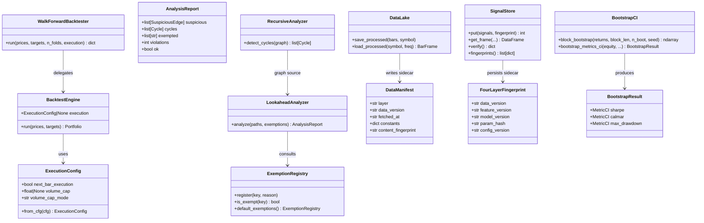
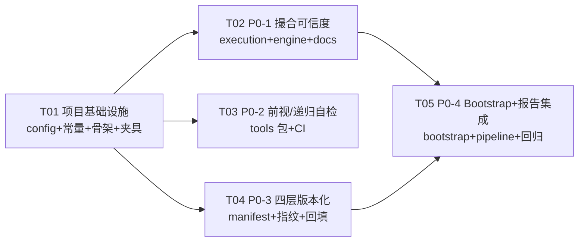

# 增量架构设计：HexBroker P0 四项优化（撮合可信度 / 前视自检 / 四层版本化 / Bootstrap 区间）

- **架构师**：高见远（Gao）· 2026-08-26
- **文档类型**：增量设计（仅设计 + 任务分解，不含实现代码）
- **输入**：`04-p0-prd.md`（产品经理增量 PRD）＋ `02-arch-optimization.md`（上一轮架构调研）＋ `README.md`（三层协作 / 防泄漏红线 / 验收口径）＋ 本地代码走读（backtest/data/forecast/evaluation/tests/pipeline/configs）
- **性质**：在**不触碰双闸门口径、防泄漏红线、315 项测试全绿**的前提下，对 P0 四项做增量改动方案与有序任务分解

---

## 0. TL;DR（一句话 + 关键决策）

**一句话**：四项均为「**新增可选能力 + 默认路径零改动**」的增量改造——新增的开关（`next_bar_execution` / `volume_cap`）、工具（lookahead/recursive CLI）、元数据（manifest / 四层指纹 sidecar）、统计（block bootstrap CI）全部**默认关闭或不参与生产口径**，既有代码路径在默认配置下数值完全不变（<1e-12），SignalStore OOS 物理隔离与双闸门判定逻辑原样保留。

**关键决策**：

| 编号 | 决策 | 依据 |
|---|---|---|
| D1 | `next_bar_execution` 成交价取**下一 bar 开盘价 ± 滑点**（freqtrade 默认 next bar open） | 待确认 Q1 裁决；开盘价是 bar 内首个可成交参考，规避"收盘价决定收盘价成交"的自指循环；Q4-4 详述 |
| D2 | 双口径对照**默认输出**进生产报告（pipeline JSON/MD 新增章节，只增不改） | 待确认 Q2 裁决；旧消费方按既有 key 读取不受影响 |
| D3 | 四层指纹存储统一用 **sidecar manifest（JSON）**，不改 Parquet schema | 待确认 Q3 裁决；Parquet 补列需历史向后兼容、且 SignalStore 文件被 RL env/baseline/pipeline 多处读取，schema 变更风险面大 |
| D4 | `volume_cap` 超量默认**部分成交**（按比例），剩余丢弃不追单；支持 `reject` 整单拒绝 | 待确认 Q4 裁决；语义简单、可刻画流动性影响 |
| D5 | block bootstrap 默认 `block_len=20, n_boot=1000, seed=cfg.seed, by_symbol=False` | 待确认 Q5 裁决；组合口径与双闸门一致，截面 CI 作研究辅助 |
| D6 | `pipeline.py` 的报告接入统一收敛到 T05，避免多任务并发修改同一文件 | 任务分解冲突规避；T02/T04 只产出数据函数，T05 统一接线 |

---

## Part A：系统设计

## 1. 实现方案（Implementation Approach）

### 1.1 总体原则

1. **最小变更（minimal change）**：优先修改现有模块的**新增可选参数**，不重写既有逻辑；新增能力全部由 `hexbroker/backtest/execution.py`、`hexbroker/tools/`、`hexbroker/data/manifest.py`、`hexbroker/evaluation/bootstrap.py` 四个新模块承载。
2. **默认零变化（default no-op）**：所有新配置默认值必须使现有代码路径在**数值上**完全等价（`<1e-12`），用回归测试兜底（`tests/test_default_behavior_unchanged.py`）。
3. **只读不污染（read-only）**：P0-2 工具只做静态分析、不改生产代码；P0-3 只在写入时附加元数据，不改变信号/数据语义。
4. **不引入新重依赖**：纯 Python（numpy/pandas/标准库 ast/JSON），pyproject 依赖零新增；mlflow/pyqlib 保持 optional。

### 1.2 P0-1 撮合可信度加固（修改 backtest 撮合层 + 新增文档）

**现状（代码佐证）**：
- `BacktestEngine.run`（`engine.py`）逐 bar 用 `close` 作 marks 同 bar 成交；P8 涨跌停拦截（`limit_trade_allowed=False` 默认）。
- `SimBroker.execute`（`broker.py`）以调用方传入的 `ref_price` 记账；`CostModel.trade_cost` 加固定 `slippage_ticks=1.0`。
- `prices` 含 `volume` 列（`pipeline._prices_df` 保留），但引擎未使用。
- RL `FuturesTradingEnv` 也用 `SimBroker.execute`，其 `target_frame` 重放给引擎的一致性测试依赖默认口径——**只要默认值不变，一致性不受影响**。

**改动方案**：
- 新增 `hexbroker/backtest/execution.py`：`ExecutionConfig`（撮合假设开关的单一载体）+ `next_bar_ref_price()` + `cap_order_qty()` + `run_dual_caliber()`。
- 修改 `BacktestEngine.__init__`：接受可选 `execution: ExecutionConfig | None`；`None` 时从 `cfg.backtest` 读取（`next_bar_execution` / `volume_cap` / `volume_cap_mode`）。**默认 `False/None/"partial"` 时走与原代码完全相同的分支**。
- `engine.run` 内部新增两个条件分支（仅在开关开启时进入）：
  - `next_bar_execution=True`：成交参考价取下一 bar `open`（预计算 per-symbol `open.shift(-1)`），无下一 bar 时跳过成交；滑点照旧叠加。
  - `volume_cap` 非 None：目标调整量 `delta = target - current` 受 `bar_volume × cap` 约束；`partial` 按比例成交、`reject` 整单拒绝（delta 置 0）；`prices` 缺 `volume` 列且开关开启时 fail-fast 报错。
- 修改 `WalkForwardBacktester.run`：透传可选 `execution` 参数。
- 新增 `docs/matching-assumptions.md`：≥14 条撮合假设，每条含【内容 / 默认值 / 影响方向（乐观·保守·中性）/ 对应代码位置】，并有**程序化结构检查测试**（`tests/test_matching_assumptions.py`，按 PRD A1.1）。
- 双口径对照数据函数放 `execution.py::run_dual_caliber`，**报告接入由 T05 统一做**（不并发改 pipeline.py）。

### 1.3 P0-2 前视/递归依赖自检工具（新增 tools 包，静态分析）

**现状**：训练/信号层防泄漏极强（SignalStore OOS 物理隔离 + `assert_no_leakage`），但特征/策略代码本身的 lookahead/recursive 依赖无工程化检测工具。

**改动方案**：
- 新增 `hexbroker/tools/` 包，4 个模块：
  - `dag.py`：基于 Python `ast` 的源码依赖图构建（节点=特征/信号列或函数，边=数据依赖）+ `SuspiciousEdge`/`Cycle` 数据结构。
  - `lookahead_analysis.py`：危险模式检测（同 bar 未来函数）：`shift(-n)`、`rolling(..., center=True)`、`ewm(...)` 时序错位、`asof` 前缺 `reindex`、直接索引未来行（`iloc[i+1]`）、`np.roll` 等；输出 DAG + 可疑边 + 证据（文件/行号/模式）。
  - `recursive_analysis.py`：在特征列依赖图上做环检测（A→B→A、特征依赖自身未来值）。
  - `exemptions.py`：`ExemptionRegistry` 白名单/豁免注册表——对已知安全模式（rolling/expanding z-score、外盘 `reindex→asof`、跨品种锁列）显式豁免，满足「0 个未豁免误报」。
- CLI 入口：`python -m hexbroker.tools.lookahead_analysis [paths...]`、`python -m hexbroker.tools.recursive_analysis [paths...]`；发现未豁免缺陷 → 非零退出（CI 可拦截）。
- 接入 `.github/workflows/ci.yml`：pytest 后加一步静态自检。
- 测试：`tests/test_lookahead_analysis.py`（注入缺陷样本，检出率 100%）、`tests/test_recursive_analysis.py`（A→B→A 回环检出）；缺陷样本夹具生成器放 `tests/_helpers.py`（T01 扩展）。
- **验收口径的关键工程化折衷**：静态分析无法同时数学保证「100% 检出 + 0 误报」。设计上以「**注入样本 100% 检出**（有监督夹具）+ **现有代码任何检出均可显式豁免**（白名单由 QA 审查豁免理由）」满足 PRD A2.1/A2.2，这是 freqtrade 同款务实做法。

### 1.4 P0-3 数据-信号-模型四层版本化（新增元数据层 + sidecar）

**现状（代码佐证）**：
- `DataLake`（`store.py`）raw/interim/processed 三层 Parquet，无 manifest；`RAW_SCALE_FIX` 等口径常量靠手工文档。
- `SignalStore`（`signal_store.py`）已按 `(model_id, train_end)` 半版本化分片；`ForecastSignal.to_record()` 无版本字段。
- `utils/fingerprint.py` 已有 `model_id = sha1(config+data_range+git_sha)[:12]`；`config_fingerprint` 已有 sha1 前 12 位。
- 四层映射：**Data**（DataLake manifest）→ **Feature-Signal**（`FeaturePipeline` 配置序列化指纹 + SignalStore 分片）→ **Model**（`model_id/train_end` + 模型配置指纹）→ **Parameter**（模型 `_params` 哈希）。

**改动方案**：
- 新增 `hexbroker/data/manifest.py`：`DataManifest` dataclass + `write_manifest/read_manifest/content_fingerprint/backfill_manifests`。manifest 为 sidecar JSON：`data/{layer}/{symbol}/{freq}/manifest.json`，含数据版本、拉取时间、来源、口径常量（`RAW_SCALE_FIX`、`adjust_method`、`main_rule`）、内容指纹、行数、日期范围。
- 修改 `DataLake.save_processed`：写 parquet 后自动写/更新 manifest（仅当有新数据写入时；读路径零改动）。
- 修改 `hexbroker/utils/fingerprint.py`：新增 `FourLayerFingerprint` dataclass + `compute_four_layer()` 等函数。
- 修改 `SignalStore.put`：新增可选参数 `fingerprint: FourLayerFingerprint | dict | None = None`，写入 `{root}/{model_id}/{train_end}.manifest.json`；**Parquet schema 不变**。同分片指纹不一致 → 告警（可配置拒绝）。
- 新增 `SignalStore.verify()` / `SignalStore.fingerprints()`：读取侧显式校验/列出四层指纹（PRD A3.2「读取可校验」；默认不侵入现有 `get_frame` 消费方）。
- 修改 `ForecastTrainer.run`：透传/计算 fingerprint（由 pipeline 计算后传入，trainer 保持无模型依赖的纯容器语义——指纹计算在 utils，不引入模型）。
- 新增 `scripts/backfill_manifests.py`：存量数据一键回填（PRD A3.1 迁移脚本）。
- 报告指纹块数据函数放 `fingerprint.py::four_layer_report_block()`，**pipeline 接入由 T05 统一做**。

### 1.5 P0-4 Bootstrap 绩效区间（新增 evaluation 统计层）

**现状**：`evaluation/stats.py` 只有 DSR/PBO 点估计；pipeline `_pbo/_dsr` 用于闸门 2；`compute_metrics` 输出 Sharpe/Calmar/MaxDD 点估计。

**改动方案**：
- 新增 `hexbroker/evaluation/bootstrap.py`：
  - `block_bootstrap(returns, block_len, n_boot, seed)`：循环块重采样（circular block bootstrap），numpy 向量化。
  - `bootstrap_metrics_ci(equity, freq, block_len, n_boot, seed, by_symbol)`：对重采样序列重算 Sharpe / Calmar / MaxDD，输出 2.5%–97.5% 分位 CI。
  - `BootstrapResult` / `MetricCI` dataclass：`point + ci_low + ci_high + 参数快照`（seed 入参保证可复现）。
- 修改 `hexbroker/evaluation/__init__.py`：导出。
- 修改 `hexbroker/config.py`：`BacktestConfig` 下新增 `bootstrap: BootstrapConfig`（`block_len=20, n_boot=1000, seed=None→cfg.seed, by_symbol=False`）——集中放 backtest 段避免顶层配置结构变化。
- 报告块数据函数放 `bootstrap.py::bootstrap_report_block()`，pipeline 接入由 T05 统一做；**DSR/PBO 计算逻辑零改动**（只读复用）。

### 1.6 架构模式

- **分层**：撮合层（backtest）→ 元数据层（manifest/fingerprint）→ 统计层（bootstrap）→ 工具层（tools 静态分析）→ 报告层（pipeline，T05 统一接线）。
- **配置驱动**：所有新开关进 `BacktestConfig`（OmegaConf/Pydantic），代码零魔法数字。
- **策略模式（新增能力而非改写）**：`ExecutionConfig` 作为撮合假设的显式策略对象，默认值与生产基线一致。
- **Sidecar 模式（P0-3）**：元数据与数据本体解耦，向后兼容零成本。

---

## 2. 文件列表（File List）

### 2.1 新增文件

```
hexbroker/backtest/execution.py            # P0-1 ExecutionConfig + next_bar/volume_cap 语义 + run_dual_caliber
hexbroker/tools/__init__.py                # P0-2 包骨架（T01 建）
hexbroker/tools/dag.py                     # P0-2 AST 依赖图 + SuspiciousEdge/Cycle
hexbroker/tools/lookahead_analysis.py      # P0-2 lookahead CLI（main 返回退出码）
hexbroker/tools/recursive_analysis.py      # P0-2 recursive CLI（环检测）
hexbroker/tools/exemptions.py              # P0-2 白名单/豁免注册表 + 默认豁免
hexbroker/data/manifest.py                 # P0-3 DataManifest + write/read/content_fingerprint/backfill
hexbroker/evaluation/bootstrap.py          # P0-4 block bootstrap + MetricCI/BootstrapResult
docs/matching-assumptions.md               # P0-1 撮合假设文档（≥14 条，结构化）
scripts/backfill_manifests.py              # P0-3 存量数据 manifest 回填迁移脚本
tests/test_execution_caliber.py            # P0-1 同bar vs next_bar / volume_cap 语义 / 默认零变化
tests/test_matching_assumptions.py         # P0-1 文档结构检查（≥14 条）
tests/test_lookahead_analysis.py           # P0-2 注入缺陷样本检出率 100% + 现有代码 0 误报
tests/test_recursive_analysis.py           # P0-2 A→B→A 回环检出
tests/test_data_manifest.py                # P0-3 manifest 生成/回填/一致性
tests/test_signal_fingerprint.py           # P0-3 四层指纹可复现 + 敏感性
tests/test_bootstrap.py                    # P0-4 MC 覆盖率 / 可复现 / 性能
tests/test_report_integration.py           # T05 报告含双口径/指纹/CI 块
tests/test_default_behavior_unchanged.py   # T05 红线：默认配置绩效 <1e-12 不变
```

### 2.2 修改文件

```
hexbroker/config.py                        # T01 BacktestConfig 新增 next_bar_execution/volume_cap/volume_cap_mode + bootstrap 段
configs/base.yaml                          # T01 显式声明默认关闭（文档化）
hexbroker/constants.py                     # T01 撮合/指纹/自检常量
tests/_helpers.py                          # T01 缺陷样本夹具生成器 + 快速配置助手
hexbroker/backtest/engine.py               # T02 接入 ExecutionConfig（默认路径零改动）
hexbroker/backtest/walkforward.py          # T02 透传 execution 参数
hexbroker/data/store.py                    # T04 save_processed 自动写 manifest
hexbroker/utils/fingerprint.py             # T04 四层指纹计算函数
hexbroker/forecast/signal_store.py         # T04 put 带 fingerprint sidecar + verify/fingerprints
hexbroker/forecast/trainer.py              # T04 透传 fingerprint
hexbroker/evaluation/__init__.py           # T05 导出 bootstrap
hexbroker/pipeline.py                      # T05 统一接入三块报告 + _render_markdown 新增章节
.github/workflows/ci.yml                   # T03 接入 lookahead/recursive CLI
```

**不修改**（红线确认）：`hexbroker/backtest/broker.py`（SimBroker 记账逻辑零改动，仅由引擎传不同 ref_price/qty）、`hexbroker/backtest/cost.py`（CostModel 纯函数不动）、`hexbroker/forecast/base.py`（ForecastSignal schema 不动）、`hexbroker/rl/futures_env.py`（RL 环境不动）、`hexbroker/evaluation/stats.py`（DSR/PBO 不动）、`hexbroker/evaluation/metrics.py`（compute_metrics 不动）。

---

## 3. 接口设计（Data Structures & Interfaces）

### 3.1 P0-1 撮合层

```python
# hexbroker/backtest/execution.py
from dataclasses import dataclass
from typing import Any

@dataclass(frozen=True)
class ExecutionConfig:
    """撮合假设开关（默认值 = 生产基线口径，零变化）。"""
    next_bar_execution: bool = False          # False：同 bar close 成交；True：下一 bar open 成交
    volume_cap: float | None = None           # None：无成交量约束；否则下单量 ≤ bar.volume × cap
    volume_cap_mode: str = "partial"          # "partial"：按比例部分成交；"reject"：整单拒绝

    @classmethod
    def from_cfg(cls, cfg: Any) -> "ExecutionConfig":
        bt = getattr(cfg, "backtest", None)
        return cls(
            next_bar_execution=bool(getattr(bt, "next_bar_execution", False)),
            volume_cap=getattr(bt, "volume_cap", None),
            volume_cap_mode=str(getattr(bt, "volume_cap_mode", "partial")),
        )

def next_bar_ref_price(open_series: "pd.Series", ts: Any) -> float | None:
    """返回 ts 下一根 bar 的 open；无下一根返回 None（调用方跳过成交）。"""

def cap_order_qty(target_qty: float, current_qty: float, bar_volume: float,
                  cap: float, mode: str = "partial") -> float:
    """按 volume_cap 约束目标仓位。
    - partial：delta = target-current 截断到 ±(bar_volume×cap)（按比例部分成交）；
    - reject ：超量时返回 current_qty（整单拒绝，delta=0）。
    """

def run_dual_caliber(prices: "pd.DataFrame", targets: "pd.DataFrame", cfg: Any,
                     metrics=("sharpe", "calmar", "max_drawdown", "win_rate")) -> dict:
    """同 bar vs next_bar 双口径绩效对照。返回：
    {"same_bar": {...}, "next_bar": {...}, "delta_pct": {...},
     "note": "信号方向准确率为信号层指标，不受撮合口径影响（Δ%=0 预期）"}
    """
```

```python
# hexbroker/backtest/engine.py（修改）
class BacktestEngine:
    def __init__(self, cfg: Any, cost: Any = None, initial_capital: float | None = None,
                 execution: ExecutionConfig | None = None) -> None:
        # execution=None → ExecutionConfig.from_cfg(cfg)；默认配置下与原代码逐语句等价
```

### 3.2 P0-2 自检工具

```python
# hexbroker/tools/dag.py
from dataclasses import dataclass, field

@dataclass
class SuspiciousEdge:
    source: str; target: str; pattern: str; file: str; line: int; evidence: str

@dataclass
class Cycle:
    nodes: list[str]; file: str; evidence: str

@dataclass
class AnalysisReport:
    files: list[str]
    nodes: int; edges: int
    suspicious: list[SuspiciousEdge] = field(default_factory=list)
    cycles: list[Cycle] = field(default_factory=list)
    exempted: list[str] = field(default_factory=list)   # 已豁免检出（供审计）
    @property
    def violations(self) -> int: return len(self.suspicious) + len(self.cycles)
    @property
    def ok(self) -> bool: return self.violations == 0

def build_dependency_graph(sources: list[str]) -> dict[str, set[str]]:
    """AST 解析源码，返回 列/函数 依赖邻接表 {node: set[deps]}。"""

def find_suspicious_edges(graph: dict[str, set[str]], ast_info: dict) -> list[SuspiciousEdge]:
    """匹配危险原语：shift(-n) / rolling(center=True) / ewm 错位 / asof 无 reindex /
    iloc[i+k] / np.roll 等。"""
```

```python
# hexbroker/tools/lookahead_analysis.py
def analyze(paths: list[str], exemptions: "ExemptionRegistry | None" = None) -> AnalysisReport:
    """对路径集合做 lookahead 静态分析。"""
def main(argv: list[str] | None = None) -> int:
    """python -m hexbroker.tools.lookahead_analysis [paths...] [--exemptions x.yaml]
    发现未豁免缺陷 → 返回非零（CI 拦截）。"""

# hexbroker/tools/recursive_analysis.py
def detect_cycles(graph: dict[str, set[str]]) -> list[Cycle]:
    """DFS 找有向环；A→B→A 与自依赖均检出。"""
def main(argv: list[str] | None = None) -> int: ...

# hexbroker/tools/exemptions.py
class ExemptionRegistry:
    def __init__(self) -> None: ...
    def register(self, key: str, reason: str) -> None: ...
    def is_exempt(self, key: str) -> bool: ...
    def load_yaml(self, path: str) -> None: ...
    def default_exemptions(self) -> "ExemptionRegistry":
        """内置已知安全模式：rolling/expanding z-score、外盘 reindex→asof、
        跨品种锁列（cross.py/global_ref.py/normalize.py 白名单键）。"""
```

### 3.3 P0-3 四层版本化

```python
# hexbroker/data/manifest.py
from dataclasses import dataclass, field

@dataclass
class DataManifest:
    layer: str                      # raw | interim | processed
    symbol: str
    freq: str
    data_version: str               # 语义版本（v1/v2...，回填脚本可赋 "backfill-<ts>"）
    fetched_at: str                 # ISO 8601 UTC
    source: str
    constants: dict = field(default_factory=dict)   # RAW_SCALE_FIX / adjust_method / main_rule ...
    content_fingerprint: str        # sha1(规范化内容) 前 12 位
    n_rows: int = 0
    date_range: tuple[str, str] = ("", "")

def content_fingerprint(df: "pd.DataFrame") -> str: ...
def write_manifest(m: DataManifest, root: "Path") -> "Path":
    """写 data/{layer}/{symbol}/{freq}/manifest.json（原子写）。"""
def read_manifest(root: "Path", layer: str, symbol: str, freq: str) -> DataManifest | None: ...
def backfill_manifests(root: "Path", cfg: Any) -> int:
    """对存量 parquet 分区回填 manifest；返回回填数。"""
```

```python
# hexbroker/utils/fingerprint.py（新增函数，复用现有 model_id/config_fingerprint 约定）
from dataclasses import dataclass

@dataclass(frozen=True)
class FourLayerFingerprint:
    data_version: str      # 数据层：DataLake manifest data_version + 内容指纹
    feature_version: str   # 特征层：sha1(feature.model_dump()) 前 12 位
    model_version: str     # 模型层：model_id + train_end + 模型配置哈希
    param_hash: str        # 参数层：sha1(sorted(model._params)) 前 12 位
    config_version: str    # 配置层：config_fingerprint(cfg)

    def to_dict(self) -> dict: ...
    def __eq__(self, other) -> bool: ...   # 结构相等（可复现性/敏感性测试用）

def compute_four_layer(cfg: Any, barframe: Any, model_id: str,
                       train_end: Any, params: dict) -> FourLayerFingerprint: ...

def four_layer_report_block(fp: FourLayerFingerprint) -> dict:
    """报告用四层指纹块（T05 接入 pipeline）。"""
```

```python
# hexbroker/forecast/signal_store.py（修改，签名向后兼容）
class SignalStore:
    def put(self, signals: "Iterable[ForecastSignal]",
            fingerprint: "FourLayerFingerprint | dict | None" = None) -> int:
        """原有 OOS 过滤/落盘逻辑不变；fingerprint 非 None 时写 sidecar：
        {root}/{model_id}/{train_end}.manifest.json；同分片指纹不一致 → warnings.warn
        （cfg 可配 raise）。"""

    def verify(self, model_id: str | None = None) -> dict:
        """读取侧校验：返回 {checked, mismatched: [...], missing: [...]}。"""

    def fingerprints(self, model_id: str | None = None) -> list[dict]:
        """列出所有分片四层指纹（含 model_id/train_end）。"""
```

### 3.4 P0-4 Bootstrap

```python
# hexbroker/evaluation/bootstrap.py
from dataclasses import dataclass

def block_bootstrap(returns: "np.ndarray", block_len: int = 20,
                    n_boot: int = 1000, seed: int = 42) -> "np.ndarray":
    """circular block bootstrap：返回 (n_boot, n) 重采样收益矩阵。"""

@dataclass
class MetricCI:
    point: float; ci_low: float; ci_high: float
    n_boot: int; block_len: int; seed: int
    def to_dict(self) -> dict: ...

@dataclass
class BootstrapResult:
    sharpe: MetricCI
    calmar: MetricCI
    max_drawdown: MetricCI
    by_symbol: dict | None = None      # by_symbol=True 时 {symbol: {metric: MetricCI}}
    def to_dict(self) -> dict: ...

def bootstrap_metrics_ci(equity: "pd.Series", *, freq: str = "1d",
                         block_len: int = 20, n_boot: int = 1000,
                         seed: int = 42, by_symbol: bool = False) -> BootstrapResult:
    """对权益曲线收益序列做 block bootstrap，输出 Sharpe/Calmar/MaxDD 的
    2.5%–97.5% 分位 CI。固定 seed 结果完全一致。"""

def bootstrap_report_block(res: BootstrapResult) -> dict:
    """报告用块：{metric: {point, ci_low, ci_high}, params: {...}}（T05 接入 pipeline）。"""
```

### 3.5 类图（classDiagram）



### 3.6 关键调用时序（sequenceDiagram）

```mermaid
sequenceDiagram
    participant P as pipeline (T05)
    participant E as BacktestEngine
    participant EX as ExecutionConfig
    participant B as SimBroker
    participant M as DataLake/Manifest
    participant S as SignalStore
    participant BT as evaluation/bootstrap

    Note over P,E: P0-1 双口径对照
    P->>E: BacktestEngine(cfg, execution=ExecutionConfig.from_cfg(cfg))
    E->>EX: next_bar_execution? volume_cap?
    E->>B: execute(symbol, capped_qty, ref_price, ts)
    B-->>E: Trade
    E-->>P: Portfolio
    P->>E: 重跑 next_bar 口径（execution 覆盖）
    E-->>P: Portfolio
    P-->>P: run_dual_caliber → 双口径块 + Δ%

    Note over P,M,S: P0-3 四层指纹
    P->>M: save_processed → write_manifest(sidecar JSON)
    P->>S: put(signals, fingerprint=compute_four_layer(...))
    S-->>P: n_oos
    P->>S: verify() / fingerprints()
    S-->>P: 一致性校验结果

    Note over P,BT: P0-4 Bootstrap
    P->>BT: bootstrap_metrics_ci(equity, block_len=20, n_boot=1000, seed)
    BT-->>P: BootstrapResult(Sharpe/Calmar/MaxDD CI)
    P-->>P: summary["bootstrap"] + _render_markdown 章节
```

---

## 4. 对 PRD 待确认问题的裁决建议（Q1–Q5）

| # | 问题 | 架构师裁决建议 | 理由 |
|---|---|---|---|
| Q1 | `next_bar_execution` 成交价：下一 bar 开盘 vs 收盘 | **下一 bar 开盘价 ± 滑点**（对齐 freqtrade 默认 next bar open） | ① 开盘价是 bar 内第一个可成交参考，天然规避「用收盘价决定以收盘价成交」的自指循环；② 收盘口径会把决策延迟放大一整根 bar，偏差被高估；③ 与 P8 涨跌停拦截（open 是否涨停可在 bar 级判断）兼容。默认 `next_bar_execution=False` 不变 |
| Q2 | 双口径对照输出位置 | **默认输出**进生产报告（pipeline JSON/MD 新增 `dual_caliber` 章节），提供 `--no-dual-caliber` 关闭开关 | ① 只增不改：既有 key（baselines/gates/rl）原样保留，旧消费方不受影响；② KPI 要求「报告自动输出」，默认开启才可审计；③ 研究期也可临时关闭省时 |
| Q3 | 四层指纹存储：Parquet 补列 vs sidecar | **sidecar manifest（JSON）**，不改 Parquet schema | ① Parquet 补列属 schema 变更：历史文件无四列，读取需 fillna 兼容、RL env/baseline/pipeline 多处消费风险面大；② sidecar 与数据本体解耦、零向后兼容成本、天然支持「写入时附加元数据」；③ DataLake 与 SignalStore 统一 sidecar 约定，语义一致 |
| Q4 | `volume_cap` 超量语义与默认阈值 | **部分成交（partial，按比例）**，剩余丢弃不追单；默认 `volume_cap=None`（不启用）；启用默认值 **0.05（5%）**，支持 per-symbol 覆盖 | ① partial 更贴近真实流动性约束且能量化影响；reject 语义太强（18 品种日频下易整日空仓）；② 单 bar 不追单避免「跨 bar 连锁成交」破坏可解释性；③ 默认 None 保证生产基线零变化；5% 是日频期货流动性经验起点，文档标注品种差异风险 |
| Q5 | bootstrap 参数默认值 + 是否按品种分组 | `block_len=20, n_boot=1000, seed=cfg.seed, by_symbol=False`（可配） | ① block=20 与日频月度自相关尺度匹配（PyBroker 同款量级）；② 1000 次 numpy 向量化在 18 品种日频组合口径 <60s（A4.4）；③ 双闸门是**组合口径**，默认不分组；`by_symbol=True` 输出截面 CI 作研究辅助 |

---

## Part B：任务分解

## 5. 任务分解（有序任务列表）

> 硬性约束：**≤5 个任务**、每任务 ≥3 个文件、按功能模块分组、T01 为基础设施；尽量「仅依赖 T01」并行。

### T01 项目基础设施（P0 公共底座）

- **Task Name**：P0 公共底座——配置扩展 + 常量 + 包骨架 + 测试夹具
- **Source Files**：
  - `hexbroker/config.py`（修改：`BacktestConfig` 新增 `next_bar_execution/volume_cap/volume_cap_mode`；新增 `bootstrap: BootstrapConfig` 段）
  - `configs/base.yaml`（修改：显式声明 `next_bar_execution: false` / `volume_cap: null` / `volume_cap_mode: partial` / `bootstrap` 默认值）
  - `hexbroker/constants.py`（修改：`EXECUTION_DEFAULTS` / `BOOTSTRAP_DEFAULTS` / 指纹常量命名）
  - `hexbroker/tools/__init__.py`（新增：P0-2 包骨架）
  - `tests/_helpers.py`（修改：缺陷样本夹具生成器 `make_leaky_features()` / `make_recursive_features()`）
- **Dependencies**：无
- **Priority**：P0
- **预计改动量**：小（约 150 行）
- **验收**：`load_config()` 默认含新字段且与旧默认值语义一致；`pytest tests/test_config.py` 全绿

### T02 P0-1 撮合可信度加固（依赖 T01）

- **Task Name**：撮合假设开关 + 双口径能力 + 假设文档
- **Source Files**：
  - `hexbroker/backtest/execution.py`（新增：ExecutionConfig / next_bar_ref_price / cap_order_qty / run_dual_caliber）
  - `hexbroker/backtest/engine.py`（修改：接入 ExecutionConfig，默认路径零改动）
  - `hexbroker/backtest/walkforward.py`（修改：透传 execution）
  - `docs/matching-assumptions.md`（新增：≥14 条撮合假设，每条含默认值与影响方向）
  - `tests/test_execution_caliber.py`（新增：同 bar vs next_bar 对照、volume_cap partial/reject、默认行为 <1e-12）
  - `tests/test_matching_assumptions.py`（新增：文档结构检查 ≥14 条）
- **Dependencies**：T01
- **Priority**：P0
- **预计改动量**：中（约 400 行 + 文档）
- **验收**：A1.1–A1.5（默认配置绩效与改动前数值完全一致；开关可用；不碰 SignalStore/OOS 逻辑）

### T03 P0-2 前视/递归自检工具（依赖 T01）

- **Task Name**：lookahead/recursive 静态分析 CLI + CI 接入
- **Source Files**：
  - `hexbroker/tools/dag.py`（新增）
  - `hexbroker/tools/lookahead_analysis.py`（新增 + CLI）
  - `hexbroker/tools/recursive_analysis.py`（新增 + CLI）
  - `hexbroker/tools/exemptions.py`（新增：白名单 + 默认豁免）
  - `.github/workflows/ci.yml`（修改：pytest 后接入 CLI 自检步骤）
  - `tests/test_lookahead_analysis.py`（新增：注入样本检出率 100% + 现有代码 0 未豁免误报）
  - `tests/test_recursive_analysis.py`（新增：A→B→A 回环检出）
- **Dependencies**：T01
- **Priority**：P0
- **预计改动量**：中大（约 700 行，AST 分析为主）
- **验收**：A2.1–A2.5（CLI 可用、检出率/豁免口径满足、只读不污染）

### T04 P0-3 四层版本化（依赖 T01）

- **Task Name**：DataLake manifest + SignalStore 四层指纹 sidecar + 回填
- **Source Files**：
  - `hexbroker/data/manifest.py`（新增）
  - `hexbroker/data/store.py`（修改：save_processed 自动写 manifest）
  - `hexbroker/utils/fingerprint.py`（修改：FourLayerFingerprint + compute_four_layer）
  - `hexbroker/forecast/signal_store.py`（修改：put 带 fingerprint sidecar + verify/fingerprints）
  - `hexbroker/forecast/trainer.py`（修改：透传 fingerprint）
  - `scripts/backfill_manifests.py`（新增：存量回填迁移）
  - `tests/test_data_manifest.py`（新增：生成/回填/一致性）
  - `tests/test_signal_fingerprint.py`（新增：可复现 + 敏感性）
- **Dependencies**：T01
- **Priority**：P0
- **预计改动量**：中大（约 600 行）
- **验收**：A3.1–A3.5（自动 manifest、四层指纹记录、同配置一致、改配置必变、信号语义零改动）

### T05 P0-4 Bootstrap + 报告集成 + 全量回归（依赖 T01；报告接入依赖 T02/T04）

- **Task Name**：Bootstrap 区间 + pipeline 报告统一接入 + 红线回归
- **Source Files**：
  - `hexbroker/evaluation/bootstrap.py`（新增：block bootstrap + CI）
  - `hexbroker/evaluation/__init__.py`（修改：导出）
  - `hexbroker/pipeline.py`（修改：统一接入 `dual_caliber` / `fingerprints` / `bootstrap` 三块 + `_render_markdown` 新增章节；DSR/PBO 逻辑零改动）
  - `tests/test_bootstrap.py`（新增：MC 覆盖率 ∈[0.90,1.00]、固定 seed 可复现、<60s 性能）
  - `tests/test_report_integration.py`（新增：报告含三块且旧 key 不变）
  - `tests/test_default_behavior_unchanged.py`（新增：默认配置绩效与改动前 <1e-12 兜底红线）
- **Dependencies**：T01（bootstrap 本体）；T02/T04（报告接入产物）
- **Priority**：P0
- **预计改动量**：中（约 500 行）
- **验收**：A4.1–A4.5 + 全量 `pytest -q` 全绿（>315 项）

### 任务依赖图（graph）



> 说明：T02/T03/T04 三项互不阻塞可并行；T05 的 bootstrap 本体仅依赖 T01（可提前开工），报告接入部分等 T02/T04 产出数据函数后接线。

---

## 6. 共享知识（Shared Knowledge）

- **默认值（全项目唯一事实源，进 config 与 constants）**：
  - `next_bar_execution=False`、`volume_cap=None`、`volume_cap_mode="partial"`
  - `bootstrap.block_len=20`、`bootstrap.n_boot=1000`、`bootstrap.seed=None→cfg.seed`、`bootstrap.by_symbol=False`
  - `volume_cap` 启用默认比例 0.05（5%），支持 `dict[symbol, ratio]` 覆盖
- **报告 JSON 新增 key 命名**：`summary["dual_caliber"]`、`summary["fingerprints"]`、`summary["bootstrap"]`；`_render_markdown` 新增对应章节，**既有 key 与章节一律不动**
- **指纹约定**：一律 `sha1(规范化JSON)[:12]`（与 `config_fingerprint` / `model_id` 一致）；四层结构 `FourLayerFingerprint(data_version, feature_version, model_version, param_hash, config_version)`；相等判定为结构相等
- **Sidecar 路径约定**：
  - DataLake：`data/{layer}/{symbol}/{freq}/manifest.json`
  - SignalStore：`{root}/{model_id}/{train_end}.manifest.json`（`train_end` 用 `_ts_file` 同款 `%Y%m%dT%H%M%S`）
- **测试目录约定**：`tests/test_*.py` 平铺；共享夹具在 `tests/_helpers.py`（新增缺陷样本生成器）；新测试前缀 `test_p0_*`；CLI 测试用 `subprocess`/`capsys` 校验退出码
- **红线复述**：SignalStore 只落 OOS、RL 环境只读、L1–L9 防泄漏机制、双闸门判定逻辑与判定结果、DSR/PBO 计算逻辑——四项全部零改动
- **命名风格**：撮合假设文档中每条含 `assumption id`（`MA-01`…`MA-14`），对应代码位置写模块/函数名

---

## 7. 风险与兼容（Risk & Compatibility）

### 7.1 对 315 项测试基线的影响评估

| 风险 | 等级 | 缓解 |
|---|---|---|
| `engine.py` 重构引入默认路径回归 | 高 | 默认配置下 `execution=None` 走与原代码**逐语句等价**的分支；`test_default_behavior_unchanged.py` 以 `<1e-12` 兜底；既有 `test_backtest_env_consistency` / `test_engine_limit_trade` / `test_broker_multiplier_pnl` 全部保持原样运行 |
| `config.py` 新增字段破坏 `config_fingerprint` / 配置断言测试 | 中 | 新字段均为默认值，`model_dump` 结构只增不改（`extra="allow"`）；`test_config.py` 全绿作为 T01 验收门槛；指纹变化是**预期行为**（同配置重跑仍一致） |
| `SignalStore.put` 签名变化（新增可选参数） | 中 | 参数默认 `None`，向后兼容；`forecast/trainer.py` 与 `kronos_predictor.py` 现有调用不改也能编译运行；Parquet schema 不变 |
| P0-2「0 误报」无法静态保证 | 高 | 白名单/豁免机制显式兜底：任何检出均可 `register(key, reason)` 豁免，QA 审查豁免理由；注入样本检出率 100% 用有监督夹具保证 |
| P0-4 MC 覆盖率测试耗时 | 低 | 测试用 `n_boot=200`、小样本序列控制运行时间；默认参数性能由独立 `test_bootstrap.py`（<60s）验证 |
| pipeline.py 并发修改冲突 | 中 | 设计上把 pipeline 报告接入**收敛到 T05 单任务**，T02/T04 只产出数据函数（`run_dual_caliber` / `four_layer_report_block` / `bootstrap_report_block`），规避多任务改同一文件 |

### 7.2 默认配置行为零变化的保证机制

1. **分支隔离**：`next_bar_execution` / `volume_cap` 的新逻辑全部位于 `if` 分支内，默认值下分支不进入；`BacktestEngine.__init__` 的 `execution=None` 分支与旧代码路径相同。
2. **红线测试**：`tests/test_default_behavior_unchanged.py` 用固定 seed 跑 demo 全链路（或最小回测），断言默认配置下 Sharpe/Calmar/MaxDD/权益曲线与改动前基线 `<1e-12` 一致。
3. **Schema 不变**：SignalStore/DataLake 的 parquet 本体与 `ForecastSignal` schema 零改动，仅附加 sidecar JSON。
4. **统计只读**：DSR/PBO/`compute_metrics` 计算逻辑零改动；bootstrap 为并列输出，不参与闸门判定。

---

*文档结束。关联输入：`04-p0-prd.md`（需求）｜ `02-arch-optimization.md`（架构调研）｜ 代码走读：`hexbroker/backtest/{engine,broker,cost,walkforward}.py`、`hexbroker/data/{store,schema}.py`、`hexbroker/forecast/{signal_store,base,trainer}.py`、`hexbroker/evaluation/{metrics,stats,report,baseline}.py`、`hexbroker/pipeline.py`、`hexbroker/config.py`、`hexbroker/utils/fingerprint.py`、`hexbroker/feature/pipeline.py`、`tests/_helpers.py`、`.github/workflows/ci.yml`。*
