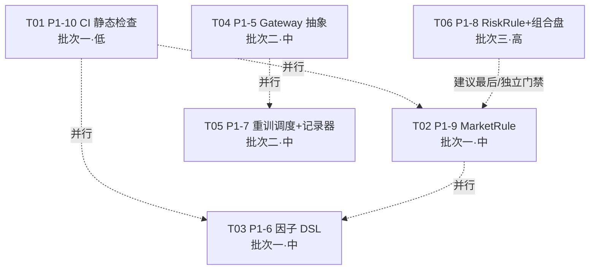
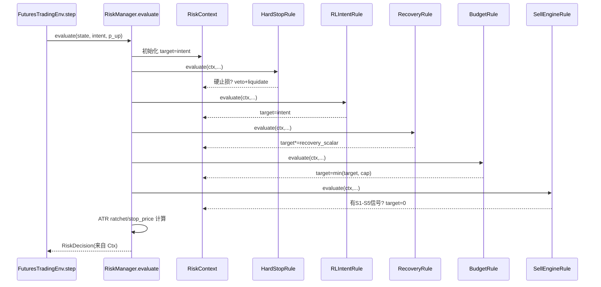
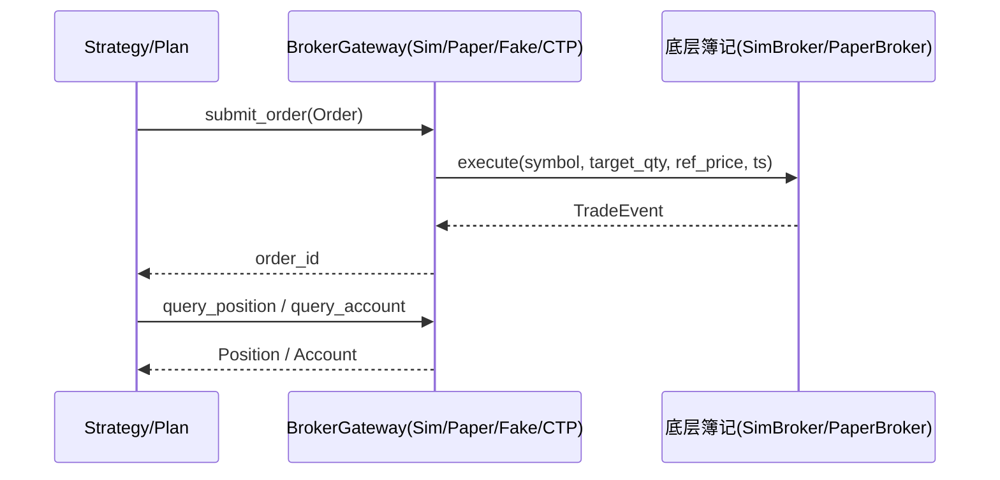
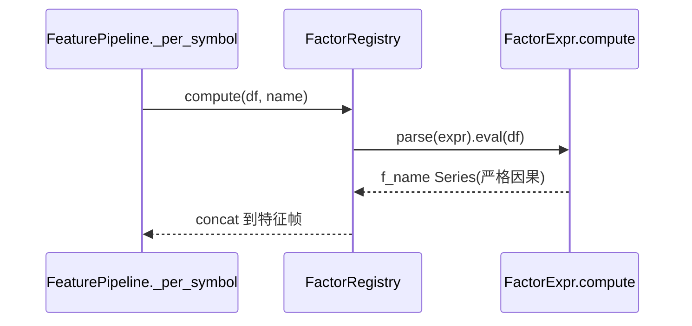

# HexBroker P1 六项优化：增量架构设计 + 任务分解

- **架构师**：高见远（Gao）· 2026-08-26
- **输入**：`09-p1-prd.md`（增量 PRD，P1-5~P1-10）、`02-arch-optimization.md`（架构差距）、`README.md`（红线/验收口径）
- **本地代码走读**：`live/ctp_skeleton.py`、`paper/broker.py`、`risk/manager.py`、`feature/pipeline.py`、`backtest/cost.py`、`backtest/engine.py`、`data/calendar.py`、`forecast/trainer.py`、`utils/fingerprint.py`、`data/manifest.py`、`pyproject.toml`、`.github/workflows/ci.yml`
- **性质**：仅增量设计与任务分解（不含实现代码）；验收与红线以 `09-p1-prd.md` 为准

---

## 0. 设计总原则（最小变更 + 零依赖承诺）

| 原则 | 落地方式 |
|---|---|
| **最小变更** | 六项全部以"新增模块 / 新增薄适配层 / 既有函数包一层"实现；**不重写现有业务逻辑**。P1-8 的 `RiskRule` 直接包裹 `limits/budget/recovery/sell_engine/stoploss` 既有函数，零重算、零口径漂移。 |
| **零依赖承诺** | P1-5 严禁 `import vnpy_ctp`（仅留函数内 `try import` 的 glue 骨架）；P1-6 严禁 `import qlib`（pyqlib 仅 optional，DSL 用自研原语）；P1-7 记录器默认自研轻量、mlflow 仅 optional 后端；P1-9/P1-8/P1-10 不引入任何新运行依赖。 |
| **默认等价** | 每项都提供"默认配置 = 现状统一值/空注册表/空规则表"策略，保证改动后既有 **549 项测试全绿不变**（逐项等价策略见 §8）。 |
| **红线不动** | 双闸门口径、防泄漏（SignalStore 只落 OOS、RL 环境只读、`L1–L9`）、549 全绿——均不在本里程碑内触碰；本设计所有改动均为"只读配置/新增抽象/薄适配"。 |

> **测试基线说明（重要）**：`09-p1-prd.md` §1 明确——P0 交付后基线已由 315 提升至 **549 项全绿**，本设计所有"全绿底线"以 549 为准。当前 `README.md` 与 `02-arch-optimization.md` 仍写 315（写作时口径），属**文档滞后**，建议 P1-10 同步把两处数字更新为 549（见 §7 共享知识 T-doc）。

---

## 1. 实现方案（P1-5 ~ P1-10 各自改动方案）

### P1-5 CTP/SimNow 通道 + Gateway 抽象
- **改动定位**：纯**新增抽象层**（`hexbroker/live/gateway.py`）+ **薄适配层**；`backtest/broker.py`、`paper/broker.py` **零改动**。
- **`BrokerGateway` ABC**：定义 `connect/disconnect/query_position/query_account/submit_order/cancel_order` 抽象契约（vn.py Gateway 插件化模式）。
- **`LiveBroker` Protocol**：`@runtime_checkable` 协议，`execute(symbol, target_qty, ref_price, ts)` 语义与 `SimBroker.execute` / `PaperBroker.execute_plan` 一致——回测-模拟-实盘三级共用同一执行契约。
- **适配实现**：`SimBrokerGateway`（包 `SimBroker`）、`PaperBrokerGateway`（包 `PaperBroker`，内部 translate 为 `execute_plan`）、`FakeBrokerGateway`（内存版，供单测 submit→query→cancel 往返）。三者均为**新增包装类**，不改被包对象的任何代码。
- **`CTPLiveGateway`**：在 `ctp_skeleton.py` 中改为 `class CTPLiveGateway(BrokerGateway)`；**守卫与凭证校验原样保留**（`--i-understand-the-risk` + 环境变量 + AppId/AuthCode）；`_connect_gateway` 由"打印占位"改为**显式抛 `CTPCapabilityPrepOnly` / `NotImplementedError("capability-prep only")`**；模块顶层**绝不 `import vnpy_ctp`**。
- **可选 glue 骨架**：`hexbroker/live/vnpy_ctp_glue.py` 仅声明 `build_vnpy_ctp_gateway()` 函数，函数体内 `try: import vnpy_ctp` 失败即 `raise RuntimeError("vnpy_ctp 未安装，属后续业务授权项")`。模块顶层不 import vnpy_ctp。
- **行情通道**：本次**不做** `MarketDataGateway`（见 §4 裁决 ⑧）；行情源沿用既有 `DataSource`。

### P1-6 因子库资产化 + 表达式 DSL
- **改动定位**：新增 `hexbroker/factor/`（dsl + registry + ic）；`feature/pipeline.py` **仅加一个可选 hook**（传入 `FactorRegistry` 后追加 DSL 列），默认无 registry → 行为不变。
- **DSL**：`factor_expr` 轻量子集（借鉴 qlib `ExpressionEngine`，**自研**），原语复用 `technical.py` 语义：`Ref/Close/Open/High/Low/Volume/Ret/Vol/MA/EMA/Std/RSI/MACD/Abs/Log/Div/Mul/Add/Sub/Min/Max/Rank`。解析为 AST → 对单标的 datetime-indexed DataFrame 求值 → 输出 `f_<name>` 列。
- **注册表**：`FactorRegistry` 支持 yaml/py 配置注册；新增因子经配置进入特征集，**不改 `pipeline.py`**。
- **IC 档案**：`FactorICArchive` 计算滚动 OOS RankIC/IC，缓存到 sidecar（Parquet/JSON），复用 `scripts/feature_symbol_ic.py` 的 RankIC 思路但提升为平台能力。
- **向后兼容**：DSL 因子与 25 硬编码特征并存；`keep_features` 白名单对两者统一裁剪。DSL 不引入未来函数（负 shift / center rolling 在 `validate()` 注册期报错）。

### P1-7 ML/RL 滚动重训调度 + 实验记录
- **改动定位**：新增 `hexbroker/ml/`（schedule + registry + recorder）；**不改 `forecast/trainer.py`**（`RetrainScheduler` 是新编排器，组合调用既有 `ForecastTrainer`）。
- **重训调度**：`RetrainScheduler` 由 `RetrainConfig`（retrain_freq / train_period / backtest_period / train_len / test_len / purge / embargo / mode）驱动滑动窗口自动重训，替代 p23 手工节奏。
- **模型版本管理**：`ModelRegistry` 每轮产出带 `FourLayerFingerprint` 的 artifact，支持 list/load/rollback。
- **实验记录器**：`ExperimentRecorder` ABC + 自研 `JsonRecorder` / `SqliteRecorder`（sidecar）+ 可选 `MlflowRecorder`（函数内 `try import mlflow`）。复用 P0-3 `compute_four_layer` / `FourLayerFingerprint`。
- **依赖门禁**：mlflow 仅 optional extra；未安装自动回落自研记录器，无硬依赖。

### P1-8 风控规则接口化 + 组合/通道级
- **改动定位**：新增 `hexbroker/risk/rules.py`（ABC + 5 个**包裹既有函数**的 concrete rule）+ `hexbroker/risk/combo.py`（组合目标合并层）；`risk/manager.py` **改为驱动规则列表**（默认顺序复刻现状）。
- **`RiskRule` ABC**：`evaluate(ctx, state, intent, p_up, …) -> RiskAdjustment`，`RiskContext` 为跨规则可变决策上下文。
- **迁移策略（增量、每步保绿）**：5 个 concrete rule 各自**直接调用** `limits.hard_stop_triggered` / `sell_engine.detect_sell_signals` / `budget.budget_target` / `recovery.recovery_scalar` / `stoploss`——逻辑不重算。`RiskManager.evaluate` 改为遍历 `self.rules` 填充同一个 `RiskContext`，最终由 `RiskContext` 生成 `RiskDecision`（ATR ratchet/stop_price 仍由 manager 在规则循环后计算，保持现状）。默认 `build_default_rules(cfg)` 顺序 = **复刻 `manager.evaluate` 现状代码路径**：硬止损 → RL意图基线 → 恢复缩放 → 预算封顶 → S1-S5 否决归零（数值与现状一致，由 A8.0 回归测试钉死）。
- **YAML 配置**：`configs/risk_rules.yaml` 列出规则名/参数/顺序；loader 把名字映射到 rule 类（默认 = 内置顺序）。
- **组合/通道级**：`ComboTargetMerger` 合并引擎 A/B 同品种目标（防自成交）+ 单笔下单单量流控（pre-trade cap），复用 `scripts/combo_validation.py` 思路提炼为 `hexbroker/risk/combo.py`。

### P1-9 中国市场规则规则化
- **改动定位**：新增 `hexbroker/market/rule.py`（`MarketRule` dataclass + `MarketRuleTable`）；`backtest/cost.py`、`backtest/engine.py`、`risk/manager.py`（或下单入口）**改为从规则表读**（默认回退现状统一值）；`paper/sessions.py` 复用共享 `Session`。
- **首批三字段**：分品种 `margin_rate` / `limit_up`+`limit_down` / `delivery_rule`（"none" | "no_open" 交割月禁开仓）。交易时段/夜盘**本次不纳入规则表**（paper `TradingSession` 已覆盖，仅提升为系统共享模块）。
- **读取点**：
  - `CostModel`：`from_config` 构造 `MarketRuleTable`；`margin(price, qty, symbol)` 用 `table.margin_rate(symbol)`（缺省 0.12）。
  - `BacktestEngine`：P8 涨跌停拦截读 `table.limit(symbol)`（有覆盖则用规则幅度，否则沿用现状 price 列 `limit_up/limit_down`）。
  - 下单入口（PaperBroker.execute_plan / engine）：`table.allows_open(symbol, ts)` 交割月禁开仓（默认无规则 → 允许，行为不变）。
- **默认等价**：默认表 = 统一 0.12 保证金 / 无幅度覆盖 / 无交割限制 → 与现状数值一致（<1e-12）。

### P1-10 CI 补 ruff/black/mypy
- **改动定位**：仅改 `.github/workflows/ci.yml`（新增 `lint` 并行 job）+ `pyproject.toml`（per-file 豁免 / 增量模块 strict overrides）+ dev extra 补 `ruff/black/mypy`。**不引入运行依赖**。
- **lint job**：与 `test` job 并行（GitHub Actions jobs 默认并行）；跑 `ruff check` + `black --check` + `mypy`。
- **严格度**：`black --check` 宽松（仅格式）；`ruff check` 用已声明配置；`mypy` 渐进 strict——`[[tool.mypy.overrides]]` 对**增量模块**（本次新增的 `live/gateway.py`、`factor/*`、`ml/*`、`risk/rules.py`、`market/*`）开 `--strict`，存量用 `per-file-ignores` / 模块级豁免使首轮 CI 绿。
- **门禁**：lint 失败 → CI 失败；pytest 549 项仍由 `test` job 守护，互不影响。

---

## 2. 文件清单（新增 / 修改，相对路径）

| 模块 | 文件 | 动作 | 说明 |
|---|---|---|---|
| P1-5 | `hexbroker/live/gateway.py` | **新增** | `BrokerGateway` ABC、`LiveBroker` Protocol、`FakeBrokerGateway`、`SimBrokerGateway`、`PaperBrokerGateway` |
| P1-5 | `hexbroker/live/ctp_skeleton.py` | 修改 | `CTPLiveGateway(BrokerGateway)`；`_connect_gateway` 显式抛 capability-prep 错误；加 `cancel_order`；顶层不 import vnpy_ctp |
| P1-5 | `hexbroker/live/vnpy_ctp_glue.py` | **新增** | 可选 glue 骨架，函数内 `try import vnpy_ctp` |
| P1-5 | `hexbroker/live/__init__.py` | 修改 | 导出新符号 |
| P1-5 | `tests/test_live_gateway.py` | **新增** | 契约测试 + FakeBrokerGateway 往返 |
| P1-6 | `hexbroker/factor/__init__.py` | **新增** | 包导出 |
| P1-6 | `hexbroker/factor/dsl.py` | **新增** | `FactorExpr` 解析 + 原语求值（无未来函数校验） |
| P1-6 | `hexbroker/factor/registry.py` | **新增** | `FactorRegistry`（yaml/py 注册 + compute） |
| P1-6 | `hexbroker/factor/ic.py` | **新增** | `FactorICArchive`（滚动 OOS IC 缓存） |
| P1-6 | `hexbroker/feature/pipeline.py` | 修改 | `FeaturePipeline` 增加可选 `factor_registry` hook（默认无 → 行为不变） |
| P1-6 | `configs/factors.yaml` | **新增** | 可选因子 DSL 配置示例 |
| P1-6 | `tests/test_factor_dsl.py` | **新增** | DSL 复刻 ≥10/25 特征 <1e-9；注册表新增因子；IC 复现 |
| P1-7 | `hexbroker/ml/__init__.py` | **新增** | 包导出 |
| P1-7 | `hexbroker/ml/schedule.py` | **新增** | `RetrainConfig` + `RetrainScheduler`（组合 `ForecastTrainer`） |
| P1-7 | `hexbroker/ml/registry.py` | **新增** | `ModelRegistry`（version/load/rollback） |
| P1-7 | `hexbroker/ml/recorder.py` | **新增** | `ExperimentRecorder` ABC + `JsonRecorder`/`SqliteRecorder`/`MlflowRecorder` |
| P1-7 | `configs/retrain.yaml` | **新增** | 可选重训调度配置 |
| P1-7 | `tests/test_ml_schedule.py`、`tests/test_model_registry.py`、`tests/test_experiment_recorder.py` | **新增** | 调度可复现 / 回滚字节一致 / 记录器四层指纹 |
| P1-8 | `hexbroker/risk/rules.py` | **新增** | `RiskRule` ABC + `RiskContext`/`RiskAdjustment` + 5 个 concrete rule（包裹既有函数） |
| P1-8 | `hexbroker/risk/combo.py` | **新增** | `ComboTargetMerger`（合并 + 流控） |
| P1-8 | `hexbroker/risk/manager.py` | 修改 | 增 `rules: list[RiskRule]`；`evaluate` 遍历规则填充 `RiskContext`；`build_default_rules(cfg)` |
| P1-8 | `hexbroker/risk/__init__.py` | 修改 | 导出 `RiskRule`/`RiskContext` 等 |
| P1-8 | `configs/risk_rules.yaml` | **新增** | 可选规则顺序/参数配置 |
| P1-8 | `tests/test_risk_rules.py` | **新增** | A8.0 现状等价回归 + A8.1~A8.4 |
| P1-9 | `hexbroker/market/__init__.py` | **新增** | 包导出 |
| P1-9 | `hexbroker/market/rule.py` | **新增** | `MarketRule` dataclass + `MarketRuleTable`（from_yaml） |
| P1-9 | `hexbroker/market/session.py` | **新增** | 共享 `Session`（复用 `data/calendar.py`） |
| P1-9 | `hexbroker/backtest/cost.py` | 修改 | `CostModel(market_rules=…)`；`margin` 读分品种；`from_config` 建表（默认回退） |
| P1-9 | `hexbroker/backtest/engine.py` | 修改 | P8 拦截读 `table.limit(symbol)`；`allows_open` 交割月禁开仓 |
| P1-9 | `hexbroker/paper/sessions.py` | 修改 | 复用 `hexbroker/market/session.py` 共享 `Session` |
| P1-9 | `configs/market_rules.yaml` | **新增** | 分品种覆盖（默认 = 统一值） |
| P1-9 | `tests/test_market_rule.py` | **新增** | A9.1~A9.5 |
| P1-10 | `.github/workflows/ci.yml` | 修改 | 新增并行 `lint` job（ruff/black/mypy） |
| P1-10 | `pyproject.toml` | 修改 | dev extra 补 ruff/black/mypy；per-file-ignores / mypy overrides（增量模块 strict） |
| P1-10 | `README.md`、`02-arch-optimization.md` | 修改(T-doc) | 测试基线 315 → 549（文档滞后修正） |

---

## 3. 关键接口签名

### P1-5 `hexbroker/live/gateway.py`
```python
from __future__ import annotations
from abc import ABC, abstractmethod
from dataclasses import dataclass
from typing import Any, Optional, Protocol, runtime_checkable

@dataclass
class Position:
    symbol: str
    qty: float
    avg_price: float

@dataclass
class Account:
    equity: float
    cash: float
    margin_used: float

@dataclass
class Order:
    symbol: str
    direction: int       # +1 买 / -1 卖
    qty: float
    ref_price: float
    order_id: str = ""

class BrokerGateway(ABC):
    """统一交易通道抽象（vn.py Gateway 插件化模式，零依赖）。"""
    @abstractmethod
    def connect(self) -> None: ...
    @abstractmethod
    def disconnect(self) -> None: ...
    @abstractmethod
    def query_position(self, symbol: str) -> Position: ...
    @abstractmethod
    def query_account(self) -> Account: ...
    @abstractmethod
    def submit_order(self, order: Order) -> str: ...        # 返回 order_id
    @abstractmethod
    def cancel_order(self, order_id: str) -> bool: ...

@runtime_checkable
class LiveBroker(Protocol):
    """回测-模拟-实盘共用执行契约。"""
    def execute(self, symbol: str, target_qty: float,
                ref_price: float, timestamp: Any = None) -> Any: ...

class FakeBrokerGateway(BrokerGateway):
    """内存版，供单测 submit→query→cancel 往返（行为对齐 SimBroker 已知场景）。"""
    def __init__(self, initial_capital: float = 100_000.0) -> None: ...

class SimBrokerGateway(BrokerGateway):
    """薄包 SimBroker（hexbroker/backtest/broker.py），零改动被包对象。"""
    def __init__(self, cost: Any, initial_capital: float = 1_000_000.0) -> None: ...

class PaperBrokerGateway(BrokerGateway):
    """薄包 PaperBroker（hexbroker/paper/broker.py），内部 translate 为 execute_plan。"""
    def __init__(self, paper: Any) -> None: ...
```

`hexbroker/live/ctp_skeleton.py`（修改点，其余 guard 原样保留）：
```python
class CTPCapabilityPrepOnly(NotImplementedError):
    """能力准备占位：真实 CTP/SimNow 接入为后续业务授权项。"""

class CTPLiveGateway(BrokerGateway):          # 改继承
    def _connect_gateway(self) -> None:
        # 不再 print 占位，显式抛"未授权 / 能力准备"
        raise CTPCapabilityPrepOnly(
            "CTP 实盘接入为后续业务授权项；本里程碑仅做 Gateway 抽象与零依赖能力准备。"
        )
    def cancel_order(self, order_id: str) -> bool:   # 新增抽象实现
        raise CTPGuardError("骨架阶段禁止撤单（未建立真实连接）")
    # submit_order / start / 守卫 --i-understand-the-risk + 环境变量凭证 原样保留
```

`hexbroker/live/vnpy_ctp_glue.py`（顶层不 import vnpy_ctp）：
```python
def build_vnpy_ctp_gateway(cfg: Any, understand_risk: bool = False) -> "BrokerGateway":
    try:
        import vnpy_ctp  # 仅函数内 import
    except ImportError as exc:
        raise RuntimeError(
            "vnpy_ctp 未安装，属后续业务授权项（pip install -e .[optional] 后仍需穿透式监管报备）"
        ) from exc
    raise CTPCapabilityPrepOnly("vnpy_ctp 适配骨架已就位，真实接线为后续里程碑")
```

### P1-6 `hexbroker/factor/dsl.py` + `registry.py`
```python
@dataclass(frozen=True)
class FactorExpr:
    name: str
    expr: str                 # 如 "Ref(close,5)/close-1" 或 "Mean(volume,20)"
    category: str = "custom"

    def parse(self) -> "Expr": ...            # 解析为 AST
    def validate(self) -> None: ...           # 校验无未来函数（负 shift / center rolling）

class FactorRegistry:
    def __init__(self) -> None: self._factors: dict[str, FactorExpr] = {}
    def register(self, fe: FactorExpr) -> None: ...
    @classmethod
    def from_yaml(cls, path: str) -> "FactorRegistry": ...
    def compute(self, df: pd.DataFrame, name: str) -> pd.Series:
        """df: 单标的 datetime-indexed；返回 f_{name} 列（严格因果）。"""
    def column_for(self, name: str) -> str: return f"f_{name}"
    def names(self) -> list[str]: ...
```

`hexbroker/factor/ic.py`：
```python
class FactorICArchive:
    def __init__(self, cache_dir: str = "artifacts/factor_ic") -> None: ...
    def rolling_ic(self, factor_name: str, symbol: str,
                   feat: pd.DataFrame, fwd_ret: pd.Series,
                   window: int = 63) -> pd.Series: ...   # 滚动 OOS RankIC
    def cached(self, factor_name: str, symbol: str) -> Optional[pd.Series]: ...
```

`hexbroker/feature/pipeline.py`（修改 hook）：
```python
class FeaturePipeline:
    def __init__(self, cfg, global_close=None, fundamental_data=None,
                 factor_registry: "FactorRegistry | None" = None) -> None:  # 新增可选参数
        ...
    # _per_symbol 末尾：若 self.factor_registry，对各 DSL 因子 compute 并 concat（默认 None → 跳过）
```

### P1-7 `hexbroker/ml/schedule.py` + `registry.py` + `recorder.py`
```python
@dataclass
class RetrainConfig:
    retrain_freq: str = "walk_forward"   # walk_forward | calendar
    train_period: int = 0                # 0 = 用 data.train_len
    backtest_period: int = 0
    train_len: int = 250
    test_len: int = 60
    purge: int = 5
    embargo: int = 2
    mode: str = "rolling"

class RetrainScheduler:
    def __init__(self, cfg: RetrainConfig, trainer: "ForecastTrainer",
                 store: Any, reg: "ModelRegistry | None" = None) -> None: ...
    def run(self, barframe, feature_frame) -> "ScheduleResult":
        """滑动窗口逐折重训；每折产出 model + FourLayerFingerprint，注册到 ModelRegistry。"""

class ModelRegistry:
    def register(self, model: Any, fp: "FourLayerFingerprint", version: str) -> str: ...
    def list_versions(self) -> list[str]: ...
    def load(self, version: str) -> Any: ...
    def rollback(self, version: str) -> Any: ...   # 设 current=version，返回加载的模型

class ExperimentRecorder(ABC):
    @abstractmethod
    def log(self, run_id: str, fp: "FourLayerFingerprint", metrics: dict) -> None: ...
    @abstractmethod
    def get(self, run_id: str) -> dict: ...

class JsonRecorder(ExperimentRecorder): ...        # sidecar JSON
class SqliteRecorder(ExperimentRecorder): ...      # sidecar sqlite
class MlflowRecorder(ExperimentRecorder):          # 可选后端，函数内 try import mlflow
    def __init__(self) -> None:
        try: import mlflow
        except ImportError: raise RuntimeError("mlflow 未安装；用 JsonRecorder/SqliteRecorder 或 pip install -e .[optional]")
```

### P1-8 `hexbroker/risk/rules.py`
```python
@dataclass
class RiskAdjustment:
    target_position: Optional[float] = None   # 设置则覆盖 running target
    liquidate: Optional[bool] = None
    reason: Optional[str] = None
    stop_price: Optional[float] = None
    veto: bool = False                         # 本规则否决后续规则（如硬止损）

@dataclass
class RiskContext:
    target_position: float = 0.0
    liquidate: bool = False
    reason: str = "rl_intent"
    stage: "RecoveryStage" = RecoveryStage.R0_NORMAL
    atr_tier: "ATRTier" = ATRTier.HIGH
    sell_signals: list = field(default_factory=list)
    kelly_fraction: float = 0.0
    stop_price: Optional[float] = None
    veto: bool = False

class RiskRule(ABC):
    name: str = "base"
    @abstractmethod
    def evaluate(self, ctx: RiskContext, state: "RiskState", intent: float,
                 p_up: float = 0.5,
                 recent_returns: Optional[np.ndarray] = None,
                 recent_volumes: Optional[np.ndarray] = None,
                 ma_price: Optional[float] = None) -> RiskAdjustment: ...

# 5 个 concrete rule：各自直接调用既有函数（零重算）
class HardStopRule(RiskRule):       # limits.hard_stop_triggered → veto
class RLIntentRule(RiskRule):       # 设置 ctx.target = intent（基线）
class RecoveryRule(RiskRule):       # recovery.recovery_scalar → ctx.target *= scalar
class BudgetRule(RiskRule):         # budget.budget_target → 封顶 min(budget, max_position_pct)
class SellEngineRule(RiskRule):     # sell_engine.detect_sell_signals → 有信号则 ctx.target=0

def build_default_rules(cfg) -> list[RiskRule]:
    """默认顺序 = 复刻 RiskManager.evaluate 现状：硬止损→RL意图→恢复→预算→S1-S5（数值一致）。"""
```

`hexbroker/risk/combo.py`：
```python
@dataclass
class EngineTarget:
    symbol: str
    engine: str          # "A" | "B"
    target: float        # 目标仓位比例

class ComboTargetMerger:
    def __init__(self, max_order_qty: float = 1e9, self_trade_guard: bool = True) -> None: ...
    def merge(self, targets: list[EngineTarget]) -> dict[str, float]:
        """同品种多引擎目标合并（防自成交：合并后无同品种反向自成交）；返回 symbol->target。"""
    def check_flow(self, symbol: str, qty: float) -> bool:
        """pre-trade 单笔下单单量流控上限。"""
```

`hexbroker/risk/manager.py`（修改点）：
```python
class RiskManager:
    def __init__(self, cfg, hard_stop=None, rules: "list[RiskRule] | None" = None) -> None:
        self.rules = rules if rules is not None else build_default_rules(cfg)
        ...
    def evaluate(self, state, intent_position, p_up=0.5, ...) -> RiskDecision:
        ctx = RiskContext(target_position=intent_position)
        for rule in self.rules:                      # 遍历规则填充 ctx
            adj = rule.evaluate(ctx, state, intent_position, p_up, ...)
            _apply(ctx, adj)
            if ctx.veto: break
        decision = _to_decision(ctx, self, state)    # ATR ratchet/stop_price 仍由 manager 计算
        return decision
```

### P1-9 `hexbroker/market/rule.py` + `session.py`
```python
@dataclass(frozen=True)
class MarketRule:
    symbol: str
    margin_rate: float = 0.12
    limit_up: Optional[float] = None        # 幅度（比例）；None=不覆盖（沿用现状拦截）
    limit_down: Optional[float] = None
    delivery_rule: str = "none"             # "none" | "no_open"
    trading_session: Optional[list] = None

class MarketRuleTable:
    def __init__(self, rules: dict[str, MarketRule],
                 default: MarketRule = MarketRule(symbol="*", margin_rate=0.12)) -> None: ...
    def margin_rate(self, symbol: str) -> float: ...        # 缺省回退 default
    def limit(self, symbol: str) -> tuple[Optional[float], Optional[float]]: ...
    def allows_open(self, symbol: str, ts: Any) -> bool: ...  # 交割月禁开仓
    @classmethod
    def from_yaml(cls, path: str) -> "MarketRuleTable": ...

# hexbroker/market/session.py
from ..data.calendar import Session          # 复用既有 Session，提升为系统共享
def day_label(ts: Any) -> str: ...           # 21:00 后归下一交易日（原 paper TradingSession.day_label）
```

`hexbroker/backtest/cost.py`（修改点）：
```python
@dataclass
class CostModel:
    ...
    market_rules: "MarketRuleTable | None" = None
    def margin(self, fill_price, qty, symbol=None) -> float:
        rate = self.market_rules.margin_rate(symbol) if self.market_rules else self.margin_rate
        return float(fill_price * self._multiplier(symbol) * abs(qty) * rate)
    @classmethod
    def from_config(cls, cfg):
        # 构造时建 MarketRuleTable（yaml 缺省 → 统一 0.12）
```

---

## 4. 对 PRD 8 条待确认问题的架构师裁决建议

| # | 问题 | **裁决建议** | 理由 |
|---|---|---|---|
| ① | P1-5 是否引入 vnpy_ctp？ | **否**。本次仅做 `BrokerGateway` 抽象 + 零依赖能力准备；vnpy_ctp 仅留 `vnpy_ctp_glue.py` 函数内 `try import` 骨架，顶层不 import。 | PRD 红线铁律；真实 CTP 接入=业务/合规决策，须穿透式监管报备，不应混入本里程碑。 |
| ② | P1-5 是否接 SimNow？ | **否**。本次不接 SimNow（需期货账户授权+真实联调）；仅以 `FakeBrokerGateway` 做 submit→query→cancel 契约往返验证。 | 零依赖、零网络；符合"仅架构能力准备"。 |
| ③ | P1-8 迁移顺序？ | **同意"先接口层、再逐条迁移、每步保 549"**。首轮仅迁**硬止损 + S1-S5** 做样板（`HardStopRule` + `SellEngineRule` 进规则循环，其余规则暂保留 `evaluate` 内联），验证 A8.0 全绿后，再二轮迁预算/恢复/RL 意图；最终切全规则驱动。 | 风险最低、回归门禁可逐条钉死；样板先行验证"包裹既有函数"模式零漂移。 |
| ④ | P1-7 记录器选型？ | **默认自研轻量 recorder（`JsonRecorder`/`SqliteRecorder` sidecar）**，mlflow 作可选后端（`MlflowRecorder` 函数内 `try import`）。 | 不增部署负担即得可查实验库；mlflow 仅 optional extra，满足"无硬依赖"。 |
| ⑤ | P1-9 首批字段？ | **首批 = 分品种保证金率 + 涨跌停幅度 + 交割月禁开仓**；交易时段/夜盘**本次不纳入规则表**（paper `TradingSession` 已覆盖，仅提升为共享 `market/session.py`）。 | 对齐实盘分品种差异的最小必要集；时段/夜盘现状已满足，避免范围蔓延。 |
| ⑥ | P1-10 lint 严格度？ | **black `--check` 宽松 + `ruff check`；mypy 渐进 strict**——增量模块（`live/gateway.py`、`factor/*`、`ml/*`、`risk/rules.py`、`market/*`）开 `--strict`，存量用 `per-file-ignores` / 模块 override 豁免，首轮 CI 绿。 | 增量可控、不一次性大改历史代码；质量门禁即开。 |
| ⑦ | P1-6 DSL 范围？ | **新增因子走 DSL + 既有 25 保留代码并存**（推荐并存）；不强制 25 全量 DSL 化。DSL 复刻 ≥10/25 项做数值一致性测试。 | 向后兼容、风险最低；并存模式下 549 测试天然不受影响。 |
| ⑧ | P1-5 行情 Gateway？ | **本次仅交易通道 `BrokerGateway`**；行情源维持现状（`DataSource` ABC 已有，7 个源）。`MarketDataGateway` 留待后续里程碑。 | 聚焦 P1-5 范围；行情抽象与交易通道解耦，避免本次膨胀。 |

---

## 5. 任务分解（T01→T06，有序 + 批次 + 依赖）

> 六项模块边界独立、**除 P1-8 内部强顺序外无硬依赖**，均可并行开发；以下"依赖"列仅标硬依赖（均为空），"批次/顺序"为风险驱动的推荐排期。

| 任务 | 对应项 | 归属批次 | 依赖 | 文件范围（≥3） | 预计改动量 | 可并行 |
|---|---|---|---|---|---|---|
| **T01** | **P1-10** CI 静态检查 | 批次一（先） | 无 | `.github/workflows/ci.yml`、`pyproject.toml`、`README.md`(T-doc)、`02-arch-optimization.md`(T-doc) | 低（配置） | ✅ 与全部并行 |
| **T02** | **P1-9** MarketRule | 批次一 | 无 | `hexbroker/market/rule.py`、`hexbroker/market/session.py`、`hexbroker/backtest/cost.py`、`hexbroker/backtest/engine.py`、`hexbroker/paper/sessions.py`、`configs/market_rules.yaml`、`tests/test_market_rule.py` | 中 | ✅ 与 T01/T03 并行 |
| **T03** | **P1-6** 因子 DSL | 批次一 | 无 | `hexbroker/factor/{__init__,dsl,registry,ic}.py`、`hexbroker/feature/pipeline.py`、`configs/factors.yaml`、`tests/test_factor_dsl.py` | 中 | ✅ 与 T01/T02 并行 |
| **T04** | **P1-5** Gateway 抽象 | 批次二 | 无 | `hexbroker/live/gateway.py`、`hexbroker/live/ctp_skeleton.py`、`hexbroker/live/vnpy_ctp_glue.py`、`hexbroker/live/__init__.py`、`tests/test_live_gateway.py` | 中 | ✅ 与 T05 并行 |
| **T05** | **P1-7** 重训调度 + 记录器 | 批次二 | 无（复用 P0-3 指纹） | `hexbroker/ml/{__init__,schedule,registry,recorder}.py`、`configs/retrain.yaml`、`tests/test_ml_*.py` | 中 | ✅ 与 T04 并行 |
| **T06** | **P1-8** RiskRule 接口化 + 组合盘 | 批次三（风险高，后置） | 无（首轮软依赖 T02 的 `MarketRuleTable` 仅供交割月检查，无则自身 no-op） | `hexbroker/risk/rules.py`、`hexbroker/risk/combo.py`、`hexbroker/risk/manager.py`、`hexbroker/risk/__init__.py`、`configs/risk_rules.yaml`、`tests/test_risk_rules.py` | 高（回归风险） | ⚠️ 建议最后，独立 549 门禁 |

**批次与顺序（风险驱动，非硬依赖）**：
```
批次一（低风险先行，可并行）： T01(P1-10) → T02(P1-9) → T03(P1-6)
批次二（零依赖能力准备）：     T04(P1-5) ‖ T05(P1-7)
批次三（回归风险高，逐规则保绿）： T06(P1-8)
```
- **T01 先行**可为其余五项尽早提供静态检查门禁（PRD §4 建议）。
- **T06 内部强顺序**（每步 549 门禁）：A) 加 `rules.py` ABC + 5 个包裹 rule；B) 首轮迁 `HardStopRule`+`SellEngineRule` 进 `evaluate` 循环（其余内联），跑 A8.0；C) 二轮迁 `BudgetRule`+`RecoveryRule`+`RLIntentRule`，跑 A8.0；D) 加 YAML 配置 + 增删/重排测试；E) 加 `ComboTargetMerger` + 流控测试。

### 任务依赖图（Mermaid）


---

## 6. 共享知识（跨文件约定）

1. **默认值约定**：`margin_rate=0.12`（无分品种覆盖）、`limit_up/limit_down=None`（不覆盖 = 沿用现状 price 列拦截）、`delivery_rule="none"`（不限制）、`factor_registry=None`（不注入 DSL）、`rules=None`（用 `build_default_rules`）。所有"无配置"路径 = 现状行为。
2. **常量/命名**：延续 `_SPEC_MULTIPLIER`/`_SPEC_MIN_TICK` 风格；新增规则表放 `hexbroker/market/`；新增抽象放各子包顶层（`gateway.py`/`rules.py`/`registry.py`）。
3. **测试目录**：置于仓库根 `tests/`，命名 `test_<module>.py`；sidecar 数据落 `artifacts/<kind>/`（原子写：`tmp` + `os.replace`，复用 `data/manifest.py` 模式）。
4. **四层指纹复用**：统一从 `hexbroker.utils.fingerprint` 导入 `compute_four_layer` / `FourLayerFingerprint` / `model_id`；指纹一律 `sha1(规范化JSON)[:12]`。P1-7 记录器/版本管理强制复用，不重造。
5. **配置**：OmegaConf yaml 置于 `configs/`（`factors.yaml` / `retrain.yaml` / `risk_rules.yaml` / `market_rules.yaml`）；默认**不被** `pipeline.py` 自动加载，须显式传参，保证默认行为零变化。
6. **零依赖纪律**：任何 optional 依赖（vnpy_ctp / qlib / mlflow）**仅函数内 `try import`**，模块顶层 import 视为红线（CI 加 grep/import 检查，参考 P1-5 A5.2）。
7. **红线不动**：`RiskManager.evaluate`、`SignalStore`、`FuturesTradingEnv` 只读约束、`L1–L9` 防泄漏——本里程碑只加抽象/配置读取，不改判定逻辑。
8. **T-doc**：P1-10 同步把 `README.md`、`02-arch-optimization.md` 的"315 项"更新为"549 项"（基线滞后修正）。

---

## 7. 风险与兼容（549 测试基线 + 默认等价策略）

| 项 | 对 549 基线影响 | 默认等价策略（零变化保证） |
|---|---|---|
| P1-5 | 仅新增 `live/gateway.py` + 薄适配；`backtest/broker.py`、`paper/broker.py` 零改动。`ctp_skeleton.py` 仅改继承 + 抛错文案（guard 行为不变）。 | 既有 paper/实盘守卫测试行为不变；`FakeBrokerGateway` 为新增，不影响旧测试。→ **549 全绿**。 |
| P1-6 | `feature/pipeline.py` 仅加可选 `factor_registry` 参数（默认 `None` 跳过 DSL 分支）。 | 默认无 registry → 输出与现状逐列一致；`keep_features` 行为不变。→ **549 全绿**。 |
| P1-7 | 全为新增 `hexbroker/ml/`，不改 `forecast/trainer.py`。 | `ForecastTrainer.run` 原路径不变；`RetrainScheduler` 为独立编排器，旧训练测试不受影响。→ **549 全绿**。 |
| P1-8 | `risk/manager.py` 改 `evaluate` 为规则循环，但 concrete rule **直接调用既有函数**，且默认顺序复刻现状代码路径。 | A8.0 回归测试钉死：对既有风控测试集，`RiskManager` 决策与迁移前**数值/布尔完全一致**；ATR ratchet/stop_price 仍由 manager 计算。→ **549 全绿**（逐规则门禁）。 |
| P1-9 | `cost.py`/`engine.py` 改读取点，但默认表 = 统一 0.12 / 无幅度覆盖 / 无交割限制。 | `CostModel.margin` 默认回退 0.12；engine P8 默认沿用 price 列；`allows_open` 默认允许。数值与现状 <1e-12 一致。→ **549 全绿**。 |
| P1-10 | 仅 CI 配置 + `pyproject` 工具配置；无运行代码改动。 | lint 失败不影响 pytest；存量豁免使首轮 CI 绿；549 项仍由 `test` job 守护。→ **549 全绿**。 |

**兼容性结论**：六项改动均为"新增抽象/薄适配/可选读取"，默认路径完整复刻现状，**不改变双闸门口径、不触碰防泄漏红线、不引发既有 549 测试回归**。唯一需同步修正的是文档基线数字（315→549，T-doc）。

---

## 8. 关键调用流（Mermaid 摘要）

### RiskManager 规则循环（P1-8）


### BrokerGateway 执行契约（P1-5）


### Factor DSL 计算（P1-6）


---

*文档结束。本设计为增量架构方案与任务分解，不含实现代码；验收口径、红线、549 测试全绿以 `09-p1-prd.md` 为准。CTP 实盘开闸与 vnpy_ctp/SimNow 真实接入为后续业务/合规授权项。*
