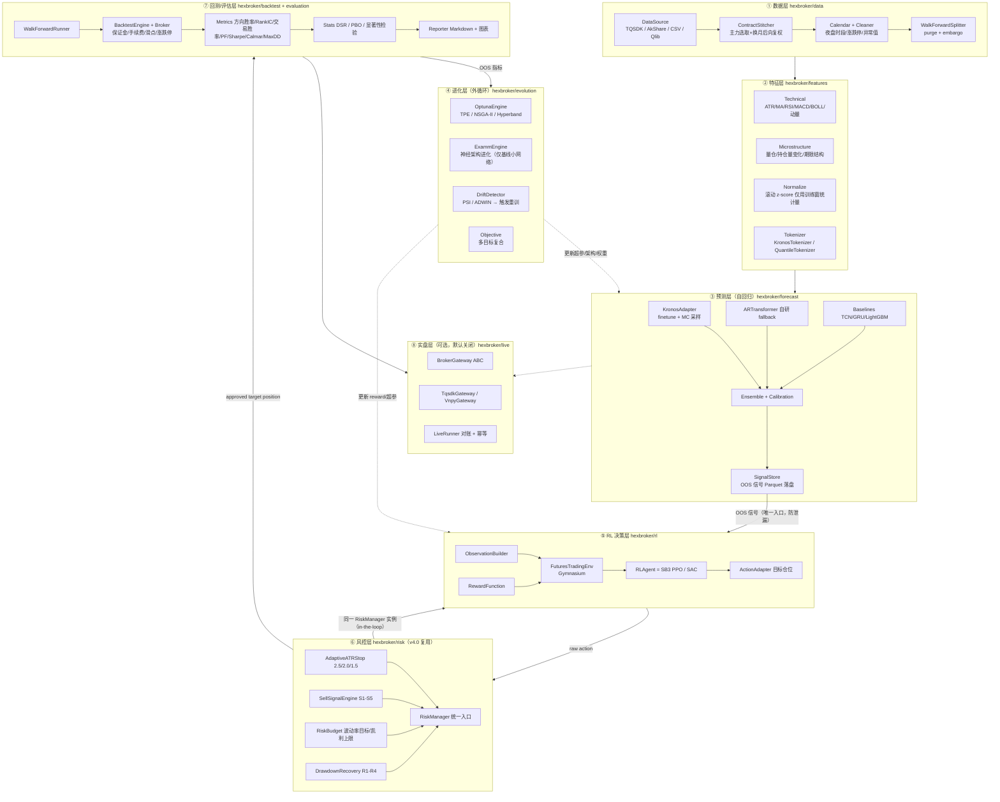
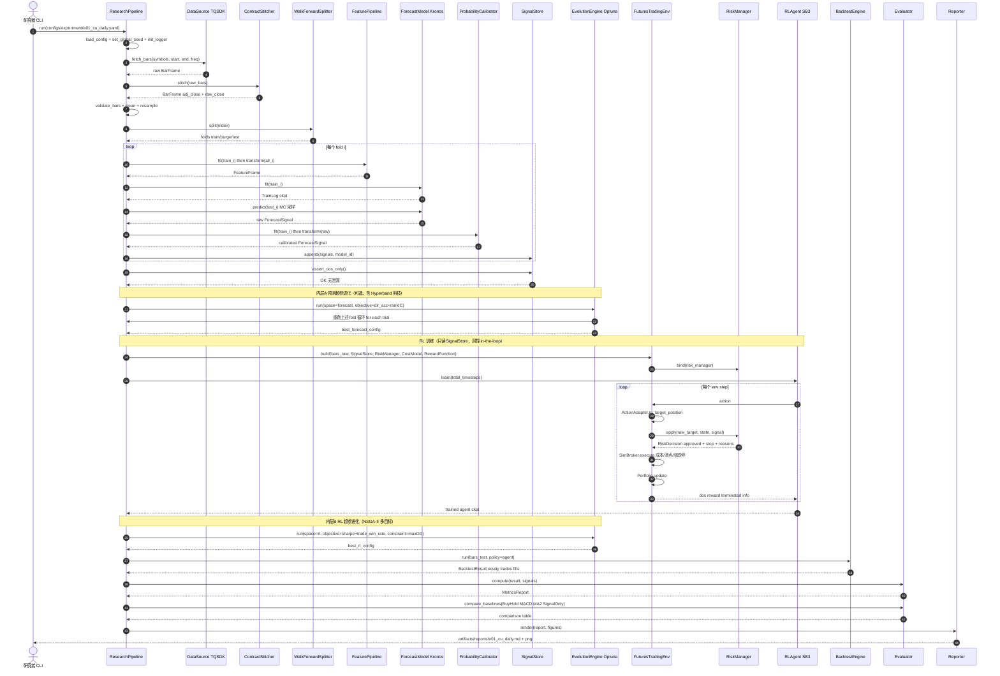
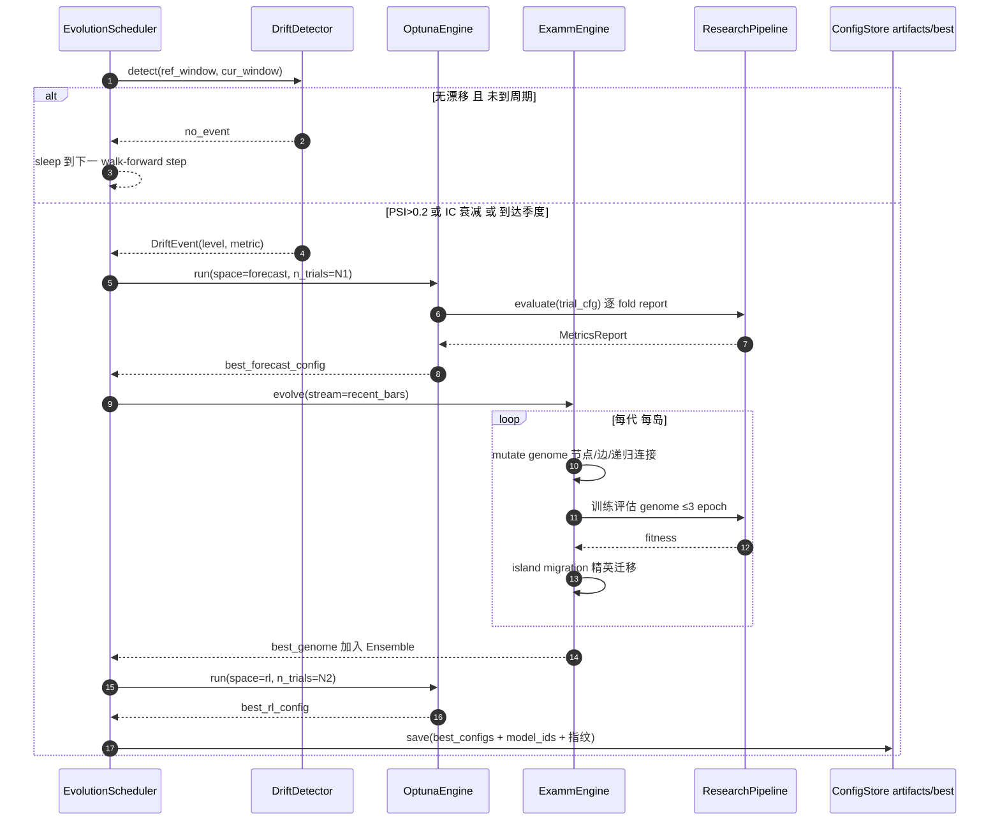
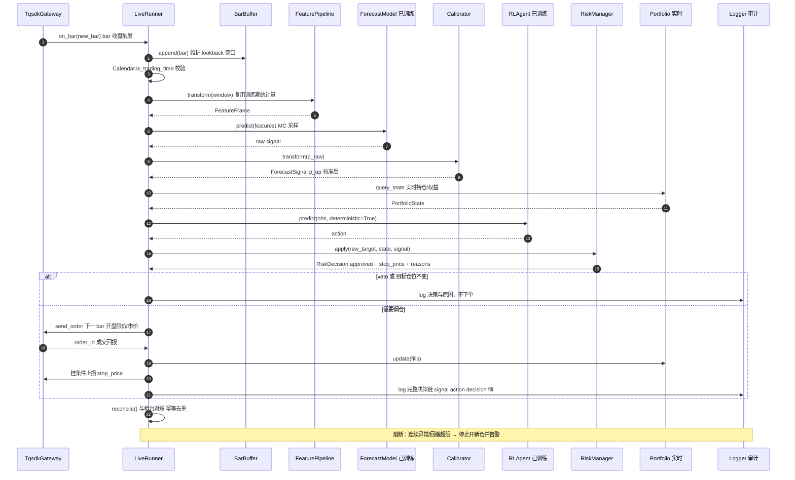
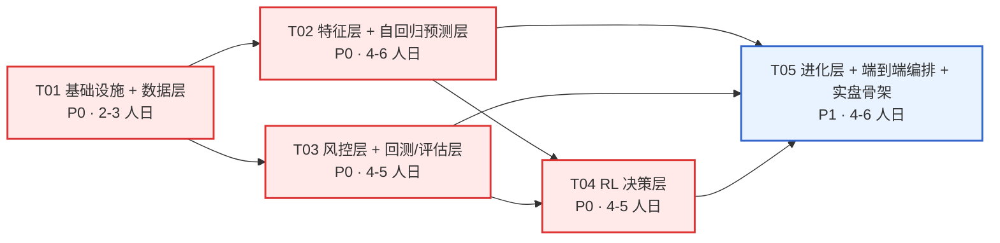

# HexFutures-AI 系统设计文档（阶段二：架构设计 + 任务分解）

> 项目代号：**HexFutures-AI** ｜ 根目录：`E:/Workspace/HexBroker/` ｜ Python 包：`hexbroker/`
> 团队：software-hexfutures-ai ｜ 架构：高见远（Bob / Architect）
> 上游输入：`deliverables/software-hexfutures-ai/research-report.md`（阶段一调研）
> 文档定位：**后续工程实现的唯一权威依据**。工程师按第 7 节任务表逐项交付。
> 性质声明：本系统为**研究型可复现代码**（research-grade），非生产交易系统；实盘层默认关闭。

---

## 0. 一页速览（TL;DR）

| 维度 | 决策 |
|------|------|
| 目标 | 中国商品期货（cu/rb/sc 起步）日线 + 60分钟线，**高胜率**方向预测 + RL 仓位管理 |
| 预测层 | **finetune Kronos-small（主）** + 自研小型 AR-Transformer（fallback）+ TCN/GRU/LightGBM（基线与集成成员） |
| RL 层 | **Stable-Baselines3 PPO（主）/ SAC（连续仓位备选）**，自建 Gymnasium 环境，借鉴 FinRL 范式但不依赖其数据层 |
| 进化层 | **Optuna（TPE + NSGA-II + Hyperband 剪枝，主）** + 自研 EXAMM 风格 NeuroEvolution（仅作用于基线小网络） |
| 数据层 | **TQSDK（主）** + AkShare/CSV（免费备份） + Qlib（可选 adapter），Parquet 本地湖 |
| 回测层 | **自研 bar 级事件回测（含保证金/手续费/滑点/涨跌停/换月）** + vn.py / RQAlpha 交叉验证（可选） |
| 风控层 | **自建，复用用户交易系统 v4.0**：ATR×2.5/2.0/1.5 自适应止损、S1–S5 卖出信号、风险预算、R1–R4 回撤恢复 |
| 三层耦合关键 | 预测层属于「环境的一部分」→ 通过 **walk-forward OOS SignalStore** 解耦；进化层是**统一外循环**，同时优化预测与 RL；**风控 in-the-loop**（训练与部署同构） |
| 任务分解 | **5 个任务包（T01–T05）**，覆盖调研阶段提出的 8 个环节，见第 7 节映射表 |

---

# Part A：系统设计

## 1. 实现方案与框架选型

### 1.1 技术难点分析（决定了架构形态）

| # | 难点 | 本质风险 | 架构对策 |
|---|------|---------|---------|
| D1 | **中国商品期货数据特殊性** | 主力合约换月导致价格跳空；夜盘/日盘不连续；涨跌停无法成交；合约乘数与保证金逐品种不同 | 独立 `data/contract.py`（持仓量选主力 + 价差后向复权，**同时保留未复权原始价**用于成本与涨跌停判定）+ `data/calendar.py` 配置化交易时段 |
| D2 | **低信噪比 + 非平稳** | 单次切分回测必然过拟合；训练集统计量泄漏到测试集 | `WalkForwardSplitter` 强制 **purge + embargo**；归一化统计量只能来自训练窗口（`features/normalize.py` 滚动 fit） |
| D3 | **预测层与 RL 层的信息泄漏** | 若 RL 训练时读取"用全量数据训练的预测模型"的输出，RL 会隐式看到未来 → 回测虚高 | **核心设计**：预测层先做 walk-forward 滚动训练，把每个 bar 的**样本外（OOS）信号**写入 `SignalStore`（带 `model_id` 指纹）；RL 环境**只读 SignalStore**，物理上不可能泄漏，且训练可离线高速重放 |
| D4 | **Kronos 输出是 K 线序列，不是概率**；且官方 `predictor.predict(sample_count=N)` **返回的是 N 条路径的平均值**，拿不到分布 | 无法直接得到"涨跌概率"用于胜率口径 | `kronos_adapter.py` 的 `sample_paths()` **循环调用 `predict(sample_count=1)` N 次（每次换 torch 随机种子）自行收集 N 条独立路径** → 得到未来收益经验分布 → `p_up = mean(path_ret > 0)`、分位数、`vol_hat = std(path_ret)`；再经 `calibration.py`（Platt/Isotonic）校准，使 `p_up` 可解释为胜率。**禁止直接用 `sample_count=N` 的平均输出反推概率** |
| D9 | **Kronos 不是 pip 包**（`from model import Kronos, KronosTokenizer, KronosPredictor` 依赖仓库内 `model/` 目录） | 无法用 `pip install` 集成，直接 import 会失败 | 以 **git submodule** 引入 `third_party/Kronos/`；`kronos_adapter.py` 内做 `sys.path.insert(0, THIRD_PARTY/Kronos)` 的**受控延迟导入**，import 失败即回退 `ARTransformer`，并记录 warning |
| D5 | **RL 训练/部署分布不一致** | 训练时无风控、部署时加风控 → 智能体动作被裁剪，策略失效 | **风控 in-the-loop**：`RiskWrapper` 把 `RiskManager` 嵌入 `env.step()`，训练即在风控约束下学习；风控状态（恢复模式、止损距离）进入观测 |
| D6 | **"高胜率 ≠ 高收益"** | 追求胜率会导致小赢大亏（负偏尾） | 评估层强制同时报告 **profit factor / payoff ratio / 最大单笔亏损**；`Objective` 采用多目标（胜率 + 夏普 + 回撤约束），单指标不可通过 |
| D7 | **进化搜索算力爆炸** | 对 Kronos 主干做 NAS 不现实（本地 GPU） | 分层：Optuna 只搜**超参 / 特征子集 / 阈值 / 集成权重 / reward 系数**；神经架构进化（EXAMM 风格）**只作用于基线小网络（RNN/TCN，参数量 <1M）**，产出集成成员 |
| D8 | **实验不可复现** | 研究代码最常见死因 | 全局 `seed.py` + `model_id = hash(config + 数据范围 + git sha)` + Optuna SQLite storage + `artifacts/` 目录规范 |

### 1.2 框架选型决策表（含理由与被否方案）

| 层 | 选定 | 理由 | 被否 / 降级为可选 |
|----|------|------|------------------|
| 预测基座 | **Kronos-small（24.7M）finetune**，mini（4.1M）用于快速迭代 | MIT 协议、解码器式分层自回归天然契合"自回归"诉求、零样本 RankIC +87~93%、参数量适配本地 GPU、自带 finetune 脚本 | Kronos-base（102.3M）显存/时长偏重，列为后续；large 未开源 |
| Kronos 集成方式 | **git submodule `third_party/Kronos` + 走官方 `finetune_csv` 路径微调** | 官方微调链路为 `train_tokenizer.py` → `train_predictor.py`（torchrun），走 `finetune_csv` 可**绕开 pyqlib 重依赖**；我方只负责导出 CSV 与推理后处理，不重写其训练代码 | 不走 `qlib_data_preprocess.py`（引入 pyqlib）；不 vendoring 拷贝代码（难以跟进上游更新） |
| 预测 fallback | 自研 `autoregressive.py`（小型 AR-Transformer + 自研 `QuantileTokenizer`） | 防止 Kronos 权重/依赖不可用导致项目阻塞；与 Kronos 共用 `ForecastModel` 接口便于消融 | — |
| 预测基线/集成 | TCN、GRU、LightGBM | 鲁棒性对照，避免单模型崩溃；也是 EXAMM 进化的载体 | — |
| RL 算法 | **Stable-Baselines3 ≥2.3（PPO 主 / SAC 连续仓位）**；`sb3-contrib` RecurrentPPO 可选 | 事实标准实现、VecEnv/Callback/日志完善、文档好、易复现 | **FinRL**：数据层强耦合美股、封装过深 → 仅借鉴环境范式，不作依赖；**ElegantRL/TensorTrade** 维护放缓 |
| RL 环境 | **自建 `FuturesTradingEnv`（Gymnasium API）** | 必须与中国期货成本模型、风控层深度耦合，第三方环境改造成本高于自写 | TensorTrade-NG（参考其组件化思路） |
| 进化/自动迭代 | **Optuna ≥3.6（TPE + NSGA-II 多目标 + HyperbandPruner）** + 自研 `examm_engine.py`（**算子设计以 `travisdesell/exact` 为规范来源**） | Optuna 成熟、支持剪枝与多目标、SQLite 持久化即可复现；EXAMM 风格模块保留"在线抗漂移"研究点但范围受控 | **RD-Agent**：LLM 驱动、依赖重、可控性差 → 阶段三可选，不进 MVP。**`travisdesell/exact` 本体不作运行时依赖**（C++/CMake/OpenMPI，Windows 宿主构建风险高，见 §8.9 R6）；纯 Python 备选 `evotorch` > `neat-python` |
| 数据源 | **TQSDK（主，期货日线/分钟/Tick + 实时）**；AkShare/CSV（免费备份）；Qlib（可选 adapter） | TQSDK 是中国期货数据与实盘接入的最短路径（90% 期货公司），Apache-2.0 | Qlib 不作强依赖（Windows 安装偶有坑、其数据格式面向股票）→ 降级为 `qlib_source.py` adapter |
| 特征存储 | **Parquet + pandas（自研 `FeaturePipeline`）** | 轻量、可 diff、无额外服务 | Qlib 表达式引擎（可选，通过 adapter） |
| 回测 | **自研 `backtest/engine.py`（bar 级事件驱动）** | RL 动作接口 + 风控 + 中国期货成本必须自控；且需支持"同一引擎服务于 RL env 与最终回测"以保证一致性 | vn.py / RQAlpha 作为**交叉验证 adapter**（同一策略双引擎跑，结果偏差 >阈值 则告警） |
| 配置 | **OmegaConf/Hydra + Pydantic v2 校验** | yaml 组合式配置 + 运行时类型校验，实验可追溯 | argparse-only（不可组合） |
| 训练框架 | **自写轻量 Trainer**（torch + AMP + 早停 + ckpt） | Kronos finetune 本身基于裸 torch；引入 Lightning 反而增加抽象层 | pytorch-lightning（降级为可选） |
| 日志/追踪 | loguru + TensorBoard（+ MLflow 本地后端可选） | 零运维 | W&B（需联网/账号） |
| 实盘 | `live/` 仅提供 `BrokerGateway` 抽象 + TQSDK 网关骨架，**默认关闭** | 待用户确认是否实盘（见第 10 节）；先保证研究闭环 | vn.py CTP 网关（阶段四） |

### 1.3 架构模式

- **分层架构（Layered）**：8 层单向依赖，上层依赖下层接口，不反向引用。
- **端口与适配器（Ports & Adapters / Hexagonal）**：数据源、回测引擎、券商网关全部是可替换 adapter（呼应项目名 Hex）。
- **管道 + 注册表（Pipeline + Registry）**：`utils/registry.py` 提供 `@register("kronos_small")` 装饰器，配置文件按名字实例化组件 → 换模型/换特征只改 yaml。
- **数据契约优先（Contract-first）**：`data/schema.py` 与 `forecast/base.py` 的 dataclass 是跨层唯一真理，任何跨层传递都必须通过契约校验。

### 1.4 系统总架构图（8 层）



### 1.5 三层协作关系（本项目的核心，务必读懂）

#### （1）职责边界

| 层 | 回答的问题 | 输入 | 输出 | 不负责 |
|----|-----------|------|------|--------|
| **自回归预测层** | "下一根/未来 H 根 K 线大概率往哪走？多大波动？" | 归一化 OHLCV+特征窗口 | `ForecastSignal`：`p_up`、`exp_ret`、分位数、`vol_hat`、`conf` | 仓位、止损、择时退出 |
| **RL 决策层** | "给定这个概率信号和我当前持仓/风险状态，我该持多少仓？现在进/出吗？" | 观测 = 预测信号 + 市场状态 + 持仓状态 + 风控状态 | `Action` → 目标仓位（连续 [-1,1] 或离散 5 档） | 预测价格、硬性风控 |
| **进化层** | "这两层的超参/架构/阈值，怎么随市场变化自动更新？" | 各内层的 OOS 指标 | 新的配置 / 新的网络拓扑 / 集成权重 | 单次训练本身 |

#### （2）防泄漏的解耦机制（最关键的一条设计约束）

```
时间轴 →
[训练窗 W1][purge][测试窗 T1]                                  → 用 W1 训练的模型对 T1 推理 → OOS 信号写入 SignalStore
        [训练窗 W2][purge][测试窗 T2]                          → 用 W2 训练的模型对 T2 推理 → 追加写入
                [训练窗 W3][purge][测试窗 T3]                  → ...
                                     ↓
        SignalStore（拼接 T1+T2+T3… 的 OOS 信号，每行带 model_id / train_end）
                                     ↓
        RL 环境只读 SignalStore  →  RL 永远不可能看到未来（物理隔离）
```

> **硬性规则**：`FuturesTradingEnv` 的构造函数**禁止**接收 `ForecastModel` 实例，只接收 `SignalStore` 路径。CI 中用 `tests/test_env_step.py::test_env_has_no_model_dependency` 静态检查。

#### （3）进化层的三时间尺度外循环

| 循环 | 优化对象 | 触发条件 | 目标函数（`evolution/objective.py`） | 预算参考 |
|------|---------|---------|----------------------------------|---------|
| **内层 A：预测** | Kronos finetune lr/上下文长度/预测长度/采样温度 T/top-p/MC 路径数、特征子集、校准方法、集成权重 | 每个 walk-forward step（默认 20 交易日） | 默认（纯预测口径）：`0.5·有效信号方向准确率 + 0.3·RankIC + 0.2·(1-Brier)`，附「校准误差 >0.05 则剪枝」<br/>**可选变体 `sharpe_aware`**：以计入成本的 OOS Sharpe 为目标并行搜索一组配置（依据 §8.9 R8 实证） | Optuna 30–80 trials，Hyperband 剪枝 |
| **内层 B：RL** | reward 各项系数 λ、观测窗口、动作空间粒度、PPO(lr/clip/gae/entropy) | 每 4–6 个 walk-forward step | 多目标 NSGA-II：`max(OOS Sharpe, 交易胜率)` s.t. `MaxDD ≤ 阈值` | Optuna 20–50 trials |
| **外层 C：神经进化** | 基线小网络拓扑（EXAMM 风格：节点/边增删、递归连接、岛屿模型迁移；记忆单元候选 Delta-RNN/GRU/LSTM/MGU/UGRNN，取自 `travisdesell/exact` 规范） | 季度 或 `DriftDetector` 告警（PSI>0.2 / ADWIN 变点） | 与内层 A 同目标，但额外惩罚参数量 | 岛屿数 4，代数 ≤30，每 genome ≤3 epoch；**Kronos 主干全程冻结，不参与进化** |

三者共享统一抽象：`SearchSpace` / `Trial` / `Objective`，全部写入同一 Optuna SQLite（`artifacts/optuna/study.db`），保证任何一次搜索都可复盘。

#### （4）关键接口伪代码（三层交界处）

```python
# ---- 预测层 → SignalStore（walk-forward 生成 OOS 信号）----
for train_idx, test_idx in splitter.split(bars):
    model = build_forecast_model(cfg.forecast)          # Kronos / AR / TCN
    model.fit(features[train_idx], labels[train_idx])
    sig = model.predict(features[test_idx])             # List[ForecastSignal]
    sig = calibrator.fit_transform_oos(sig)             # 概率校准（仅用训练窗拟合）
    signal_store.append(sig, model_id=model.model_id)   # Parquet 追加，带指纹

# ---- RL 层：环境只读信号（禁止持有模型）----
env = FuturesTradingEnv(
    bars=bars_raw,                    # 未复权原始价 → 成本/涨跌停判定
    signal_store=SignalStore(path),   # ← 唯一信号入口
    risk_manager=RiskManager(cfg.risk),   # 风控 in-the-loop
    cost_model=CostModel(cfg.backtest),
    reward_fn=RewardFunction(cfg.rl.reward),
)
agent = RLAgent(algo="PPO", env=env, cfg=cfg.rl).learn(total_timesteps=N)

# ---- env.step 内部：动作 → 风控 → 撮合 ----
def step(self, action):
    raw_target = self.action_adapter.to_target_position(action, self.state)
    decision   = self.risk_manager.apply(raw_target, self.state, self.signal_row)  # RiskDecision
    fills      = self.broker.execute(decision.approved_target_position, self.bar)  # 成本/滑点/涨跌停
    self.state = self.portfolio.update(fills, self.bar)
    reward     = self.reward_fn(self.state, fills, decision)
    obs        = self.obs_builder.build(self.signal_row, self.bar, self.state, decision)
    return obs, reward, terminated, truncated, info

# ---- 进化层：统一目标（同一函数服务于 A/B/C 三个循环）----
def objective(trial):
    cfg = search_space.suggest(trial, base_cfg)
    report = run_walkforward(cfg)                       # 复用 pipelines/research_pipeline.py
    trial.report(report.dir_accuracy, step=report.fold) # 支持 Hyperband 剪枝
    if report.calibration_error > 0.05: raise optuna.TrialPruned()
    return report.dir_accuracy, report.sharpe           # 多目标
```

#### （5）Reward 设计（`rl/reward.py`）

```
r_t = w_pnl · Δequity_t / (σ_target · capital)          # 波动率归一化收益（跨品种可比）
    - w_cost · cost_t / capital                          # 手续费 + 滑点显式惩罚
    - w_dd   · max(0, DD_t - dd_tol)                     # 超容忍回撤的凸惩罚
    - w_turn · |Δposition_t|                             # 抑制过度换手
    + w_align · align_bonus_t                            # 与预测方向一致且盈利的引导项（训练后期线性退火至 0）
```
默认 `w_pnl=1.0, w_cost=1.0, w_dd=2.0, w_turn=0.05, w_align=0.1→0`；全部由内层 B 进化搜索。

---

## 2. 文件列表（相对 `E:/Workspace/HexBroker/`）

> 约 90 个源文件。`data/`、`artifacts/` 为运行时产物目录（`.gitignore`）。

### 2.1 根目录与配置

| 路径 | 职责 |
|------|------|
| `README.md` | 项目说明、环境搭建、5 条最短复现命令 |
| `pyproject.toml` | 包元数据、ruff/black/pytest 配置 |
| `requirements.txt` | 核心依赖（见第 6 节） |
| `requirements-optional.txt` | 重依赖隔离：qlib / rqalpha / vnpy / mlflow |
| `.env.example` | TQSDK 账号、数据目录等环境变量模板（**不提交真实凭据**） |
| `.gitignore` | 忽略 `data/`、`artifacts/`、`.env`、`__pycache__` |
| `.gitmodules` | 声明 `third_party/Kronos` submodule（`github.com/shiyu-coder/Kronos`，锁定 commit） |
| `third_party/Kronos/` | **Kronos 官方仓库（submodule，不修改）**，提供 `model/`（Kronos/KronosTokenizer/KronosPredictor）与 `finetune/` 脚本 |
| `configs/base.yaml` | 全局默认：随机种子、时区、目录、日志级别 |
| `configs/data/futures_daily.yaml` | 品种清单、频率=1d、复权方式、数据起止、主力判定规则 |
| `configs/data/futures_60m.yaml` | 60 分钟线配置（夜盘边界处理） |
| `configs/feature/default.yaml` | 特征清单与参数、归一化窗口 |
| `configs/forecast/kronos_small.yaml` | Kronos 权重名、上下文/预测长度、finetune 超参、MC 采样数 |
| `configs/forecast/ar_transformer.yaml` | 自研 AR 模型超参（fallback） |
| `configs/forecast/baselines.yaml` | TCN/GRU/LightGBM 超参 |
| `configs/evolution/optuna_tpe.yaml` | 搜索空间、trial 预算、pruner、storage 路径 |
| `configs/evolution/examm_online.yaml` | 岛屿数、变异算子权重、代数、漂移阈值 |
| `configs/rl/ppo_default.yaml` | PPO 超参、观测/动作定义、reward 权重 |
| `configs/rl/sac_continuous.yaml` | SAC + 连续仓位备选 |
| `configs/risk/v4_atr.yaml` | ATR 倍数 2.5/2.0/1.5、S1–S5 参数、风险预算、R1–R4 阈值 |
| `configs/backtest/cn_commodity.yaml` | 手续费/滑点/保证金/合约乘数/最小变动价位/涨跌停幅度 |
| `configs/experiment/e01_cu_daily.yaml` | 实验入口：组合上述配置片段（Hydra defaults 列表） |

### 2.2 `hexbroker/` 核心包

#### 通用基础

| 路径 | 职责 |
|------|------|
| `hexbroker/__init__.py` | 版本号、包级导出 |
| `hexbroker/config.py` | `load_config()`：yaml 组合 → Pydantic 模型校验 → 冻结；`config_fingerprint()` |
| `hexbroker/constants.py` | `Freq`、`SignalDirection`、`ActionSpaceType`、`SellSignalCode`、`RecoveryStage`、交易时段常量、时区 `Asia/Shanghai` |
| `hexbroker/utils/logging.py` | loguru 配置：控制台 + `artifacts/logs/{run_id}.log`，统一格式 |
| `hexbroker/utils/seed.py` | `set_global_seed()`：random/numpy/torch/cudnn deterministic |
| `hexbroker/utils/registry.py` | `Registry` + `@register` 装饰器，配置驱动实例化 |
| `hexbroker/utils/io.py` | Parquet/JSON/ckpt 读写、原子写、路径规范 `paths.py` 语义 |
| `hexbroker/utils/timeutil.py` | 交易时间对齐、bar 时间戳规范（**左闭右开，标注 bar 结束时刻**） |
| `hexbroker/utils/fingerprint.py` | `model_id = sha1(config + data_range + git_sha)[:12]` |

#### ① 数据层 `hexbroker/data/`

| 路径 | 职责 |
|------|------|
| `schema.py` | `BarSchema`/`validate_bars()`：列名、dtype、单调索引、无重复、无未来 NaN |
| `base.py` | `DataSource` ABC：`fetch_bars(symbols, start, end, freq) -> BarFrame` |
| `sources/tqsdk_source.py` | TQSDK 主力/指数/单合约行情拉取，断点续拉，本地缓存 |
| `sources/akshare_source.py` | AkShare 免费日线备份源 |
| `sources/csv_source.py` | 本地 CSV/Parquet 离线源（**离线开发默认源**） |
| `sources/qlib_source.py` | Qlib 数据/表达式 adapter（可选依赖，import 失败时优雅降级） |
| `contract.py` | `ContractStitcher`：持仓量/成交量选主力、换月检测、**价差后向复权**，输出 `adj_close` 与 `raw_close` 双轨 |
| `calendar.py` | `FuturesCalendar`：交易日、日盘/夜盘时段、品种差异、`is_trading_time()` |
| `cleaner.py` | 涨跌停标记、停牌/无成交 bar、极值 winsorize、缺失前向填充上限 |
| `resample.py` | Tick/1m → 60m/1d 合成，**不跨夜盘边界聚合** |
| `dataset.py` | `BarDataset`（表格）与 `WindowDataset`（自回归滑窗，torch `Dataset`），标签生成 `make_labels()` |
| `splitter.py` | `WalkForwardSplitter(train_len, test_len, purge, embargo, expanding/rolling)` |
| `store.py` | `DataLake`：`data/raw|interim|processed` 分层 Parquet，按 `symbol/freq/year` 分区 |

#### ② 特征层 `hexbroker/features/`

| 路径 | 职责 |
|------|------|
| `base.py` | `FeatureTransformer` ABC：`fit(train_only)` / `transform` / `feature_names` |
| `technical.py` | ATR、MA/EMA、RSI、MACD、BOLL、ADX、动量、真实波幅比 |
| `microstructure.py` | 成交量/持仓量变化率、量价背离、期限结构（近远月价差，可选） |
| `normalize.py` | 滚动 z-score / robust scaler，**统计量仅来自训练窗**，`assert_no_leakage()` |
| `tokenizer.py` | `BaseTokenizer` + `KronosTokenizerAdapter`（调用官方分词器）+ `QuantileTokenizer`（自研分位数分层量化，fallback 用） |
| `pipeline.py` | `FeaturePipeline`：有序组合 transformer，产出 `FeatureFrame` + 特征指纹 |

#### ③ 预测层 `hexbroker/forecast/`

| 路径 | 职责 |
|------|------|
| `base.py` | `ForecastModel` ABC + **`ForecastSignal` 数据契约**（跨层核心） |
| `kronos_adapter.py` | 受控延迟导入 `third_party/Kronos`；加载 `KronosTokenizer` + `Kronos` 权重（**tokenizer 与模型必须配对**）；**循环 `predict(sample_count=1)` 收集 N 条路径 → p_up/分位数/vol_hat**；封装官方微调脚本调用 |
| `kronos_dataio.py` | 把 `BarFrame` 导出为 Kronos `finetune_csv` 所需 CSV/时间戳格式；反向读取微调 ckpt |
| `autoregressive.py` | 自研小型 AR-Transformer（decoder-only + 分层 token 头），fallback |
| `baselines.py` | TCN、GRU、LightGBM 分类/回归基线（统一 `ForecastModel` 接口） |
| `ensemble.py` | 加权平均 / stacking / 按近期 IC 动态加权 |
| `calibration.py` | Platt / Isotonic 概率校准 + `calibration_error()`、可靠性曲线数据 |
| `trainer.py` | 通用训练循环：AMP、梯度裁剪、early stop、ckpt、TensorBoard |
| `signal_store.py` | `SignalStore`：OOS 信号 Parquet 追加/读取/去重、按 `model_id` 溯源、`to_obs_frame()` |
| `threshold.py` | 有效信号阈值 τ 选取（coverage-accuracy 曲线，训练窗内确定） |

#### ④ 进化层 `hexbroker/evolution/`

| 路径 | 职责 |
|------|------|
| `base.py` | `SearchSpace` / `Trial` / `Objective` / `EvolutionEngine` ABC |
| `space.py` | 三类搜索空间定义（预测超参 / RL 超参 / 特征子集） |
| `optuna_engine.py` | TPE 单目标 + NSGA-II 多目标 + HyperbandPruner + SQLite storage + 断点续跑 |
| `examm_engine.py` | EXAMM 风格神经进化：`Genome`（节点/边/递归连接）、变异算子、岛屿模型、异步评估 |
| `objective.py` | 复合目标函数（第 1.5(3) 节公式），含约束与剪枝规则 |
| `drift.py` | `DriftDetector`：PSI、ADWIN、滚动 IC 衰减；输出 `DriftEvent` 触发重训/再进化 |
| `scheduler.py` | 三时间尺度外循环编排（何时跑 A/B/C） |

#### ⑤ RL 决策层 `hexbroker/rl/`

| 路径 | 职责 |
|------|------|
| `env.py` | `FuturesTradingEnv(gymnasium.Env)`：`reset/step`，**只接受 SignalStore，禁止持有 ForecastModel** |
| `obs.py` | `ObservationBuilder`：信号特征 + 市场状态 + 持仓状态 + 风控状态 → `np.float32` 向量（含 `obs_names` 便于解释） |
| `action.py` | `ActionAdapter`：离散 5 档 `{-1,-0.5,0,0.5,1}` 或连续 `Box[-1,1]` → 目标仓位手数（含合约乘数取整） |
| `reward.py` | `RewardFunction`（第 1.5(5) 节公式），各项可开关、系数可搜索 |
| `agent.py` | `RLAgent`：SB3 PPO/SAC/RecurrentPPO 封装，`learn/predict/save/load`，统一 `model_id` |
| `wrappers.py` | `RiskWrapper`（风控 in-the-loop）、`VecNormalize`、`ActionMaskWrapper`（涨跌停/非交易时段掩码） |
| `callbacks.py` | OOS 定期评估、早停、指标写 TensorBoard、漂移监控回调 |
| `vec_factory.py` | 多品种/多起点并行 VecEnv 构建（`SubprocVecEnv`） |

#### ⑥ 风控层 `hexbroker/risk/`

| 路径 | 职责 |
|------|------|
| `types.py` | `RiskState`、`RiskDecision`（`approved_target_position`、`stop_price`、`veto`、`reason_codes`） |
| `manager.py` | `RiskManager.apply(raw_target, state, signal) -> RiskDecision`，串联下列子模块，**优先级：硬止损 > 卖出信号 > 风险预算 > 恢复模式 > RL 意图** |
| `stoploss.py` | `AdaptiveATRStop`：按波动状态在 ATR×2.5 / 2.0 / 1.5 间切换，含移动止损 |
| `sell_engine.py` | `SellSignalEngine`：S1–S5 五类卖出信号（趋势破坏/量价背离/目标达成/时间止损/波动异常），输出 `SellSignalCode` |
| `budget.py` | `RiskBudget`：波动率目标仓位、单品种/组合风险上限、凯利上限截断、保证金占用约束 |
| `recovery.py` | `DrawdownRecovery`：R1–R4 分级（回撤触发降仓/暂停/小仓试探/恢复满仓） |
| `limits.py` | 交易所层面硬约束：涨跌停禁开、持仓限额、单笔最大手数、最小变动价位 |

#### ⑦ 回测/评估层 `hexbroker/backtest/` + `hexbroker/evaluation/`

| 路径 | 职责 |
|------|------|
| `backtest/cost.py` | `CostModel`：手续费（比例/固定、平今差异）、滑点（tick 数 / spread 倍数）、保证金比例、合约乘数 |
| `backtest/broker.py` | `SimBroker`：撮合（下一 bar 开盘或 VWAP）、涨跌停不成交、保证金不足拒单/强平 |
| `backtest/portfolio.py` | `Portfolio`：多品种持仓、逐日权益、浮动盈亏、可用资金、`Trade` 生命周期 |
| `backtest/engine.py` | `BacktestEngine`：bar 级事件循环，**与 RL env 共用 `SimBroker`/`Portfolio` 以保证训练-回测一致** |
| `backtest/walkforward.py` | `WalkForwardRunner`：编排「切分 → 训练预测 → 生成 OOS 信号 → 训练/复用 RL → 分段回测 → 拼接」 |
| `backtest/adapters/rqalpha_adapter.py` | 可选：导出策略到 RQAlpha 交叉验证 |
| `backtest/adapters/vnpy_adapter.py` | 可选：导出到 vn.py CtaTemplate 交叉验证 |
| `evaluation/metrics.py` | **方向准确率（总/有效信号）**、RankIC、ICIR、交易胜率、profit factor、payoff ratio、Sharpe、Sortino、Calmar、MaxDD、换手、成本拖累 |
| `evaluation/stats.py` | Deflated Sharpe Ratio、PBO、White's Reality Check、bootstrap 置信区间 |
| `evaluation/report.py` | `Evaluator.report()` → `MetricsReport` dataclass + Markdown/HTML 落盘 |
| `evaluation/plots.py` | 权益曲线、回撤、概率校准曲线、混淆矩阵、coverage-accuracy 曲线、逐 fold 稳定性 |
| `evaluation/baseline.py` | 对照基线：买入持有、MACD、双均线、纯预测阈值策略（**必须跑赢才算有效**） |

#### 编排与实盘

| 路径 | 职责 |
|------|------|
| `pipelines/train_pipeline.py` | 数据 → 特征 → 预测模型训练 → OOS 信号落盘 |
| `pipelines/rl_pipeline.py` | 读 SignalStore → 构建 env → RL 训练 → 保存 agent |
| `pipelines/evolve_pipeline.py` | 驱动进化层三循环，写回最优配置 |
| `pipelines/research_pipeline.py` | **端到端**：一条命令跑完 walk-forward 全流程并出报告 |
| `live/base.py` | `BrokerGateway` ABC：`subscribe/on_bar/send_order/query_position` |
| `live/tqsdk_gateway.py` | TQSDK 实盘/SIMNOW 模拟网关（骨架，默认不启用） |
| `live/vnpy_gateway.py` | 可选 vn.py CTP 网关占位 |
| `live/runner.py` | `LiveRunner`：实时 bar → 特征 → 预测 → RL → 风控 → 下单，含幂等、对账、心跳、熔断 |

#### 脚本入口 `scripts/`

| 路径 | 命令 |
|------|------|
| `scripts/fetch_data.py` | `python -m scripts.fetch_data --config configs/experiment/e01_cu_daily.yaml` |
| `scripts/build_features.py` | 构建并缓存特征 |
| `scripts/train_forecast.py` | 训练/finetune 预测模型 |
| `scripts/generate_signals.py` | walk-forward 生成 OOS 信号到 SignalStore |
| `scripts/evolve.py` | 启动进化搜索（可续跑） |
| `scripts/train_rl.py` | 训练 RL 智能体 |
| `scripts/backtest.py` | 端到端回测 |
| `scripts/evaluate.py` | 出评估报告 |
| `scripts/live_trade.py` | 实盘/模拟盘运行（需 `--i-understand-the-risk` 显式开关） |

#### 测试 `tests/`

`test_config.py`、`test_data_contract.py`、`test_contract_stitch.py`、`test_calendar_resample.py`、`test_splitter_leakage.py`、`test_features_no_leakage.py`、`test_tokenizer.py`、`test_forecast_api.py`、`test_calibration.py`、`test_signal_store.py`、`test_env_step.py`（含**无模型依赖**静态检查）、`test_reward.py`、`test_risk_rules.py`、`test_backtest_costs.py`、`test_metrics.py`、`test_walkforward_e2e.py`（小数据端到端 smoke）

---

## 3. 数据结构与接口（类图）

> 完整文件另存：`docs/class-diagram.mermaid`

```mermaid
classDiagram
    direction LR

    %% ===== 数据契约 =====
    class BarFrame {
        <<DataContract>>
        +Index idx_symbol_datetime
        +float open
        +float high
        +float low
        +float close
        +float volume
        +float amount
        +float open_interest
        +float adj_factor
        +bool limit_up
        +bool limit_down
        +str freq
        +validate() bool
    }

    class FeatureFrame {
        <<DataContract>>
        +Index idx_symbol_datetime
        +List~str~ feature_names
        +ndarray values
        +str feature_fingerprint
        +validate_no_nan_future() bool
    }

    class ForecastSignal {
        <<DataContract>>
        +str symbol
        +Timestamp ts
        +int horizon
        +float p_up
        +float exp_ret
        +Dict~str,float~ quantiles
        +float vol_hat
        +float conf
        +str model_id
        +Timestamp train_end
        +bool is_effective
    }

    class RiskDecision {
        <<DataContract>>
        +float approved_target_position
        +float stop_price
        +bool veto
        +List~str~ reason_codes
        +str recovery_stage
    }

    class Trade {
        <<DataContract>>
        +str symbol
        +Timestamp entry_ts
        +Timestamp exit_ts
        +int direction
        +float entry_price
        +float exit_price
        +float volume
        +float pnl
        +float cost
        +str exit_reason
    }

    class MetricsReport {
        <<DataContract>>
        +float dir_accuracy
        +float dir_accuracy_effective
        +float coverage
        +float rank_ic
        +float icir
        +float brier
        +float calibration_error
        +float trade_win_rate
        +float profit_factor
        +float payoff_ratio
        +float sharpe
        +float calmar
        +float max_drawdown
        +float turnover
        +float cost_drag
        +float deflated_sharpe
        +float pbo
        +to_markdown() str
    }

    %% ===== 数据层 =====
    class DataSource {
        <<abstract>>
        +fetch_bars(symbols, start, end, freq) BarFrame
        +health_check() bool
    }
    class TqsdkSource
    class AkshareSource
    class CsvSource
    class QlibSource

    class ContractStitcher {
        +str main_rule
        +str adjust_method
        +stitch(raw_bars) BarFrame
        +rollover_dates() List~Timestamp~
    }

    class FuturesCalendar {
        +is_trading_time(ts, symbol) bool
        +sessions(symbol) List~Session~
        +next_bar_ts(ts, freq) Timestamp
    }

    class WalkForwardSplitter {
        +int train_len
        +int test_len
        +int purge
        +int embargo
        +str mode
        +split(index) List~Fold~
    }

    class WindowDataset {
        +int lookback
        +int horizon
        +__len__() int
        +__getitem__(i) Tuple
    }

    %% ===== 特征层 =====
    class FeatureTransformer {
        <<abstract>>
        +fit(train_frame) void
        +transform(frame) FeatureFrame
        +feature_names() List~str~
    }
    class TechnicalFeatures
    class MicrostructureFeatures
    class RollingNormalizer

    class FeaturePipeline {
        +List~FeatureTransformer~ steps
        +fit(train_frame) void
        +transform(frame) FeatureFrame
    }

    class BaseTokenizer {
        <<abstract>>
        +encode(bars) ndarray
        +decode(tokens) BarFrame
        +vocab_size() int
    }
    class KronosTokenizerAdapter
    class QuantileTokenizer

    %% ===== 预测层 =====
    class ForecastModel {
        <<abstract>>
        +str model_id
        +fit(X_train, y_train, X_valid) TrainLog
        +predict(X) List~ForecastSignal~
        +save(path) void
        +load(path) ForecastModel
    }
    class KronosAdapter {
        +str model_name
        +str tokenizer_name
        +int max_context
        +int horizon
        +int n_mc_samples
        +float temperature
        +float top_p
        +assert_pairing() bool
        +finetune_via_official_scripts(csv_dir) TrainLog
        +sample_paths(X) ndarray
    }
    class ARTransformer
    class TcnBaseline
    class GruBaseline
    class LgbmBaseline
    class EnsembleModel {
        +List~ForecastModel~ members
        +Dict~str,float~ weights
        +reweight_by_recent_ic(window) void
    }
    class ProbabilityCalibrator {
        +str method
        +fit(p_raw, y) void
        +transform(p_raw) ndarray
        +calibration_error() float
    }
    class SignalStore {
        +str path
        +append(signals, model_id) void
        +read(symbols, start, end) DataFrame
        +to_obs_frame(cols) DataFrame
        +assert_oos_only() bool
    }

    %% ===== 进化层 =====
    class SearchSpace {
        +suggest(trial, base_cfg) Config
        +List~str~ param_names
    }
    class Objective {
        +weights
        +evaluate(report) Tuple
        +should_prune(report) bool
    }
    class EvolutionEngine {
        <<abstract>>
        +run(n_trials) BestResult
        +best_config() Config
    }
    class OptunaEngine {
        +str sampler
        +str pruner
        +str storage
        +resume() void
    }
    class ExammEngine {
        +int n_islands
        +int n_generations
        +Dict~str,float~ mutation_ops
        +evolve(stream) Genome
    }
    class Genome {
        +List nodes
        +List edges
        +int n_params
        +to_torch_module() Module
    }
    class DriftDetector {
        +float psi_threshold
        +detect(ref, cur) DriftEvent
    }

    %% ===== RL 层 =====
    class FuturesTradingEnv {
        +SignalStore signal_store
        +RiskManager risk_manager
        +SimBroker broker
        +RewardFunction reward_fn
        +reset(seed) Tuple
        +step(action) Tuple
    }
    class ObservationBuilder {
        +List~str~ obs_names
        +build(signal_row, bar, state, decision) ndarray
    }
    class ActionAdapter {
        +str space_type
        +to_target_position(action, state) float
    }
    class RewardFunction {
        +float w_pnl
        +float w_cost
        +float w_dd
        +float w_turn
        +float w_align
        +__call__(state, fills, decision) float
    }
    class RLAgent {
        +str algo
        +str model_id
        +learn(total_timesteps) void
        +predict(obs, deterministic) Action
        +save(path) void
        +load(path) RLAgent
    }
    class RiskWrapper

    %% ===== 风控层 =====
    class RiskManager {
        +apply(raw_target, state, signal) RiskDecision
        +update_state(bar, portfolio) RiskState
    }
    class AdaptiveATRStop {
        +float mult_high_vol
        +float mult_mid_vol
        +float mult_low_vol
        +stop_price(state) float
    }
    class SellSignalEngine {
        +check(state, signal) List~str~
    }
    class RiskBudget {
        +float vol_target
        +float max_position_pct
        +size(state, signal) float
    }
    class DrawdownRecovery {
        +stage(equity_curve) str
        +position_scalar(stage) float
    }
    class ExchangeLimits {
        +clip(target, bar, state) float
    }

    %% ===== 回测/评估层 =====
    class CostModel {
        +Dict~str,float~ fee_rate
        +float slippage_ticks
        +Dict~str,float~ margin_rate
        +Dict~str,float~ multiplier
        +cost(order, bar) float
    }
    class SimBroker {
        +CostModel cost_model
        +execute(target_position, bar) List~Fill~
        +check_margin(state) bool
    }
    class Portfolio {
        +float cash
        +Dict~str,float~ positions
        +Series equity_curve
        +List~Trade~ trades
        +update(fills, bar) PortfolioState
    }
    class BacktestEngine {
        +run(bars, policy) BacktestResult
    }
    class WalkForwardRunner {
        +run(cfg) BacktestResult
    }
    class Evaluator {
        +compute(result, signals) MetricsReport
        +compare_baselines(result) DataFrame
    }
    class Reporter {
        +render(report, figures) str
    }

    %% ===== 实盘层 =====
    class BrokerGateway {
        <<abstract>>
        +subscribe(symbols) void
        +on_bar(callback) void
        +send_order(order) str
        +query_position() Dict
    }
    class TqsdkGateway
    class LiveRunner {
        +run_once(bar) void
        +reconcile() void
    }

    %% ===== 关系 =====
    DataSource <|-- TqsdkSource
    DataSource <|-- AkshareSource
    DataSource <|-- CsvSource
    DataSource <|-- QlibSource
    DataSource ..> BarFrame : produces
    ContractStitcher ..> BarFrame : transforms
    ContractStitcher --> FuturesCalendar : uses
    WindowDataset --> FeatureFrame : reads
    WalkForwardSplitter ..> WindowDataset : indexes

    FeatureTransformer <|-- TechnicalFeatures
    FeatureTransformer <|-- MicrostructureFeatures
    FeatureTransformer <|-- RollingNormalizer
    FeaturePipeline o-- FeatureTransformer
    FeaturePipeline ..> FeatureFrame : produces
    BaseTokenizer <|-- KronosTokenizerAdapter
    BaseTokenizer <|-- QuantileTokenizer

    ForecastModel <|-- KronosAdapter
    ForecastModel <|-- ARTransformer
    ForecastModel <|-- TcnBaseline
    ForecastModel <|-- GruBaseline
    ForecastModel <|-- LgbmBaseline
    ForecastModel <|-- EnsembleModel
    EnsembleModel o-- ForecastModel
    KronosAdapter --> BaseTokenizer : uses
    ForecastModel ..> ForecastSignal : produces
    ProbabilityCalibrator ..> ForecastSignal : calibrates
    SignalStore o-- ForecastSignal

    EvolutionEngine <|-- OptunaEngine
    EvolutionEngine <|-- ExammEngine
    EvolutionEngine --> SearchSpace : uses
    EvolutionEngine --> Objective : uses
    ExammEngine o-- Genome
    Objective ..> MetricsReport : reads
    DriftDetector ..> EvolutionEngine : triggers

    FuturesTradingEnv --> SignalStore : reads_only
    FuturesTradingEnv --> ObservationBuilder
    FuturesTradingEnv --> ActionAdapter
    FuturesTradingEnv --> RewardFunction
    FuturesTradingEnv --> RiskManager : in_the_loop
    FuturesTradingEnv --> SimBroker
    FuturesTradingEnv --> Portfolio
    RiskWrapper ..> FuturesTradingEnv : wraps
    RLAgent --> FuturesTradingEnv : trains_on

    RiskManager o-- AdaptiveATRStop
    RiskManager o-- SellSignalEngine
    RiskManager o-- RiskBudget
    RiskManager o-- DrawdownRecovery
    RiskManager o-- ExchangeLimits
    RiskManager ..> RiskDecision : produces

    SimBroker --> CostModel
    Portfolio o-- Trade
    BacktestEngine --> SimBroker
    BacktestEngine --> Portfolio
    BacktestEngine --> RiskManager
    BacktestEngine ..> RLAgent : as_policy
    WalkForwardRunner --> WalkForwardSplitter
    WalkForwardRunner --> ForecastModel
    WalkForwardRunner --> SignalStore
    WalkForwardRunner --> RLAgent
    WalkForwardRunner --> BacktestEngine
    Evaluator ..> MetricsReport : produces
    Reporter ..> MetricsReport : renders

    BrokerGateway <|-- TqsdkGateway
    LiveRunner --> BrokerGateway
    LiveRunner --> ForecastModel
    LiveRunner --> RLAgent
    LiveRunner --> RiskManager
```



### 3.1 关键数据契约字段说明

**`ForecastSignal`（预测层唯一对外产物）**

| 字段 | 类型 | 说明 |
|------|------|------|
| `symbol` | str | 品种主力代码，如 `SHFE.cu` |
| `ts` | Timestamp | **信号可用时刻 = bar 结束时刻**（不可用于本 bar 成交，必须下一 bar 执行） |
| `horizon` | int | 预测步长（日线默认 1、5；60m 默认 1、4） |
| `p_up` | float | 校准后上涨概率 ∈ (0,1)，**方向胜率口径的直接来源** |
| `exp_ret` | float | 期望对数收益（MC 路径均值） |
| `quantiles` | dict | `{q10,q25,q50,q75,q90}` 未来收益分位数 |
| `vol_hat` | float | 预测波动率（供风险预算/仓位缩放） |
| `conf` | float | 置信度 = 路径一致性（1 - 分位区间宽度归一化） |
| `model_id` | str | 指纹，用于溯源与消融 |
| `train_end` | Timestamp | 产出该信号的模型训练截止时刻，**审计防泄漏** |
| `is_effective` | bool | `abs(p_up-0.5) > τ`，有效信号标记 |

**`Observation` 向量组成（`obs.py` 输出，附 `obs_names`）**

| 分组 | 内容 |
|------|------|
| 信号组 | `p_up`、`exp_ret`、`q10/q50/q90`、`vol_hat`、`conf`、`is_effective`、多 horizon 拼接 |
| 市场组 | 归一化收益序列（近 N bar）、ATR/价格、成交量 z-score、持仓量变化、是否临近涨跌停 |
| 持仓组 | 当前仓位比例、持仓天数、浮动盈亏比例、距止损距离（ATR 单位）、保证金占用率 |
| 风控组 | 当前 `recovery_stage` one-hot、上一 step 是否被 veto、`reason_codes` 计数 |
| 时间组 | 距收盘 bar 数、是否夜盘、周内日 one-hot（可选） |

**`Action`**

| 空间 | 定义 | 说明 |
|------|------|------|
| 离散（默认） | `Discrete(5)` → 目标仓位 `{-1, -0.5, 0, +0.5, +1}` | PPO 更稳、可解释、便于风控裁剪 |
| 连续（备选） | `Box(-1, 1, shape=(1,))` | SAC；配合 `action` 死区（`|a|<0.1 → 0`）抑制抖动 |

### 3.2 Kronos 集成契约（与官方 API 精确对齐，工程师必读）

> 依据：`deliverables/software-hexfutures-ai/kronos-api-reference.md`（PM 实测 README）

**（1）权重配对表（错配会直接报维度错误）**

| 模型 | HF 名称 | 参数量 | 必须搭配的 Tokenizer | 默认 max_context |
|------|---------|--------|---------------------|------------------|
| Kronos-mini | `NeoQuasar/Kronos-mini` | 4.1M | `NeoQuasar/Kronos-Tokenizer-2k` | 2048 |
| Kronos-small | `NeoQuasar/Kronos-small` | 24.7M | `NeoQuasar/Kronos-Tokenizer-base` | 512 |
| Kronos-base | `NeoQuasar/Kronos-base` | 102.3M | `NeoQuasar/Kronos-Tokenizer-base` | 512 |

配置文件必须同时指定 `model_name` 与 `tokenizer_name`，`config.py` 中加**配对校验**（不匹配则 `HexConfigError`）。

**（2）推理适配伪代码（`kronos_adapter.py` 核心）**

```python
# 受控延迟导入：失败即优雅回退
def _import_kronos():
    sys.path.insert(0, str(THIRD_PARTY / "Kronos"))
    from model import Kronos, KronosTokenizer, KronosPredictor   # 仓库内模块，非 pip 包
    return Kronos, KronosTokenizer, KronosPredictor

class KronosAdapter(ForecastModel):
    def __init__(self, cfg):
        Kronos, KronosTokenizer, KronosPredictor = _import_kronos()
        self.tokenizer = KronosTokenizer.from_pretrained(cfg.tokenizer_name)  # 必须与模型配对
        self.model     = Kronos.from_pretrained(cfg.model_name)
        self.predictor = KronosPredictor(self.model, self.tokenizer,
                                        max_context=cfg.max_context)

    def sample_paths(self, x_df, x_ts, y_ts, pred_len) -> np.ndarray:
        """关键：官方 predict(sample_count=N) 返回的是 N 条路径的【平均值】，
        拿不到分布 → 因此这里循环 N 次 sample_count=1，自行收集独立路径。"""
        paths = []
        for i in range(self.cfg.n_mc_samples):            # 默认 30
            torch.manual_seed(self.cfg.seed * 1000 + i)   # 可复现的路径多样性
            pred_df = self.predictor.predict(
                df=x_df[["open","high","low","close","volume","amount"]],
                x_timestamp=x_ts, y_timestamp=y_ts, pred_len=pred_len,
                T=self.cfg.temperature,   # 默认 1.0，进化层可搜索
                top_p=self.cfg.top_p,     # 默认 0.9，进化层可搜索
                sample_count=1,           # ← 必须为 1
            )
            paths.append(pred_df["close"].to_numpy())
        return np.stack(paths)                            # (n_mc, pred_len)

    def predict(self, X) -> list[ForecastSignal]:
        paths   = self.sample_paths(...)                  # (n_mc, H)
        rets    = np.log(paths[:, -1] / last_close)       # H 步累计对数收益分布
        return ForecastSignal(
            p_up      = float((rets > 0).mean()),         # ← 原始概率，后续必须校准
            exp_ret   = float(rets.mean()),
            quantiles = {f"q{q}": float(np.quantile(rets, q/100)) for q in (10,25,50,75,90)},
            vol_hat   = float(rets.std(ddof=1)),
            conf      = float(1 - (np.quantile(rets,.9)-np.quantile(rets,.1)) / (6*rets.std()+1e-9)),
            model_id  = self.model_id, train_end = self.train_end, ...
        )
```

**（3）微调链路（走 `finetune_csv`，绕开 pyqlib）**

```
BarFrame → scripts/export_kronos_csv.py → third_party/Kronos/finetune_csv/{symbol}.csv
        → torchrun --standalone --nproc_per_node=1 finetune/train_tokenizer.py   (步骤2)
        → torchrun --standalone --nproc_per_node=1 finetune/train_predictor.py   (步骤3)
        → ckpt → KronosAdapter.load(ckpt) → 推理产出 OOS 信号
```
- **不使用** `finetune/qlib_data_preprocess.py` 与 `finetune/qlib_test.py`（会引入 pyqlib 重依赖，且其回测为演示级）；回测统一走我方 `backtest/engine.py`。
- 单 GPU 也用 `torchrun --nproc_per_node=1`，保持与官方脚本一致。
- 微调是否成功的判据：验证集 loss 下降 + **微调后 RankIC 优于零样本**（消融必做，若不优则保留零样本方案并在报告中说明）。

**（4）依赖版本雷区**

Kronos `requirements.txt` 使用**精确 pin**：`einops==0.8.1`、`huggingface_hub==0.33.1`、`pandas==2.2.2`、`safetensors==0.6.2`、`matplotlib==3.9.3`、`tqdm==4.67.1`。
→ 本项目 `requirements.txt` 的这几项**必须收敛到与 Kronos 兼容的版本**（见 6.1 备注列），且 `pyqlib` / `rqalpha` 一律隔离到独立虚拟环境，防止 pandas 版本互踩。

---

## 4. 程序调用流程（时序图）

> 完整文件另存：`docs/sequence-diagram.mermaid`

### 4.1 训练/研究流水线（walk-forward 全流程）



### 4.2 进化外循环（含漂移触发）



### 4.3 推理 / 交易流程（实时，实盘层默认关闭）



---

## 5. 待明确事项与假设（Anything UNCLEAR）

**已作出的工程假设（工程师按此实现，后续可通过 yaml 改）**

1. **bar 时间戳约定**：以 bar **结束时刻**标注，信号在 bar 结束后可用，**最早于下一 bar 开盘执行**（严格禁止同 bar 成交）。
2. **默认离线开发**：`CsvSource` 为默认数据源，先用少量样本数据打通全链路，再切 TQSDK。
3. **默认单品种独立训练**，多品种通过 `symbol_embedding` 预留扩展位（配置开关 `joint_training: false`）。
4. **实盘层默认关闭**，`scripts/live_trade.py` 需显式 `--i-understand-the-risk` 且默认连 SIMNOW 模拟。
5. **成本假设默认值**：手续费按成交额万分之 0.5（双边）+ 平今加倍、滑点 1 个最小变动价位、保证金 12%、初始资金 100 万、单品种最大占用 30%。
6. **Kronos 获取方式**：git submodule + HuggingFace Hub 拉权重，需可访问外网；若受限则需预先手动下载权重到 `third_party/weights/` 并在配置中指向本地路径（`local_files_only: true`），链路不因此阻塞（自动回退 `ARTransformer`）。

未明确项详见第 10 节（需主理人/用户确认）。

---

# Part B：任务分解

## 6. 依赖包清单（`requirements.txt` 级）

### 6.1 核心依赖（`requirements.txt`）

| 包 | 版本约束 | 用途 | 备注 |
|----|---------|------|------|
| `python` | 3.10 或 3.11 | 运行时 | Kronos 与 TQSDK 共同兼容区间；**不建议 3.12+** |
| `torch` | `>=2.1,<2.6` | 预测模型训练/推理（CUDA 12.1 轮子） | 本地 GPU；安装用官方 index-url |
| `einops` | **`==0.8.1`** | Kronos / Transformer 张量重排 | **Kronos 精确 pin，不可放宽** |
| `safetensors` | **`==0.6.2`** | 权重加载 | **Kronos 精确 pin** |
| `huggingface_hub` | **`==0.33.1`** | 拉取 Kronos mini/small 权重 | **Kronos 精确 pin**；需网络，提供本地权重目录回退 |
| `numpy` | `>=1.24,<2.1` | 数值计算 | 与 torch/pandas 兼容区间 |
| `pandas` | **`==2.2.2`** | 表格与时间序列 | **Kronos 精确 pin**；与 `rqalpha` 可能冲突 → rqalpha 隔离环境 |
| `tqdm` | `==4.67.1` | 进度条 | Kronos pin |
| `matplotlib` | `==3.9.3` | 图表 | Kronos pin（与下方 matplotlib 行合并） |
| `pyarrow` | `>=14.0` | Parquet 数据湖 | |
| `scipy` | `>=1.11` | 统计/分位数 | |
| `scikit-learn` | `>=1.3` | 概率校准、PSI、指标 | |
| `statsmodels` | `>=0.14` | ADF/Ljung-Box/显著性检验 | |
| `lightgbm` | `>=4.1` | 基线模型 | |
| `gymnasium` | `>=0.29,<1.1` | RL 环境 API | SB3 2.x 依赖 |
| `stable-baselines3` | `>=2.3,<2.7` | PPO/SAC/A2C 实现 | 主 RL 库 |
| `sb3-contrib` | `>=2.3` | RecurrentPPO（可选实验） | |
| `tensorboard` | `>=2.15` | 训练曲线 | |
| `optuna` | `>=3.6` | 超参/多目标进化（TPE、NSGA-II、Hyperband） | SQLite storage |
| `omegaconf` | `>=2.3` | yaml 组合配置 | |
| `hydra-core` | `>=1.3` | 实验配置组合与多 run（可选但推荐） | |
| `pydantic` | `>=2.6` | 配置与数据契约校验 | |
| `loguru` | `>=0.7` | 日志 | |
| `rich` | `>=13` | CLI 输出 | `tqdm`/`matplotlib` 见上方 Kronos pin 行 |
| `tqsdk` | `>=3.7` | 中国期货行情/回测/实盘接入 | **需账户；免费版数据范围待确认（见 10.1）** |
| `akshare` | `>=1.14` | 免费期货日线备份源 | 接口不稳，仅备份 |
| `joblib` | `>=1.3` | 并行与缓存 | |

### 6.2 可选依赖（`requirements-optional.txt`，独立虚拟环境安装）

| 包 | 用途 | 风险提示 |
|----|------|---------|
| `pyqlib` | Qlib 数据/表达式/walk-forward 交叉验证 | Windows 编译依赖较重，隔离安装 |
| `rqalpha` | 中国回测基线交叉验证 | 依赖较老，可能与 pandas 2.x 冲突 |
| `vnpy` + `vnpy_ctp` | CTP 实盘/Tick 回测 | 仅实盘阶段启用 |
| `mlflow` | 实验追踪（本地 file backend） | TensorBoard 已够用 |
| `pytorch-lightning` | 训练封装 | 默认不用（自写 Trainer） |
| `optuna-dashboard` | 搜索可视化 | |

### 6.3 开发依赖

`pytest>=8`、`pytest-cov`、`ruff>=0.4`、`black>=24`、`mypy`（可选）、`pre-commit`

---

## 7. 任务列表（5 个任务包，按依赖排序）

> **说明**：主理人转交的需求中提到 T1–T8 八个环节，按团队 SOP 的任务粒度规范（每任务 ≥3 个相关文件、任务包上限 5 个），归并为 **5 个任务包**，映射关系如下。

| 原环节 | 归属任务包 |
|--------|-----------|
| T1 数据加载 | **T01** |
| T2 特征工程 | **T02** |
| T3 预测模型 | **T02** |
| T6 风控 | **T03** |
| T7 回测 / T8 评估 | **T03** |
| T5 RL | **T04** |
| T4 进化 + 端到端编排 + 实盘骨架 | **T05** |

> 依赖设计原则：**T02 与 T03 可并行**（均只依赖 T01），T04 依赖 T02+T03，T05 收口。

---

### T01 项目基础设施 + 数据层

- **优先级**：P0
- **依赖**：无
- **预估**：2–3 人日

**产出文件**

```
README.md, pyproject.toml, requirements.txt, requirements-optional.txt, .env.example, .gitignore
configs/base.yaml, configs/data/futures_daily.yaml, configs/data/futures_60m.yaml,
configs/backtest/cn_commodity.yaml, configs/experiment/e01_cu_daily.yaml
hexbroker/__init__.py, config.py, constants.py
hexbroker/utils/{logging.py, seed.py, registry.py, io.py, timeutil.py, fingerprint.py}
hexbroker/data/{schema.py, base.py, contract.py, calendar.py, cleaner.py, resample.py, dataset.py, splitter.py, store.py}
hexbroker/data/sources/{csv_source.py, tqsdk_source.py, akshare_source.py, qlib_source.py}
scripts/fetch_data.py
tests/{test_config.py, test_data_contract.py, test_contract_stitch.py, test_calendar_resample.py, test_splitter_leakage.py}
data/sample/  ← 提交 3 个品种 × 约 300 根日线的样例数据，保证离线可跑
```

**验收标准**

1. `python -m scripts.fetch_data --config configs/experiment/e01_cu_daily.yaml --source csv` 成功产出 `data/processed/*.parquet`，且 `validate_bars()` 全绿。
2. `ContractStitcher` 在换月点产出连续 `adj_close`（相邻 bar 复权后收益无跳空，|jump| < 3σ），同时保留 `raw_close`；换月日期列表可打印。
3. `WalkForwardSplitter` 单测证明：任一 fold 的 `train.max_ts + purge < test.min_ts`，且 embargo 生效；**故意构造泄漏时单测必须失败**。
4. 60m 重采样不跨夜盘边界（单测覆盖 21:00 起夜盘与次日日盘的边界）。
5. `set_global_seed(42)` 后连续两次运行数据管线，输出 Parquet 的 md5 一致。
6. TQSDK/AkShare/Qlib 三个 source 在依赖缺失时 **优雅降级**（warning + 明确异常信息），不影响 CSV 路径。

---

### T02 特征层 + 自回归预测层（含 OOS 信号落盘）

- **优先级**：P0
- **依赖**：T01
- **预估**：4–6 人日（含 Kronos 接入调试）

**产出文件**

```
.gitmodules + third_party/Kronos (git submodule, 锁定 commit)
configs/feature/default.yaml, configs/forecast/{kronos_small.yaml, kronos_mini.yaml, ar_transformer.yaml, baselines.yaml}
hexbroker/features/{base.py, technical.py, microstructure.py, normalize.py, tokenizer.py, pipeline.py}
hexbroker/forecast/{base.py, kronos_adapter.py, kronos_dataio.py, autoregressive.py, baselines.py,
                    ensemble.py, calibration.py, trainer.py, signal_store.py, threshold.py}
hexbroker/pipelines/train_pipeline.py
scripts/{build_features.py, export_kronos_csv.py, train_forecast.py, generate_signals.py}
tests/{test_features_no_leakage.py, test_tokenizer.py, test_forecast_api.py, test_calibration.py,
       test_signal_store.py, test_kronos_adapter.py}
```

**验收标准**

1. `ForecastModel` 接口一致性：Kronos / ARTransformer / TCN / GRU / LightGBM 五个实现全部通过同一套 `test_forecast_api.py`（fit → predict → save → load → predict 结果一致）。
2. `KronosAdapter`：submodule 就位后能加载 mini(`Tokenizer-2k`) 与 small(`Tokenizer-base`) 且**配对校验生效**（故意错配须抛 `HexConfigError`）；`sample_paths()` 返回 shape `(n_mc, pred_len)` 的**独立路径矩阵**（单测断言各路径不相同，证明未误用 `sample_count=N` 平均值）；产出 `p_up ∈ (0,1)`、`quantiles` 单调递增、`vol_hat > 0`。
2b. `scripts/export_kronos_csv.py` 能把 `BarFrame` 导出为 `finetune_csv` 格式；调用官方 `train_tokenizer.py` + `train_predictor.py`（`--nproc_per_node=1`）完成 ≥1 epoch 微调且验证 loss 下降；**记录"零样本 vs 微调"RankIC 消融对比**。
3. **归一化零泄漏**：`test_features_no_leakage.py` 断言归一化统计量仅由训练窗计算（篡改测试窗数据不改变训练窗输出）。
4. `python -m scripts.generate_signals ...` 在样例数据上产出 SignalStore Parquet，`assert_oos_only()` 通过；每行含 `model_id` 与 `train_end`。
5. 概率校准后 `calibration_error < 0.05`（样例数据上），并输出可靠性曲线数据。
6. 报告样例数据上的 **方向准确率 / 有效信号准确率 / coverage / RankIC**（样例数据阶段不设门槛，只要求指标可算、可复现）。
6b. **【P0 spike，对应 §8.9 R5/R7】** 在真实 CN 商品期货数据上产出闸门 1 证据：**Kronos 必须在 OOS 方向准确率与 RankIC 上同时跑赢 LightGBM 基线**（公开对比显示两者仅差 1–3pp，故这是严肃门槛，非陪跑）；同时给出「零样本 vs 微调」消融。未跑赢则按 §10 Q5 处置——集成主位让给 LightGBM，Kronos 降为集成成员，并在报告中如实说明"复杂度未被数据支持"。
7. Kronos 权重不可用时自动回退 `ARTransformer`，链路不中断（配置 `fallback: true`）。

---

### T03 风控层 + 回测/评估层

- **优先级**：P0
- **依赖**：T01（**可与 T02 并行**）
- **预估**：4–5 人日

**产出文件**

```
configs/risk/v4_atr.yaml
hexbroker/risk/{types.py, manager.py, stoploss.py, sell_engine.py, budget.py, recovery.py, limits.py}
hexbroker/backtest/{cost.py, broker.py, portfolio.py, engine.py, walkforward.py}
hexbroker/backtest/adapters/{rqalpha_adapter.py, vnpy_adapter.py}   ← 可选，可留 NotImplemented 骨架
hexbroker/evaluation/{metrics.py, stats.py, report.py, plots.py, baseline.py}
scripts/{backtest.py, evaluate.py}
tests/{test_risk_rules.py, test_backtest_costs.py, test_metrics.py}
```

**验收标准**

1. `RiskManager.apply()` 优先级链单测通过：硬止损 > S1–S5 卖出信号 > 风险预算 > 恢复模式 > RL 意图；每个 `RiskDecision` 必带 `reason_codes`（可审计）。
2. ATR 自适应止损三档（2.5/2.0/1.5）随波动状态正确切换；移动止损只上移不下移（多头）。
3. R1–R4 回撤恢复：构造回撤序列，验证仓位缩放系数按级别递减/恢复，且不发生"死锁"（永不恢复）。
4. `CostModel` 单测：手续费（含平今加倍）、滑点、保证金占用、合约乘数计算与手工算例一致（误差 <1e-8）；涨跌停 bar 下单被拒。
5. **训练-回测一致性**：同一策略经 `BacktestEngine` 与（后续 T04）`FuturesTradingEnv` 重放，权益曲线差异 < 1e-6（共用 `SimBroker`/`Portfolio`）。
6. `Evaluator` 输出完整 `MetricsReport`（含方向胜率、交易胜率、profit factor、payoff ratio、Sharpe、Calmar、MaxDD、换手、成本拖累、DSR、PBO）并渲染 Markdown + 图表。
7. `baseline.py` 能跑通买入持有 / 双均线 / MACD / 纯信号阈值四个对照基线，输出对比表。

---

### T04 RL 决策层（含风控 in-the-loop）

- **优先级**：P0
- **依赖**：T02、T03
- **预估**：4–5 人日

**产出文件**

```
configs/rl/{ppo_default.yaml, sac_continuous.yaml}
hexbroker/rl/{env.py, obs.py, action.py, reward.py, agent.py, wrappers.py, callbacks.py, vec_factory.py}
hexbroker/pipelines/rl_pipeline.py
scripts/train_rl.py
tests/{test_env_step.py, test_reward.py}
```

**验收标准**

1. `FuturesTradingEnv` 通过 `gymnasium.utils.env_checker.check_env`；`reset(seed)` 可复现。
2. **防泄漏静态检查**：`test_env_step.py::test_env_has_no_model_dependency` 断言 env 构造签名与运行时属性中**不存在** `ForecastModel` 实例（仅 `SignalStore`）。
3. 风控 in-the-loop 生效：给出必然触发止损的行情，env 在该 step 强制平仓，`info["risk_reason_codes"]` 非空。
4. `ObservationBuilder.obs_names` 与观测向量长度严格一致；观测中无 NaN/Inf；数值范围经裁剪。
5. PPO 在样例数据上完成 ≥5 万 steps 训练，TensorBoard 中 `ep_rew_mean` 呈上升趋势；`agent.save/load` 后确定性推理结果一致。
6. `SAC + 连续动作` 配置可跑通（不要求性能）。
7. RL 策略回测结果**优于"纯信号阈值策略"**（在样例数据上，至少在 Calmar 或最大回撤维度改善）——若不优，需在报告中给出诊断而非放过。

---

### T05 进化层 + 端到端编排 + 实盘骨架 + 研究报告

- **优先级**：P1
- **依赖**：T02、T03、T04
- **预估**：4–6 人日

**产出文件**

```
configs/evolution/{optuna_tpe.yaml, examm_online.yaml}
hexbroker/evolution/{base.py, space.py, optuna_engine.py, examm_engine.py, objective.py, drift.py, scheduler.py}
hexbroker/pipelines/{evolve_pipeline.py, research_pipeline.py}
hexbroker/live/{base.py, tqsdk_gateway.py, vnpy_gateway.py, runner.py}
scripts/{evolve.py, live_trade.py}
tests/{test_walkforward_e2e.py}
docs/experiment_log.md, artifacts/reports/  ← 首份基线研究报告
```

**验收标准**

1. `python -m scripts.evolve --space forecast --n-trials 20` 可运行、可 Ctrl-C 后 **断点续跑**（Optuna SQLite storage 生效）；多目标模式产出 Pareto 前沿。
2. `Objective` 复合目标与剪枝规则生效：校准误差超限 trial 被 `TrialPruned`；Hyperband 提前终止劣质 trial（日志可见）。
3. `ExammEngine` 在小网络上完成 ≥5 代进化，产出 `Genome → torch.nn.Module` 可训练，且参数量受约束（<1M）；最优 genome 可加入 `EnsembleModel`。**实现须注明算子规范来源 = `travisdesell/exact`（EXAMM/EXALT，GECCO'19 / EvoApps'19）**，记忆单元候选覆盖 Delta-RNN/GRU/LSTM/MGU/UGRNN 中至少 3 种；**Kronos 主干冻结、仅基线网参与进化**（§8.9 R6：不引入该 C++ 仓库为运行时依赖）。
4. `DriftDetector` 在人工注入分布突变的数据上触发 `DriftEvent`（PSI>0.2），并驱动 `EvolutionScheduler` 重跑内层 A。
5. **端到端一条命令**：`python -m scripts.backtest --config configs/experiment/e01_cu_daily.yaml` 走完「数据→特征→预测→OOS 信号→RL→风控→回测→评估」，产出 `artifacts/reports/e01_cu_daily.md`。
6. `test_walkforward_e2e.py` 在样例小数据上 CI 内 5 分钟跑完全链路 smoke。
7. `live/` 仅骨架：`LiveRunner` 可对接 SIMNOW 模拟或 mock gateway 完成一次「bar→信号→动作→风控→（模拟）下单→对账」闭环；`scripts/live_trade.py` 无 `--i-understand-the-risk` 时拒绝启动。
8. 首份研究报告包含：三层消融（纯信号 / 信号+风控 / 信号+RL+风控）、与 4 个基线对比、逐 fold 稳定性、DSR/PBO 过拟合诊断、失败案例分析。

---

## 8. 共享知识（跨文件强制约定）

### 8.1 配置管理

- 唯一入口 `hexbroker.config.load_config(path)`；yaml 通过 Hydra/OmegaConf `defaults` 组合；返回**冻结的 Pydantic 模型**（禁止运行时修改）。
- **任何魔法数字都不许写在 .py 里**（阈值、倍数、费率、窗口长度一律进 yaml）。
- 每次运行生成 `run_id = {实验名}_{yyyymmdd_HHMMSS}_{config_fingerprint[:6]}`，产物落 `artifacts/{类别}/{run_id}/`，并把完整配置快照写入该目录。

### 8.2 随机性与复现

- 所有入口脚本第一行调用 `set_global_seed(cfg.seed)`（默认 42），设置 `random / numpy / torch / cudnn.deterministic=True`。
- `model_id = sha1(config_json + data_range + git_sha)[:12]`，写入 ckpt、SignalStore 每一行、报告页脚。

### 8.3 时间与频率

- 全系统时区 **`Asia/Shanghai`**，存储为 tz-naive 本地时间（TQSDK 原生一致）。
- `Freq` 枚举：`D1 = "1d"`、`M60 = "60m"`、`M30`、`M5`、`M1`、`TICK`。
- **bar 时间戳 = bar 结束时刻**；bar 区间左闭右开。
- **禁止同 bar 成交**：`ts` 时刻产生的信号，最早在下一 bar 开盘执行。跨层代码必须保持这一约定。

### 8.4 数据契约

- 标准列名（小写）：`open, high, low, close, volume, amount, open_interest`；复权列 `adj_close`；原始列 `raw_close`；标记列 `limit_up, limit_down, is_rollover`。
- 索引：`MultiIndex(symbol, datetime)`，`symbol` 格式 `EXCHANGE.product`（如 `SHFE.cu`、`SHFE.rb`、`INE.sc`）。
- 所有跨层 DataFrame 必须通过 `validate_*()` 才能传递；缺失值策略：**不静默填充**，前向填充上限 1 根 bar，超限即报错。

### 8.5 枚举与代码

```python
class SignalDirection(IntEnum): SHORT = -1; FLAT = 0; LONG = 1
class SellSignalCode(StrEnum):
    S1_TREND_BREAK = "S1"; S2_VOL_DIVERGENCE = "S2"; S3_TARGET_REACHED = "S3"
    S4_TIME_STOP    = "S4"; S5_VOLATILITY_SPIKE = "S5"
class RecoveryStage(StrEnum): R0_NORMAL="R0"; R1_REDUCE="R1"; R2_HALT="R2"; R3_PROBE="R3"; R4_RESTORE="R4"
class ActionSpaceType(StrEnum): DISCRETE5 = "discrete5"; CONTINUOUS = "continuous"
```
`RiskDecision.reason_codes` 只允许上述枚举字符串 + `LIMIT_*` / `MARGIN_*` 前缀，便于统计归因。

### 8.6 目录约定

```
data/raw/{source}/{symbol}/{freq}/{year}.parquet
data/processed/{symbol}/{freq}.parquet
data/signals/{experiment}/{model_id}.parquet
artifacts/models/{run_id}/{ckpt, config.yaml, train_log.json}
artifacts/rl/{run_id}/{agent.zip, vecnorm.pkl, tensorboard/}
artifacts/optuna/study.db
artifacts/reports/{run_id}.md + figures/
artifacts/logs/{run_id}.log
```

### 8.7 日志与错误

- 统一 loguru；层级前缀 `[DATA] [FEAT] [FCST] [EVO] [RL] [RISK] [BT] [EVAL] [LIVE]`。
- 关键决策必须留痕：每次 `RiskDecision`、每笔 `Fill`、每个 `DriftEvent` 都写结构化日志（JSON lines），供事后审计。
- 异常分层：`HexDataError` / `HexConfigError` / `HexLeakageError` / `HexRiskError`，`HexLeakageError` 一旦抛出**必须终止运行**，不允许 catch 后继续。

### 8.8 评估口径（统一话术，避免团队理解偏差）

| 术语 | 定义 | 出处 |
|------|------|------|
| **方向准确率（预测层胜率，主口径）** | `mean(sign(actual_ret) == sign(p_up - 0.5))`，全样本 | `metrics.py` |
| **有效信号准确率** | 仅在 `is_effective`（`abs(p_up-0.5) > τ`）子集上的准确率，需同时报 `coverage` | `metrics.py` |
| **交易胜率（辅口径）** | 已平仓 `Trade.pnl > 0` 的比例（含成本） | `metrics.py` |
| **RankIC** | 每期预测与实际收益的 Spearman 相关，报均值与 ICIR | `metrics.py` |
| 有效性红线 | 必须同时满足：跑赢 4 个基线 + `PBO < 0.5` + `DSR > 0`，否则结论标注"未通过" | `stats.py` |

> 反面警戒：**只报胜率不报盈亏比 = 无效结论**。所有报告模板强制并列 `dir_accuracy / trade_win_rate / profit_factor / payoff_ratio / max_drawdown`。

### 8.9 工程假设与风险（可直接被 PRD 引用，source of truth = §3.2）

> 本节浓缩自架构阶段对 Kronos 官方 API 的核对（来源：`deliverables/software-hexfutures-ai/kronos-api-reference.md`，作者 software-product-manager；实现契约以本文 §3.2 为准）。**PRD 中凡涉及胜率/概率类成功指标，验收口径必须基于下表 R1，绝不可默认使用 `predict()` 返回值。**

| 编号 | 风险 / 假设 | 影响 | 对策（已写入设计） |
|------|-----------|------|-------------------|
| **R1** | **预测层胜率口径依赖循环采样**：官方 `predictor.predict(sample_count=N)` 返回的是 N 条路径的**平均值**，拿不到分布，无法反推 `p_up`。必须循环 `predict(sample_count=1)` N 次（每次换 torch 种子）收集独立路径，再算 `p_up=mean(ret>0)`、分位数、`vol_hat` | 直接决定"高胜率"目标的方向准确率口径是否成立；误用默认返回值会得到错误概率 | `kronos_adapter.py::sample_paths()` 已按此法实现；`ForecastSignal` 必带 `calibration_error`；单测断言各路径互不相同 |
| **R2** | **Kronos 非 pip 包**：`from model import Kronos, KronosTokenizer, KronosPredictor` 依赖仓库内 `model/` 目录 | `pip install` 会失败 | git submodule `third_party/Kronos` + 受控延迟导入；import 失败自动回退 `ARTransformer` |
| **R3** | **tokenizer↔模型必须配对**：mini↔`Kronos-Tokenizer-2k`(max_context 2048)，small/base↔`Kronos-Tokenizer-base`(512)；错配即维度报错 | 配置错误直接崩溃 | `config.py` 配对校验，错配抛 `HexConfigError` |
| **R4** | **依赖精确 pin**：einops==0.8.1、huggingface_hub==0.33.1、pandas==2.2.2、safetensors==0.6.2 | 与 pyqlib/rqalpha/pandas 2.x 生态互相踩版本 | 精确收敛版本；pyqlib/rqalpha 隔离到独立 venv；微调走 `finetune_csv` 绕开 pyqlib |
| **R5** ⚠️**P0 风险** | **Kronos 本体在 CN 商品期货上无公开实证**：官方仅公布跨市场零样本 RankIC +87~93%（论文）、A 股/BTC 示例；**无公开胜率、无 CN 商品期货公开回测**。注意：**同类方法有实证（见下"R5 证据基线"），但 Kronos 本体没有** | "高胜率"仍是最大未验证假设；可能在 CN 商品期货上退化为弱信号 | 列为 **P0 spike**（T02 即做）：零样本 vs 微调 RankIC 消融 + 方向准确率基线 + **必须跑赢 LightGBM**（见 R7）；若低于 §10 Q5 双闸门，回 PRD 重议目标，不得带病推进 T05 |
| **R6** | **EXAMM 规范实现是 C++**：`travisdesell/exact`（EXAMM/EXALT，Desell 组，GECCO'19 / EvoApps'19 同行评审）需 CMake + OpenMPI 编译，且**本项目宿主为 Windows**，OpenMPI 在 Windows 支持薄弱 | 直接依赖 C++ 仓库会引入高风险构建链 + 跨进程桥接成本，与"研究型可复现代码"目标冲突 | **不作运行时依赖**：`examm_engine.py` 用轻量 Python 实现，**算子设计以 `travisdesell/exact` 为规范来源**（Delta-RNN/GRU/LSTM/MGU/UGRNN 记忆单元 + 拓扑变异）；该仓库作为**算子正确性对照**；若自研成本超预期，备选 `evotorch`(PyTorch 原生) > `neat-python` |
| **R7** ⚠️ | **Transformer 相对树模型优势微弱**：CN 商品期货公开对比显示 Transformer 58.3% vs LightGBM 57.1% vs LSTM 56.5%（方向准确率，仅高 1–3pp） | **LightGBM 是严肃竞争者，不是陪跑基线**。若 Kronos finetune 打不过 LightGBM，则复杂度不被数据支持 | T02 验收硬性新增：**Kronos 必须在 OOS 方向准确率与 RankIC 上同时跑赢 LightGBM 基线**，否则集成主位让给 LightGBM，Kronos 降为成员（架构支持——`EnsembleModel` 权重可搜索） |
| **R8** | **Sharpe-aware 训练目标有正面实证**：同行评审（Liu et al., *Annals of Operations Research*, 2024/2026）在 CN 期货时序动量场景发现，把 Sharpe ratio 纳入训练目标可显著提升收益并降风险 | 纯分类/回归目标可能次优 | 进化层内层 A 目标增设可选变体 `objective_variant: sharpe_aware`（在纯预测口径之外并行搜索一组"以 Sharpe 为目标"的配置），由 §1.5(3) 内层 A 承载 |

**R5 证据基线（CN 商品期货上同类方法的可达区间，用于校准预期，非 Kronos 本体证据）**

| 来源类型 | 证据 | 口径 |
|---------|------|------|
| 同行评审（Annals of Operations Research, 2024/2026） | LSTM 在 CN 期货时序动量上优于其他 ML；Sharpe 入目标可提升收益降风险 | Sharpe / 收益，**非方向胜率** |
| 券商专题（中信期货，CU 沪铜 / IF / T） | EMD/CEEMDAN 分解 + LSTM/GRU，最佳方向准确率 **>60%** | 方向准确率 |
| 社区实战对比（12 品种，2020–2026 日线，预测未来 5 日方向） | Transformer **58.3%** > LightGBM 57.1% > LSTM 56.5% > 线性回归 52.1%；螺纹/铁矿 Transformer 61.2%。作者警示：55–60% **距稳定盈利很远，应作辅助信号** | 方向准确率 |
| 工程博客（CNN+Attention+LSTM） | 螺纹钢日频 20 日滚动 DA 68.3%（极端行情 62.4%） | 偏宣传、单品种，仅作**上界参考** |

> **结论**：CN 商品期货上 DL/ML 方向准确率的合理可达区间为 **55–68%**，且深度模型相对树模型优势仅 1–3pp。因此本项目的成功不应寄望于"预测层单点突破"，而应来自 **RL 仓位管理 + 风控 + 成本控制的联合增益**——这正是双层+风控架构的存在理由。

**R5 是交付前的硬闸门**：在拿到 Kronos 于 CN 商品期货的样本外方向准确率证据之前，任何"高胜率"承诺都视为未验证；T05 最终报告必须把 §8.8 有效性红线（跑赢 4 基线 + PBO<0.5 + DSR>0）作为唯一放行判据。

---

## 9. 任务依赖图



**并行建议**：T02（模型方向）与 T03（工程/风控方向）可由两条线并行推进，交界处只有 `ForecastSignal` 与 `MetricsReport` 两个契约，先冻结契约即可解耦。

---

## 10. 待明确事项（需主理人 / 用户确认，**建议在 T01 完成前答复**）

| # | 问题 | 影响 | 默认假设（若不答复即按此实施） |
|---|------|------|------------------------------|
| **Q1** | **数据获取渠道与授权**：是否已有天勤 TQSDK 账户？用免费版（数据范围/历史深度受限）、专业版（全 Tick + Tick 回测，付费），还是先用 AkShare 免费日线？历史起点年份（2015? 2010?） | 决定 T01 数据源实现优先级、数据质量上限、能否做小时线/Tick | 先用 `data/sample` + AkShare 日线打通；TQSDK 留接口，待账户到位再切 |
| **Q2** | **是否接实盘**：仅研究回测 / 接 SIMNOW 模拟盘 / 最终接实盘 CTP（涉及穿透式监管信息采集、期货公司报备） | 决定 T05 中 `live/` 的投入深度与合规工作量 | 仅到 SIMNOW 模拟骨架，实盘不实现 |
| **Q3** | **回测成本假设**：手续费率（按品种）、滑点档位、保证金比例、是否区分平今、初始资金与单品种最大手数 | 直接决定回测结论可信度；成本假设过松是"高胜率假象"的最大来源 | 万分之 0.5 双边 + 平今加倍、滑点 1 tick、保证金 12%、100 万本金、单品种 ≤30% 占用 |
| **Q4** | **训练预算与算力**：GPU 型号/显存？单次实验可接受时长（1h/6h/24h）？Kronos 用 mini 还是 small？epoch 上限与 Optuna trial 预算 | 决定 T02 的模型规模与 T05 的搜索预算，避免设计超出算力 | 假设 ≥12GB 显存；先 mini 打通、small 出正式结果；单实验 ≤6h；Optuna 预算 forecast 40 / rl 30 trials |
| **Q5** | **多品种策略与验收目标**：首批品种清单（cu/rb/sc 三个？）；单品种独立训练 vs 跨品种联合训练（共享底座 + 品种嵌入）；**胜率验收数值目标** | 决定 T02 模型结构与 T05 报告的"通过/不通过"判据 | cu/rb/sc 三品种、单品种独立训练；验收采用**下方 Q5 双闸门** |

### Q5 双闸门定义（依据 §8.9「R5 证据基线」校准，避免"54% 即达标"的误读）

方向准确率与"可盈利"是两件事——文献中 55–60% 的准确率作者仍明确警示"距稳定盈利很远"。因此拆成两道独立闸门：

| 闸门 | 位置 | 判据 | 含义 | 未通过的处置 |
|------|------|------|------|-------------|
| **闸门 1：信号有效性（viability floor）** | T02 | OOS 日线方向准确率 **≥54%** 且有效信号准确率 **≥58%**（coverage ≥30%）且 **跑赢 LightGBM 基线**（R7） | 只证明"信号非噪声"，**不代表可盈利** | 回 PRD 重议目标；不得推进 T05 |
| **闸门 2：可交付性（放行判据）** | T05 | **计入交易成本后**的样本外 Sharpe / Calmar 跑赢 4 基线，且 `PBO < 0.5`、`DSR > 0`（§8.8 红线） | 唯一的"能否交付"判据 | 报告标注"未通过"，如实交付负向结论 |

**弱信号带处置（新增）**：若方向准确率落在 **54%–58%** 区间，即判定为「弱信号」，则：
1. 报告中**强制标注"仅可作辅助信号，不得作为唯一信号"**（呼应 §8.9 证据基线中作者警示）；
2. RL 层配置切换为保守档（降低最大仓位、提高 `is_effective` 阈值 τ、增大 `w_cost`/`w_dd` 惩罚）；
3. 集成权重向 LightGBM / 技术指标基线倾斜，不放大单一深度模型的赌注。

---

## 附：文档产物清单

| 文件 | 内容 |
|------|------|
| `docs/system_design.md` | 本文档（架构 + 任务分解） |
| `docs/class-diagram.mermaid` | 第 3 节类图源文件 |
| `docs/sequence-diagram.mermaid` | 第 4 节时序图源文件（含三张） |

> 风险声明：本设计面向**研究与回测验证**。期货交易具有高杠杆风险，任何模型的历史表现不代表未来收益；在通过第 8.8 节"有效性红线"前，不应投入真实资金。
