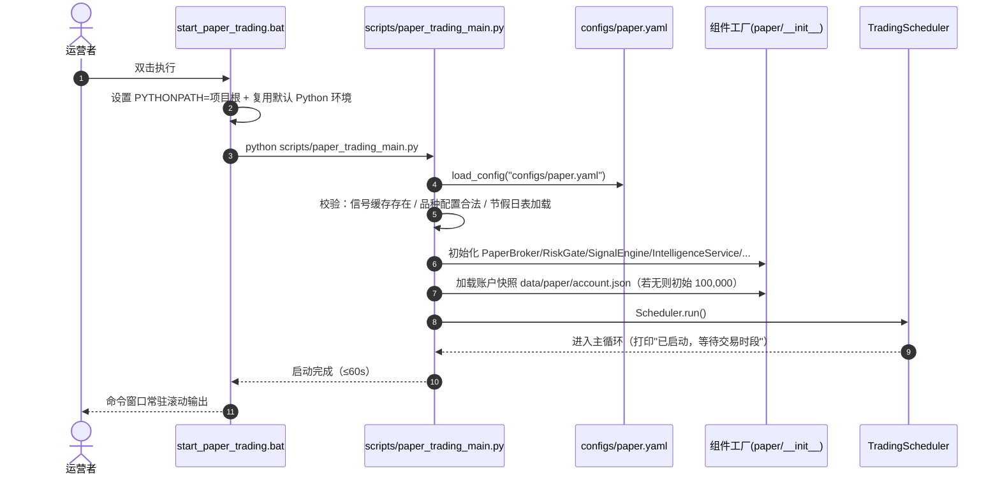
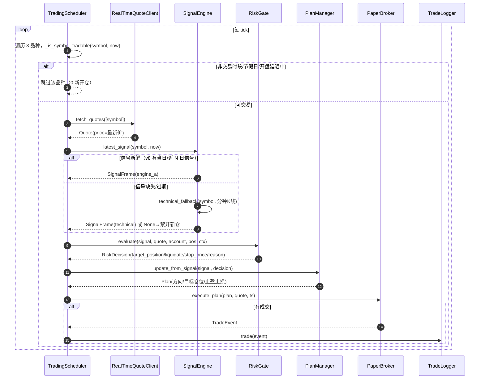
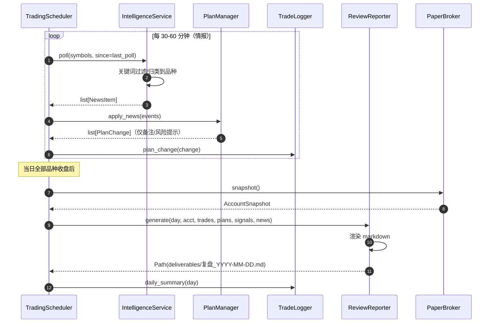
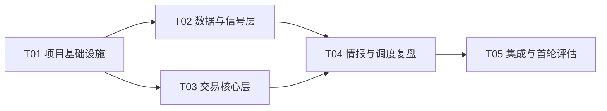

# 模拟盘交易系统 架构设计

> 作者：高见远（软件架构师）· 日期：2026-08-23 · 状态：待评审
> 输入：PRD v1.0（simulated_paper_trading_prd_2026-08-23.md）+ 主理人 Q1-Q6 批复
> 范围：仅系统设计 + 任务分解，不含实现代码

---

## 0. TL;DR（技术方案一句话 + 关键决策）

**一句话**：在 `hexbroker` 内新增 `hexbroker/paper/` 实时模拟盘包，复用 `SimBroker` / `CostModel` / `RiskManager` / v8 信号缓存，按「报价 → 信号 → 风控 → 计划 → 撮合 → 日志 → 情报 → 复盘」管道每轮询自动运行；实时行情用新浪 `hq.sinajs.cn`（**已实测三品种可拉**），**零新增第三方依赖**；`start_paper_trading.bat` 一键启动 ≤60s；首轮运行 20 个交易日后自动出评估摘要。

**关键决策**：

| 编号 | 决策 | 依据 |
|---|---|---|
| D1 | 执行通道 = PaperBroker **薄封装** SimBroker（同口径成本/保证金/平今费），叠加资金约束/预算上限/账户快照 | PRD 4.1；`hexbroker/backtest/broker.py`、`cost.py` 已核实接口 |
| D2 | 信号源 = v8 缓存（ag0/rb0 有信号；**c0 无信号** → 技术指标兜底，见 §8.1） | 主理人 Q2 批复；实测 v8 18 品种不含 c0 |
| D3 | 实时数据 = 新浪 `hq.sinajs.cn` 实时报价（nf_AG0/nf_RB0/nf_C0）+ SinaSource 分钟线兜底；pytdx 弃用 | 实测 hq 接口可用；pytdx 网络不可达（fetch_tdx_extension.py 已实证） |
| D4 | 风控 = RiskGate 复用 `RiskManager.evaluate`，构造 `RiskState` → `RiskDecision` | `hexbroker/risk/manager.py` 签名已核实 |
| D5 | 情报 = `IntelligenceProvider` 接口隔离；MVP 用公开新闻源/静态源，MCP 桥接列为 P1 | mx-ds-mcp/westock 是 agent 层 MCP，独立 Python 进程无法直接 import（§8.3） |
| D6 | 复盘 = `ReviewReporter` 收盘后落盘 `deliverables/复盘_YYYY-MM-DD.md` + 命令窗口摘要 | 主理人 Q4 批复 |
| D7 | 集合竞价跳过、开盘后延迟 N 分钟进入（默认 5 分钟，可配置） | 主理人 Q6 批复 |

---

## 1. 实现方案与框架选型

### 1.1 核心技术难点与对策

| 难点 | 对策 |
|---|---|
| 模拟撮合口径必须与回测一致 | PaperBroker 直接复用 SimBroker.execute（含平今判定、乘数记账），只加资金层 |
| 实时行情：项目内无现成实时报价客户端 | 新写 `quotes.py`（约 60 行），用标准库 `urllib.request` 拉 `hq.sinajs.cn`，零依赖；已实测返回最新价 |
| 交易时段：ag 夜盘跨日（21:00-02:30） | 复用 `FuturesCalendar.Session`（已支持 `crosses_midnight`），按品种配置时段 + 内置 2026 节假日表 |
| 信号新鲜度/覆盖率（v8 最新 2026-06-29、c0 无信号） | SignalEngine 做新鲜度检测（过期 → 技术指标兜底 / 禁开新仓 / 告警） |
| 情报源是 MCP 工具而非 pip 包 | Provider 接口隔离 + 懒加载；MVP 用公开源/静态源，MCP 桥接 P1 |
| 20 交易日首轮评估的可观测性 | TradeLogger 双输出（文件+stdout）+ 账户快照 JSON + 复盘 md，三者可交叉核对 |

### 1.2 模块划分决策

**独立包 `hexbroker/paper/`（核心库）+ `scripts/paper_trading_main.py`（进程入口）+ 根目录 `start_paper_trading.bat`（一键启动）**。

理由：
- 独立包可被 `tests/` 直接 import 做单测（时段判定/资金约束/日志格式/风控接入均是可测纯逻辑）；
- `scripts/` 已有"可执行脚本"先例（`p2_basis_backtest.py` 等），入口脚本放 `scripts/` 与项目惯例一致；
- bat 放根目录，满足 A1「一键启动」，不污染包结构；
- 不选择纯 `scripts/paper_*` 散脚本：核心逻辑需要类/接口/复用，散脚本不可测试、不可复用。

### 1.3 架构模式

- **层次**：调度层（TradingScheduler）→ 决策层（SignalEngine / RiskGate / PlanManager）→ 执行层（PaperBroker）→ 输出层（TradeLogger / ReviewReporter）
- **管道模式**：每轮 tick 固定走 `quote → signal → risk → plan → execute → log`，任何一步失败不阻断整轮（隔离异常、记审计）
- **DTO 通信**：组件间用 dataclass（Quote / SignalFrame / Plan / TradeEvent / NewsItem / AccountSnapshot）解耦，不共享可变状态
- **配置驱动**：所有阈值/时段/频率进 `configs/paper.yaml`（自包含，OmegaConf 组合）

### 1.4 组件清单（8 个）

| 组件 | 文件 | 职责 | 复用资产 |
|---|---|---|---|
| PaperBroker | `broker.py` | 账户/资金/持仓/成交/快照，资金约束 | SimBroker、CostModel |
| TradingScheduler | `scheduler.py` | 主循环：时段/节假日/开盘延迟/轮询/收盘触发 | FuturesCalendar（扩展） |
| SignalEngine | `signals.py` | v8 信号读取 + 新鲜度 + 技术指标兜底 | `artifacts/signals_cache18_grouped_v8.parquet` |
| RiskGate | `risk_gate.py` | 构造 RiskState → RiskDecision | RiskManager、`configs/risk/v4_atr.yaml` |
| IntelligenceService | `intel.py` | 情报拉取/过滤/结构化事件/计划影响 | Provider 接口（mx-ds-mcp/westock 懒加载） |
| PlanManager | `planner.py` | 交易计划维护/变更落盘 | `trade_plans/` 已有 JSON schema |
| TradeLogger | `logger.py` | 双输出日志（文件+stdout）+ 5 要素格式 | loguru、`log_structured` |
| ReviewReporter | `reporter.py` | 每日复盘 md + stdout 摘要 | `deliverables/` |

---

## 2. 文件列表

### 新增文件（14 个核心 + 3 个测试 + 2 个文档）

```
start_paper_trading.bat                              # 一键启动（P0 R1）
configs/paper.yaml                                   # 模拟盘配置（自包含：品种/资金/时段/频率/阈值）
hexbroker/paper/__init__.py                          # 包导出
hexbroker/paper/types.py                             # 公共 DTO + 常量（符号规范/时段表/节假日表）
hexbroker/paper/sessions.py                          # TradingSession：FuturesCalendar 扩展（按品种时段 + 节假日）
hexbroker/paper/quotes.py                            # RealTimeQuoteClient（hq.sinajs.cn，标准库 urllib）
hexbroker/paper/signals.py                           # SignalEngine（v8 + 新鲜度 + 技术指标兜底）
hexbroker/paper/broker.py                            # PaperBroker（SimBroker 薄封装 + 资金/预算/快照）
hexbroker/paper/risk_gate.py                         # RiskGate（RiskManager 封装）
hexbroker/paper/planner.py                           # PlanManager（交易计划 DTO + 变更审计）
hexbroker/paper/intel.py                             # IntelligenceService + IntelligenceProvider 接口 + 实现
hexbroker/paper/logger.py                            # TradeLogger（双输出 + 5 要素格式 + 审计 JSON）
hexbroker/paper/scheduler.py                         # TradingScheduler（主循环 + 情报轮询 + 收盘触发）
hexbroker/paper/reporter.py                          # ReviewReporter（复盘 md 生成）
scripts/paper_trading_main.py                        # 进程入口（组装组件 + 启动 + 优雅退出 + --days 参数）
tests/test_paper_sessions.py                         # 时段/节假日/开盘延迟测试
tests/test_paper_broker.py                           # PaperBroker 资金约束/预算/平今费测试
tests/test_paper_pipeline.py                         # 端到端冒烟（离线模式，mock 行情）
docs/system_design.md                                # 本文档
docs/class-diagram.mermaid                           # 类图
docs/sequence-diagram.mermaid                        # 时序图
```

### 改动现有文件

```
configs/base.yaml                                    # 可选：加 paper: 组合说明（非必须，paper.yaml 自包含）
README.md                                            # 可选：模拟盘运行说明段落
```

---

## 3. 数据结构与接口

### 3.1 类图

```mermaid
classDiagram
    class TradingScheduler {
        +cfg: Any
        +run() None
        +_tick() None
        +_is_symbol_tradable(symbol: str, ts: datetime) bool
        +_on_close(day: date) None
        -_intel_interval_sec: int
    }
    class RealTimeQuoteClient {
        +fetch_quotes(symbols: list[str]) dict[str, Quote]
        +fetch_bars(symbol: str, freq: str, days: int) pd.DataFrame
        -_parse_line(line: str) Quote
    }
    class Quote {
        +symbol: str
        +ts: datetime
        +price: float
        +open: float
        +high: float
        +low: float
        +pre_settle: float
    }
    class SignalEngine {
        +latest_signal(symbol: str, asof: datetime) SignalFrame | None
        +freshness_days(symbol: str, asof: datetime) int
        +technical_fallback(symbol: str, bars: pd.DataFrame) SignalFrame | None
        -_cache: pd.DataFrame
    }
    class SignalFrame {
        +symbol: str
        +ts: datetime
        +p_up: float
        +exp_ret: float
        +is_effective: bool
        +source: str
        +freshness_days: int
    }
    class RiskGate {
        +evaluate(signal: SignalFrame, quote: Quote, acct: AccountSnapshot, pos_ctx: PositionCtx) RiskDecision
        +build_state(...) RiskState
        -_manager: RiskManager
    }
    class PlanManager {
        +update_from_signal(signal: SignalFrame, decision: RiskDecision) Plan
        +apply_news(events: list[NewsItem]) list[PlanChange]
        +get_plan(symbol: str) Plan | None
        +save_plan_file(day: date) Path
    }
    class Plan {
        +symbol: str
        +direction: int
        +target_qty: float
        +target_pos_pct: float
        +stop_price: float | None
        +take_profit: float | None
        +note: str
        +risk_flag: str
        +source: str
        +updated_at: datetime
    }
    class PaperBroker {
        +execute_plan(plan: Plan, quote: Quote, ts: datetime) TradeEvent | None
        +available_cash(marks: dict) float
        +margin_used(marks: dict) float
        +snapshot() AccountSnapshot
        +save_snapshot(path: Path) None
        +load_snapshot(path: Path) None
        -_broker: SimBroker
        -_cost: CostModel
    }
    class TradeEvent {
        +trade_id: str
        +ts: datetime
        +symbol: str
        +direction: int
        +qty: float
        +entry: float
        +stop: float | None
        +take_profit: float | None
        +price: float
        +fee: float
        +is_open: bool
        +is_today_close: bool
    }
    class IntelligenceService {
        +poll(symbols: list[str], since: datetime) list[NewsItem]
        +filter_by_keywords(items: list[NewsItem]) list[NewsItem]
        +providers: list[IntelligenceProvider]
    }
    class IntelligenceProvider {
        <<interface>>
        +fetch_news(symbols: list[str], since: datetime) list[NewsItem]
        +name() str
    }
    class NewsItem {
        +ts: datetime
        +symbols: list[str]
        +title: str
        +summary: str
        +tags: list[str]
        +source: str
    }
    class TradeLogger {
        +trade(event: TradeEvent) None
        +plan_change(change: PlanChange) None
        +daily_summary(day: date) None
        -_stdout_sink
        -_file_sink
    }
    class ReviewReporter {
        +generate(day: date, acct: AccountSnapshot, trades: list[TradeEvent], plans: dict, signals: dict, news: list[NewsItem]) Path
        -_render_md(...) str
    }
    class AccountSnapshot {
        +ts: datetime
        +equity: float
        +cash: float
        +margin_used: float
        +positions: dict[str, float]
        +avg_entry: dict[str, float]
        +realized: dict[str, float]
        +drawdown: float
        +peak_equity: float
    }
    class PositionCtx {
        +position: float
        +entry_price: float
        +atr: float
        +bars_in_position: int
        +highest_since_entry: float
        +lowest_since_entry: float
    }
    class TradingSession {
        +is_tradable(symbol: str, ts: datetime) bool
        +is_trading_day(ts: datetime) bool
        +is_open_delay_passed(symbol: str, ts: datetime, delay_min: int) bool
        +day_label(ts: datetime) date
        -_calendar: FuturesCalendar
        -_holidays_2026: set[date]
    }

    TradingScheduler --> RealTimeQuoteClient
    TradingScheduler --> SignalEngine
    TradingScheduler --> RiskGate
    TradingScheduler --> PlanManager
    TradingScheduler --> PaperBroker
    TradingScheduler --> IntelligenceService
    TradingScheduler --> TradeLogger
    TradingScheduler --> ReviewReporter
    TradingScheduler --> TradingSession
    RealTimeQuoteClient ..> Quote
    SignalEngine ..> SignalFrame
    RiskGate ..> RiskDecision : 复用 hexbroker.risk.types
    PlanManager ..> Plan
    PaperBroker ..> TradeEvent
    PaperBroker --> SimBroker : 复用 hexbroker.backtest.broker
    PaperBroker --> CostModel : 复用 hexbroker.backtest.cost
    RiskGate --> RiskManager : 复用 hexbroker.risk.manager
    IntelligenceService --> IntelligenceProvider
    IntelligenceService ..> NewsItem
    TradeLogger ..> TradeEvent
    ReviewReporter ..> AccountSnapshot
```



### 3.2 关键接口签名（已核实复用资产对齐）

**PaperBroker.execute_plan**（核心新增接口，薄封装 SimBroker.execute）：
```python
def execute_plan(self, plan: Plan, quote: Quote, ts: datetime) -> TradeEvent | None:
    """按计划调整持仓到 target_qty；内部：
    1) 校验资金：可用资金 = equity(marks) - margin_used(marks) >= 0
    2) 校验预算：单品种保证金占用 <= budget_per_symbol
    3) 调 SimBroker.execute(symbol, target_qty, ref_price=quote.price, timestamp=ts)
    4) 组装 TradeEvent（含止盈/止损来自 plan），写审计
    """
```

**SimBroker.execute**（复用，签名已核实）：`execute(symbol, target_qty, ref_price, is_today_close=False, timestamp=None) -> Trade | None`，含平今判定 `_compute_is_today_close`、乘数记账 `cost._multiplier(symbol)`。

**CostModel**（复用，签名已核实）：`from_config(cfg)`；`trade_cost(ref_price, qty, is_open, is_today_close, symbol) -> (fill_price, fee, slip, total)`；`margin(fill_price, qty, symbol)`。三品种参数：ag0 ×15/tick0.01、rb0 ×10/tick1、**c0 需在 paper.yaml 显式声明 ×10/tick1**（不在 CONTRACTS18 内）。

**RiskManager.evaluate**（复用，签名已核实）：`evaluate(state: RiskState, intent_position, p_up=0.5, recent_returns=None, recent_volumes=None, ma_price=None) -> RiskDecision`。RiskGate 负责构造 RiskState（equity/peak_equity/position/entry_price/current_price/atr/realized_vol/drawdown/...）与 intent_position（由 SignalFrame 换算）。

### 3.3 信号帧结构（v8 缓存列已核实）

`artifacts/signals_cache18_grouped_v8.parquet`：`symbol(str: ag0/rb0/...) | ts(datetime64) | p_up(float) | exp_ret(float) | is_effective(bool)`，共 8624 行，最新 2026-06-29，**不含 c0**。

### 3.4 情报事件结构

```json
{"ts": "2026-08-23T10:30:00", "symbols": ["ag0"], "title": "...", "summary": "...", "tags": ["risk"], "source": "sina_news"}
```
P1 情报影响面：仅「风险提示 + 计划备注」（主理人 Q3 批复），不自动改方向/仓位。

---

## 4. 程序调用流程

### 4.1 启动调用链（P0 R1，≤60s）



### 4.2 单轮 tick 管道（每 N 秒轮询，默认 60s）



### 4.3 情报轮询 + 收盘复盘



---

## 5. 任务列表（有序、含依赖、按实现顺序）

> 规则：≤5 个任务；每任务 ≥3 个相关文件；按功能模块分组；T01 必须为项目基础设施。

### T01 项目基础设施（P0）
- **文件**：`start_paper_trading.bat`、`configs/paper.yaml`、`hexbroker/paper/__init__.py`、`scripts/paper_trading_main.py`（骨架）、`docs/`（占位）
- **依赖**：无
- **验收**：双击 bat 可在 ≤60s 内完成「配置加载 + 组件初始化 + 打印启动成功」并常驻；配置缺失/缓存缺失时输出中文错误提示（A1）
- **复杂度**：M

### T02 数据与信号层（P0）
- **文件**：`hexbroker/paper/types.py`、`hexbroker/paper/quotes.py`、`hexbroker/paper/sessions.py`、`hexbroker/paper/signals.py`
- **依赖**：T01
- **验收**：`hq.sinajs.cn` 三品种实时价可解析（实测已验证）；ag 夜盘跨日时段判定正确；v8 读取 ag0/rb0 信号正确、c0 走技术指标兜底；新鲜度检测与降级路径可单测（A2）
- **复杂度**：L

### T03 交易核心层（P0）
- **文件**：`hexbroker/paper/broker.py`、`hexbroker/paper/risk_gate.py`、`hexbroker/paper/planner.py`、`hexbroker/paper/logger.py`
- **依赖**：T01（T02 的 DTO 类型契约）
- **验收**：PaperBroker 资金约束成立（可用资金 ≥0、单品种预算不超限，A4）；平今费与 SimBroker 口径一致（单测对比）；RiskGate 输出 RiskDecision（S1-S5/ATR/预算，R6）；TradeLogger 双输出且 5 要素格式可解析（A3）
- **复杂度**：L

### T04 情报与调度复盘（P0/P1）
- **文件**：`hexbroker/paper/intel.py`、`hexbroker/paper/scheduler.py`、`hexbroker/paper/reporter.py`
- **依赖**：T02、T03
- **验收**：调度主循环按品种时段自动运行、非交易时段 0 新开仓（A2）；情报事件→计划备注/风险提示且落盘 `trade_plans/`（R7/R8）；收盘后自动生成 `deliverables/复盘_YYYY-MM-DD.md`（A5）
- **复杂度**：M

### T05 集成与首轮评估（P0）
- **文件**：`scripts/paper_trading_main.py`（完整组装）、`tests/test_paper_sessions.py`、`tests/test_paper_broker.py`、`tests/test_paper_pipeline.py`、bat 完善、文档收尾
- **依赖**：T02、T03、T04
- **验收**：离线冒烟测试（mock 行情）全绿；真实模式可启动；运行满 20 个交易日后自动输出评估摘要（胜率/盈亏曲线/信号命中率，Q5）
- **复杂度**：M

### 任务依赖图



---

## 6. 依赖包

**新增依赖：无**（零新增，全部复用现有/标准库）。

| 用途 | 依赖 | 说明 |
|---|---|---|
| 数据/信号 | numpy、pandas、pyarrow | 已有（pyproject 核心依赖） |
| 配置 | pyyaml、omegaconf、pydantic | 已有 |
| 日志 | loguru | 已有；复用 `log_structured` 审计 JSON |
| 实时报价 | `urllib.request`（标准库） | 新写 quotes.py 用标准库，**不依赖 requests**，规避 sources extra 缺失风险 |
| K 线兜底 | requests（可选，sources extra） | SinaSource 已存在；缺失时 `health_check=False`，仅影响分钟线技术兜底，不阻塞主链路 |
| 情报 | mx-ds-mcp / westock（MCP 工具，非 pip） | 通过 Provider 懒加载/桥接，不进 requirements |

---

## 7. 共享知识（跨文件约定）

1. **符号短名规范**：内部统一 `ag0 / rb0 / c0`（小写品种 + `0` 主力连续）；展示名 `SHFE.ag / SHFE.rb / DCE.c`；新浪实时代码 `nf_AG0 / nf_RB0 / nf_C0`；K 线源代码 `ag0 / rb0 / c0`。转换统一走 `CostModel._short_symbol` 语义（禁止在业务代码里手写转换）。
2. **时间口径**：全系统 `Asia/Shanghai`，存储 tz-naive 本地时间（`hexbroker/utils/timeutil.py` 约定）；bar 时间戳 = bar 结束时刻（左闭右开）；**夜盘（21:00 之后）归属下一交易日**（`TradingSession.day_label` 统一处理）。
3. **日志格式**：
   - 成交事件（A3 五要素）：`TRADE|ts|symbol|dir|qty|entry|stop|tp|price|fee`（管道分隔，dir ∈ {LONG,SHORT}，qty 手数）
   - 计划变更：`PLAN|ts|symbol|change_type|detail`
   - 审计 JSON：`log_structured("trade", {...})` 与 `log_structured("plan_change", {...})`
   - 命令窗口与日志文件内容一致（同一 sink 双输出）。
4. **配置来源**：`configs/paper.yaml` 自包含（品种/初始资金/预算比例/时段/轮询频率/信号新鲜度阈值/开盘延迟分钟/节假日表）；引用现有 `configs/risk/v4_atr.yaml` 的风控参数语义；所有魔法数字进 yaml，代码不写裸阈值。
5. **落盘目录**：
   - 账户快照：`data/paper/account.json`（每次成交后原子写）
   - 交易日志：`data/paper/trades.log`
   - 交易计划：`trade_plans/YYYY-MM-DD_plan.json`（复用已有 schema_version 约定）
   - 复盘报告：`deliverables/复盘_YYYY-MM-DD.md`
6. **错误处理**：组件异常不退出进程，记 error 日志 + 继续下一 tick；启动期致命错误（缓存缺失/配置非法）打印中文提示并 exit(1)（A1）。
7. **金额/仓位口径**：手数为期货标准手（ag15kg/rb10t/c10t）；资金单位元；权益 = initial + realized + unrealized（与 SimBroker 一致）。

---

## 8. 待明确事项（实现中的坑与建议）

1. **【最高风险】c0 信号/数据双缺口**（实测）：v8 缓存 18 品种**无 c0**；本地 `data/raw/processed/` **无 c0 parquet**；sina 日线接口实测最新 **2024-07-17**（全品种）。后果：c0 无引擎 A 信号、无历史 K 线支撑技术指标兜底，仅 `hq.sinajs.cn` 实时价可用。建议：与主理人确认 (a) 首轮 c0 仅跟踪不交易（只跑情报+复盘占位），或 (b) 提供 c0 历史数据源后启用交易；系统按配置 `paper.symbols.c0.mode: track|trade` 控制，不阻塞 ag/rb 主链路。
2. **sina 日线新鲜度不足的降级策略**：v8 最新 2026-06-29、sina 日线 2024-07-17 → 信号过期阈值（默认 5 个交易日）内正常；过期后：有持仓 → 仅风控（不追信号）；无持仓 → 禁开新仓 + 告警。阈值进 yaml。
3. **mx-ds-mcp/westock 是 agent 层 MCP 工具**，独立 Python 进程无法直接 import 调用 → 情报 MVP 用「公开新闻接口（如新浪财经/东财公开搜索）+ 静态 provider（测试/离线）」实现；MCP 桥接（子进程/HTTP 回调）列为 P1，接口层 `IntelligenceProvider` 已隔离，切换无侵入。
4. **夜盘跨日 bar 归属**：ag 21:00-02:30 的信号/持仓/复盘必须按「下一交易日」对齐（如 08-23 21:00 夜盘归 08-24 交易日），`TradingSession.day_label` 统一处理，复盘/计划文件名用交易日标签。
5. **2026 节假日表**：设计内置可配置表（元旦/春节/清明/劳动节/端午/中秋/国庆 + 周末自动跳过），**以交易所当年公告为准**，启动时打印生效节假日清单；上线前需人工核对一次。
6. **实时撮合偏差**：SimBroker 按 `ref_price + 1 tick` 滑点撮合，与真实盘口存在已知偏差（PRD 4.1 已认可，模拟盘口径一致优先）。
7. **止损/止盈执行语义**：MVP 为「每 tick 轮询盘中价，触发即按 ref_price 撮合」，不保证精确成交价、不抢集合竞价（Q6 已定）；止损触发后 `RiskDecision.liquidate` 优先于新开仓（复用 RiskManager 硬止损优先级）。
8. **20 交易日评估终止**：运行满 20 个交易日后自动生成评估摘要（`deliverables/模拟盘评估_第20交易日.md`），进程默认不自动退出，可用 `--days N` 控制；重启时账户快照续跑，交易日计数从快照恢复。
